# Проектная работа: Создание отказоусточивого кластера PostgreSQL с Patroni

Для реализации отказоустойчивого кластера я решил остановиться на следующей связке:
* Patroni - ПО для управления кластером.
* Consul - распределённое хранилище key-value (ключ-значение)

> **Примечание:** несмотря на то, что более популярным решением является распределённое хранилище ETCD, я всё же решил выбрать Consul, т.к. мы его уже разбирали на уроке, он более стабилен и у Consul есть WEB-интерфейс. К тому же, для меня главным было понять сам принцип работы подобной связки, а поменять инструмент при необходимости - это уже дело техники.
>
> На уроке мы устанавливали Consul на те же ВМ, где находились Patroni+PostgreSQL, однако для финальной работы я решил построить более грамотный стенд и вынести Consul на отдельные ВМ.

## Часть 1: Создаю ВМ.

> **Примечание:** Как я выполнял настройку terraform, я показывал ранее:
> 
> [Урок 12: Нагрузочное тестирование и тюнинг PostgreSQL](https://github.com/nvdmike/OTUSPostgreSQL/blob/main/Lesson12/Lesson12.md "Урок 12: Нагрузочное тестирование и тюнинг PostgreSQL")

1. В данном случае пришлось немного изменить файл конфигурации Terraform [postgtes_settings.tf](https://github.com/nvdmike/OTUSPostgreSQL/blob/main/Final/files/postgtes_settings.tf "postgtes_settings.tf"), т.к. требовалось создать несколько ВМ с различными характеристиками: 3 ВМ под БД, 3 ВМ под Consul (кластер Patroni и распределённые хранилища рекомендуется создавать минимум из 3х нод, т.к. при выходе одной ноды из строя по методу кворума будет выбран новый Master, а в случае, когда нод всего 2, кластер просто развалится).

2. После запуска терминала в `режиме администратора` необходимо добавить аутентификационные данные в переменные окружения:

```bash
$Env:YC_TOKEN=$(yc iam create-token)
$Env:YC_CLOUD_ID=$(yc config get cloud-id)
$Env:YC_FOLDER_ID=$(yc config get folder-id)
```

> **Примечание:** т.к. iam-токен обновляется довольно часто, команды по добавлению в переменные окружения, придётся выполнять почти каждый раз после нового запуска терминала

3. Перехожу в каталог с конфигурационными файлами terraform и разворачиваю ВМ:

```bash
cd 'C:\Program Files\Terraform\cloud-terraform\'
terraform apply
```

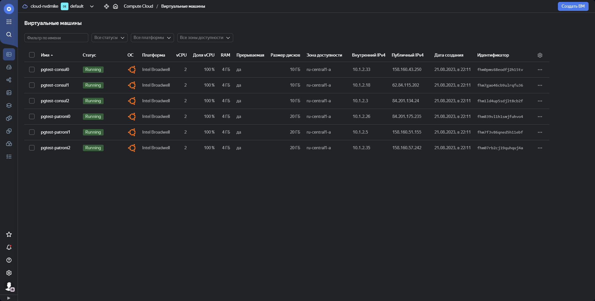

4. Для удобства использования для каждой ВМ я создаю отдельную вкладку в Visual Studio Code с собственным наименованием.

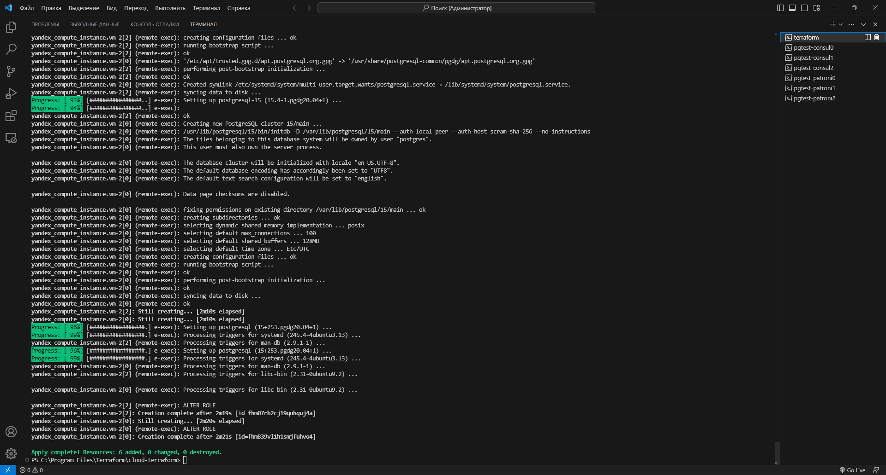

## Часть 2: Разворачиваю Consul.

> **Примечание:** показываю на примере одной ВМ с Consul, т.к. настройки для всех ВМ практически идентичны.

1. Для начала необходимо скопировать бинарный файл с Consul на ВМ, которые для него созданы (изначально я хотел залить бинарник на GitHub, однако GitHub блокирует файлы размером более 100 МБ):

```bash
scp -i C:\Users\USER01\.ssh\yc D:\Programming\2023_PostgreSQL\Software\consul user01@158.160.43.250:\tmp
scp -i C:\Users\USER01\.ssh\yc D:\Programming\2023_PostgreSQL\Software\consul user01@62.84.115.202:\tmp
scp -i C:\Users\USER01\.ssh\yc D:\Programming\2023_PostgreSQL\Software\consul user01@84.201.134.24:\tmp
```

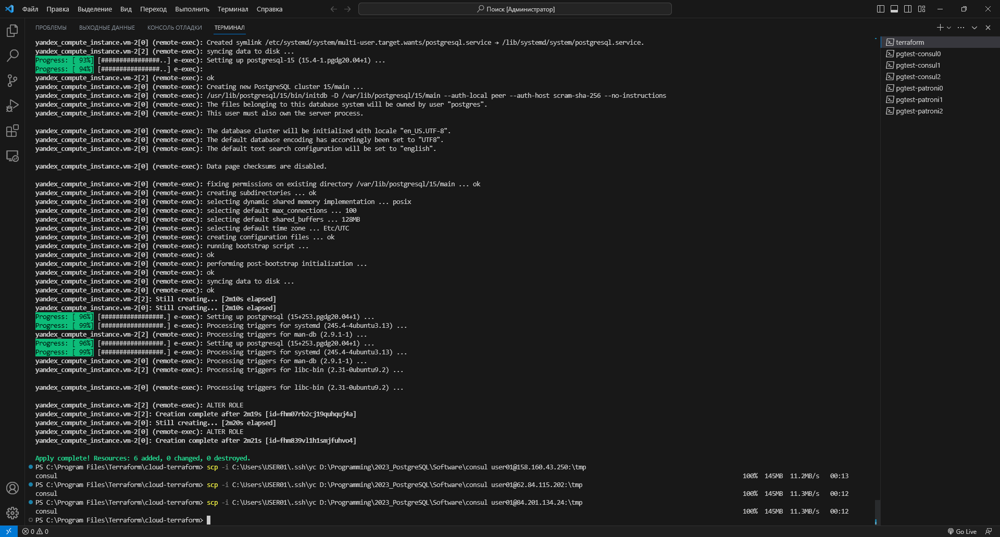

2. Захожу под ssh на ВМ, где планируется устанавливать и настраивать Consul:

```bash
ssh -i C:\Users\<имя_пользователя>\.ssh\<имя_ключа>.pub <системный_аккаунт>@<ip_адрес_хоста>
```

3. Перемещаю бинарный файл в каталог `/usr/bin`, делаю файл исполняемым, добавляю нового пользователя `consul`, создаю каталог для конфигурационных файлов Consul, меняю права на каталоги с конфигурационными файлами Consul и меня права доступа на каталоги Consul:

```bash
sudo mv /tmp/consul /usr/bin/
sudo chmod +x /usr/bin/consul
sudo useradd -r -c 'Consul DCS service' consul
sudo mkdir -p /var/lib/consul /etc/consul.d
sudo chown consul:consul /var/lib/consul /etc/consul.d
sudo chmod 775 /var/lib/consul /etc/consul.d
```

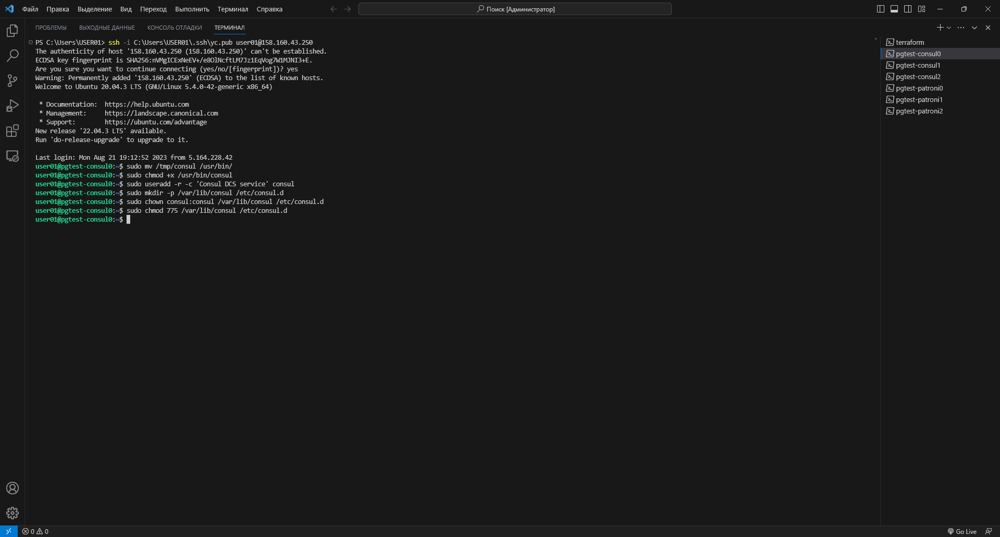

4. Генерирую ключ для Consul (его можно генерировать на любой из нод кластера):

```bash
consul keygen
```

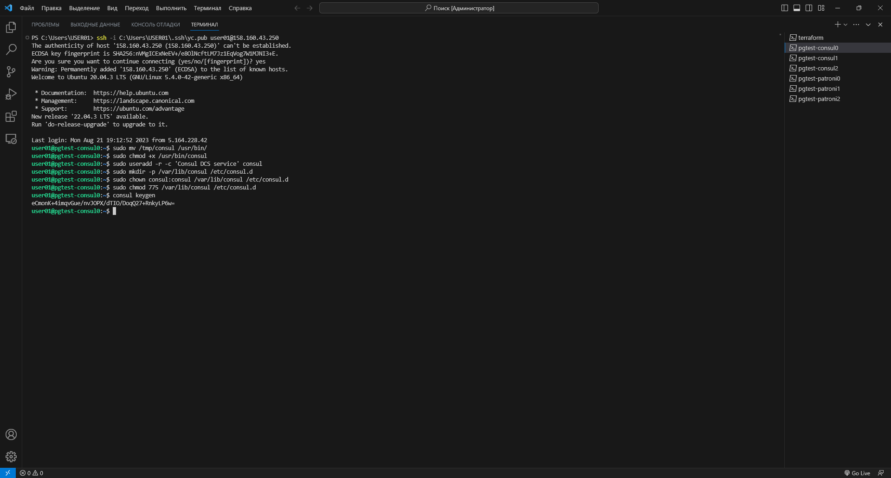

5. Я заранее подготовил конфигурационный файл [config.json](https://github.com/nvdmike/OTUSPostgreSQL/blob/main/Final/files/config.json "config.json") для Consul и выложил его на GitHub. Теперь данный файл необходимо скопировать в каталог `/etc/consul.d/`:

```bash
cd /etc/consul.d
sudo wget https://github.com/nvdmike/OTUSPostgreSQL/raw/main/Final/files/config.json
```

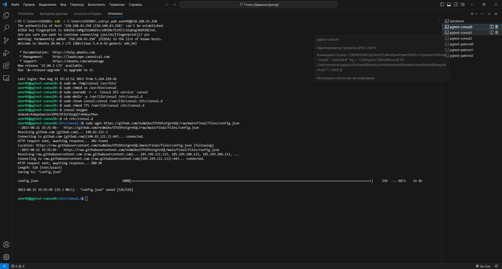

6. Данный файл необходимо поправить на всех ВМ, вставив в параметр `encrypt` ранее сгенерированный ключ:

```bash
sudo nano -w /etc/consul.d/config.json
```

<details><summary>Параметры конфигурационного файла config.json</summary>

```bash
* bind_addr		#адрес, на котором будет слушать наш сервер консул. Это может быть IP любого из наших сетевых интерфейсов или, как в данном примере, все.
* bootstrap_expect	#ожидаемое количество серверов в кластере.
* client_addr		#адрес, к которому будут привязаны клиентские интерфейсы.
* datacenter		#привязка сервера к конкретному датацентру. Нужен для логического разделения. Серверы с одинаковым датацентром должны находиться в одной локальной сети.
* data_dir		#каталог для хранения данных.
* domain		#домен, в котором будет зарегистрирован сервис.
* enable_script_checks	#разрешает на агенте проверку работоспособности.
* dns_config		#параметры для настройки DNS.
* enable_syslog		#разрешение на ведение лога.
* encrypt		#ключ для шифрования сетевого трафика. В качестве значения используем сгенерированный ранее.
* leave_on_terminate	#при получении сигнала на остановку процесса консула, корректно отключать ноду от кластера.
* log_level		#минимальный уровень события для отображения в логе. Возможны варианты "trace", "debug", "info", "warn", and "err".
* rejoin_after_leave	#по умолчанию, нода покидающая кластер не присоединяется к нему автоматически. Данная опция позволяет управлять данным поведением.
* retry_join		#перечисляем узлы, к которым можно присоединять кластер. Процесс будет повторяться, пока не завершиться успешно.
* server		#режим работы сервера.
* start_join		#список узлов кластера, к которым пробуем присоединиться при загрузке сервера.
* ui_config		#конфигурация для графического веб-интерфейса.
```

</details>

6. Проверить валидность конфигурационного файла можно следующей командой:

```bash
consul validate /etc/consul.d/config.json
```

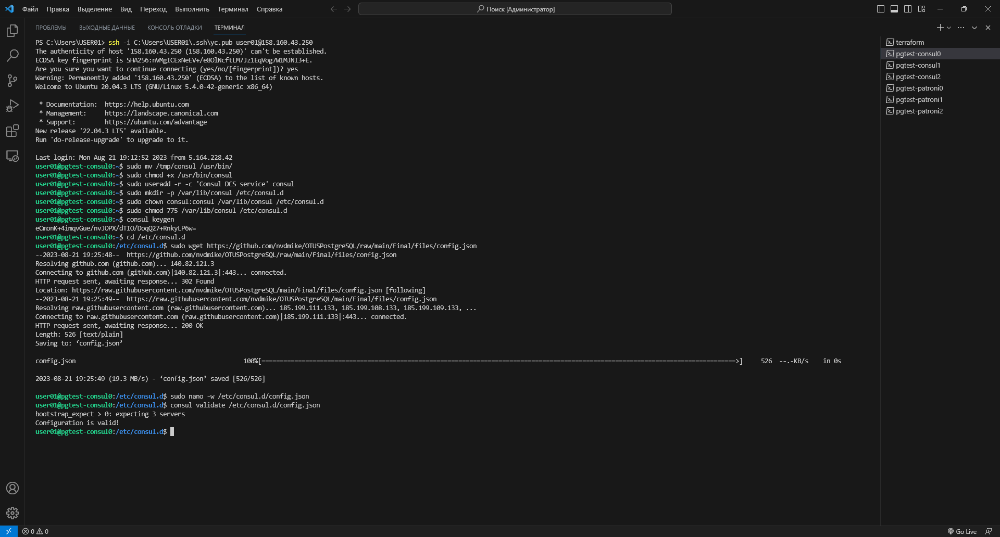

7. Создаю модуль службы [consul.service](https://github.com/nvdmike/OTUSPostgreSQL/blob/main/Final/files/consul.service "consul.service") в systemd для возможности автоматического запуска сервиса:

```
cd /etc/systemd/system
sudo wget https://github.com/nvdmike/OTUSPostgreSQL/raw/main/Final/files/consul.service
```

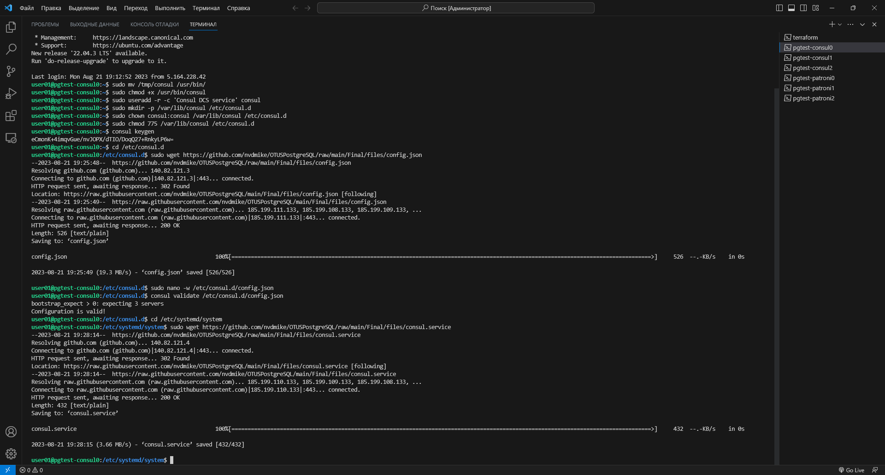

> **Примечание:** на второй и третьей ВМ необходимо поправить файл командой:

```bash
sudo nano -w /etc/systemd/system/consul.service
```

> и поменять параметр `node` на `pgtest-patroni1` для второй ВМ и `pgtest-patroni2` для третьей ВМ, соответственно.

8. Ввожу команду на перечитывание конфигурацию systemd:

```bash
sudo systemctl daemon-reload
```
9. Разрешаю автоматический запуск сервиса Consul при старте ВМ и стартую его:

```bash
sudo systemctl enable consul --now
```

10. Проверяю текущее состояние работы сервиса:

```bash
sudo systemctl status consul
```

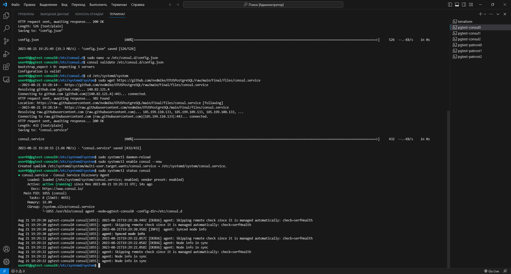

11. Так же смотрю список нод Consul:

```bash
consul members
```

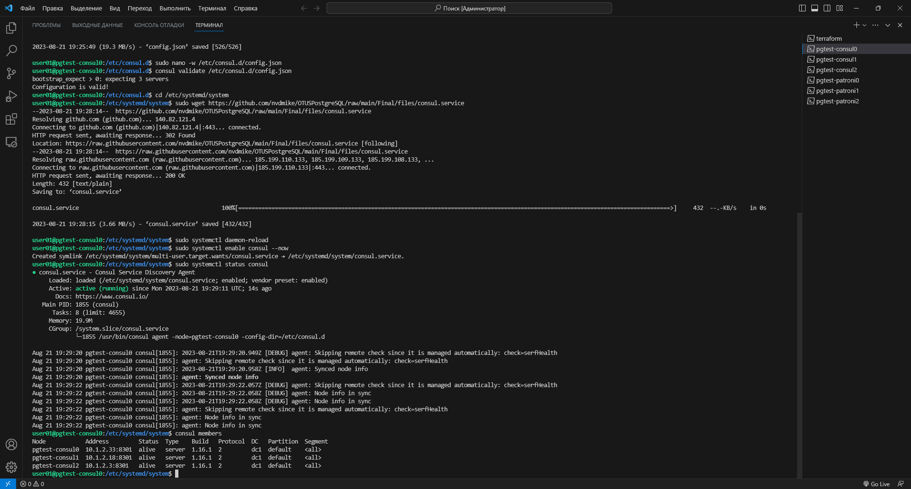

12. Теперь стал доступен WEB-интерфейс Consul по адресу: `http://<IP-адрес любого сервера Consul>:8500`. Перейдя по этому адресу, можно увидеть страницу со статусом кластера:

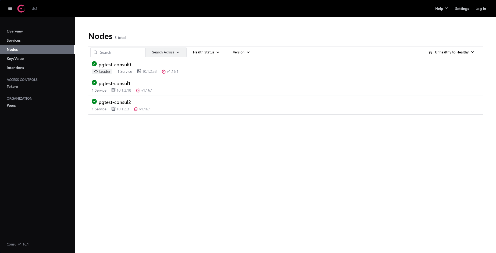


14. Далее, необходимо настроить проверку доступа на базе ACL-токена, для чего на лидере кластера Consul нужно выполнить команду:

```bash
consul acl bootstrap
```

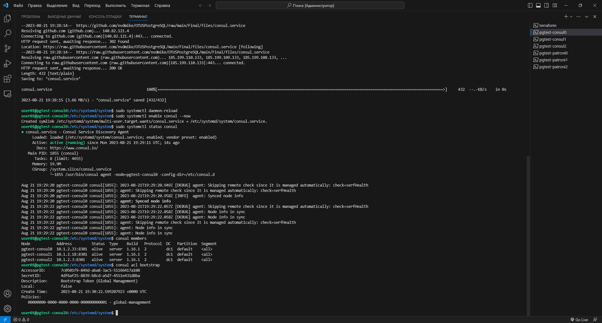

15. После чего останавливаю сервисы Consul на всех ВМ:

```
sudo systemctl stop consul
```

15. А затем, на всех ВМ, правлю файл [config.json](https://github.com/nvdmike/OTUSPostgreSQL/blob/main/Final/files/config.json "config.json") и меняю блок `acl` слеюущим образом (где параметр `default` соотвествует значению `SecretID` полученному ранее):

```bash
sudo nano -w /etc/consul.d/config.json
```

```log
"acl": {
  "enabled": true,
  "tokens": {
    "default": "<значение_SecretID>"
  }
}
```

> **Примечание:** перед блоком `acl` нужно не забыть поставить запятую!

16. Снова запускаю Consul на всех ВМ:

```bash
sudo systemctl start consul
```

17. На лидере кластера Consul небходимо создать файл политики:

```bash
cd /var/lib/consul
sudo wget https://github.com/nvdmike/OTUSPostgreSQL/raw/main/Final/files/patroni-policy.json
```

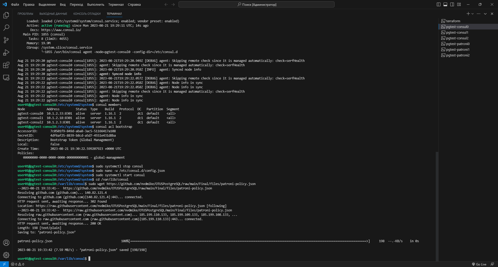

18. Для применения политики ввожу команду на лидере кластера Consul:

```bash
consul acl policy create -name "patroni-policy" -rules @patroni-policy.json
```

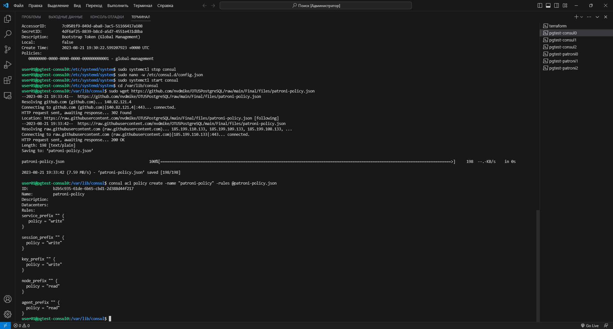

19. Создаю токен с привязкой к созданной политики на лидере кластера Consul:

```bash
consul acl token create -description "Token for Patroni" -policy-name patroni-policy
```

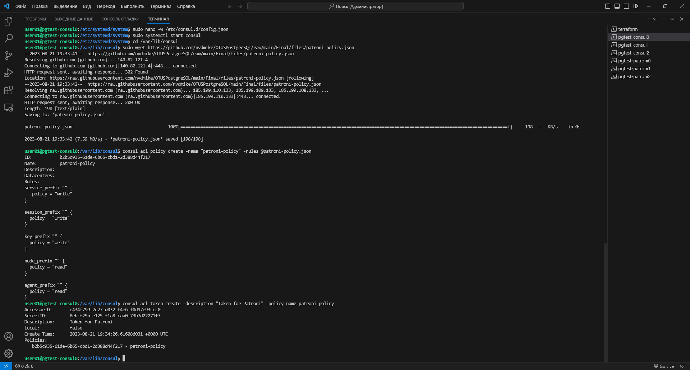

> **Примечание:** необходимо сохранить значение `SecretID`, т.к. оно дальше потребуется!

20. Проверяю текущее состояние работы сервиса:

```bash
sudo systemctl status consul
```

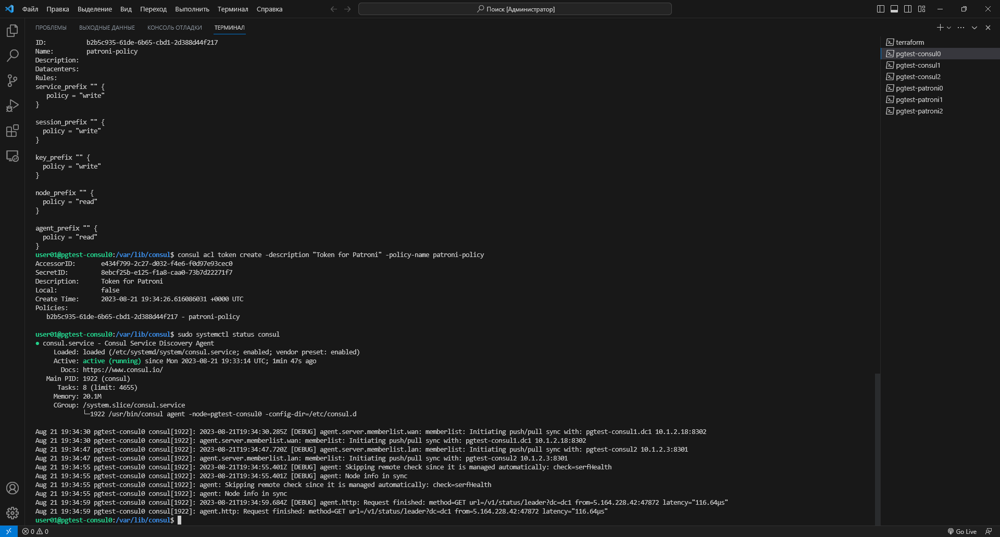

21. Смотрю список нод Consul:

```bash
consul members
```

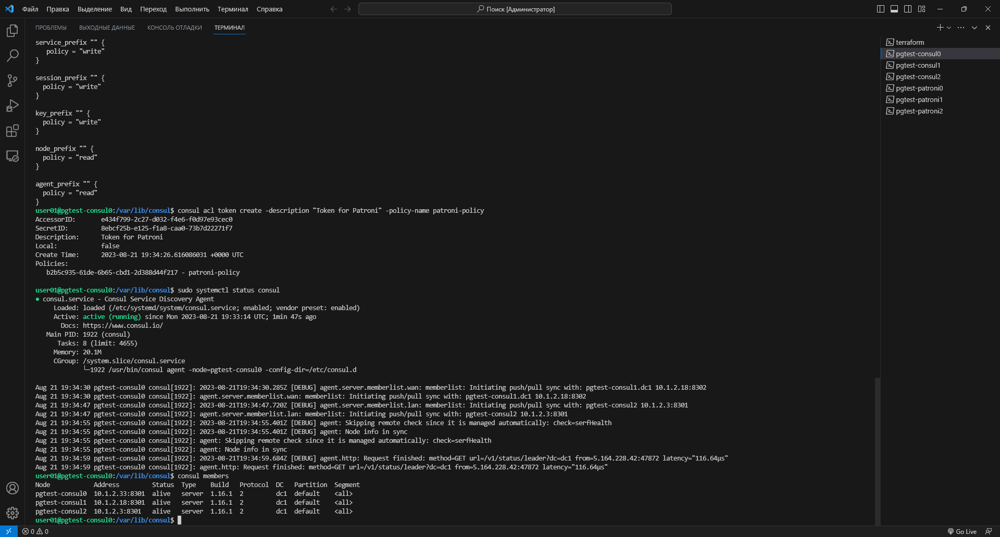

## Часть 2: Разворачиваю Patroni+PostgreSQL

> **Примечание:** т.к. в моём случае используется Terraform, установка PostgreSQL не требуется, т.к. он устанавливается скриптами при инициализации ВМ.
>
> Аналогично Consul я буду показывать настройки на примере одной ВМ, т.к. они практически идентичны.

1. Захожу на ВМ, где планируется устанавливать и настраивать PostgreSQL+Patroni.

2. Удаляю директорию PGDATA и отключаю сервис для запуска кластера, так как кластером теперь будет управлять Patroni:

```bash
sudo systemctl disable postgresql --now
sudo rm -rf /var/lib/postgresql/15/main/*
```

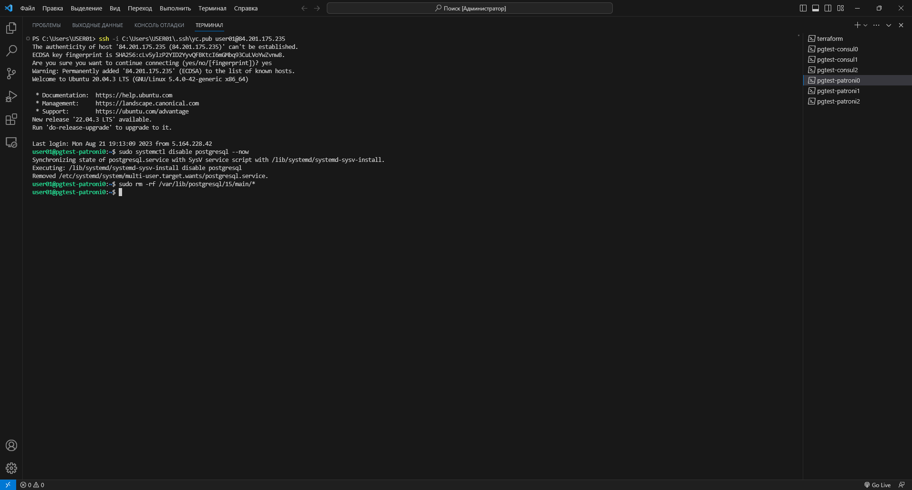

3. Вместо этого каталога я буду использовать каталог `/data/patroni`:

```bash
sudo mkdir -p /data/patroni
sudo chown postgres:postgres /data/patroni
sudo chmod 700 /data/patroni
```

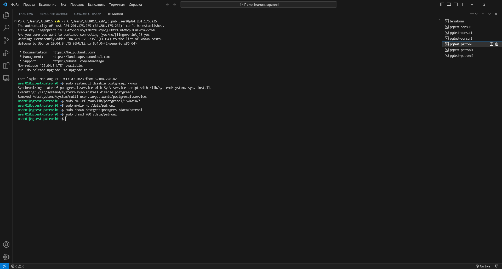

4. Устанавливаю Patroni:

```bash
sudo apt install -y python3 python3-pip python3-psycopg2 && sudo pip3 install patroni[consul] && sudo mkdir /etc/patroni
```

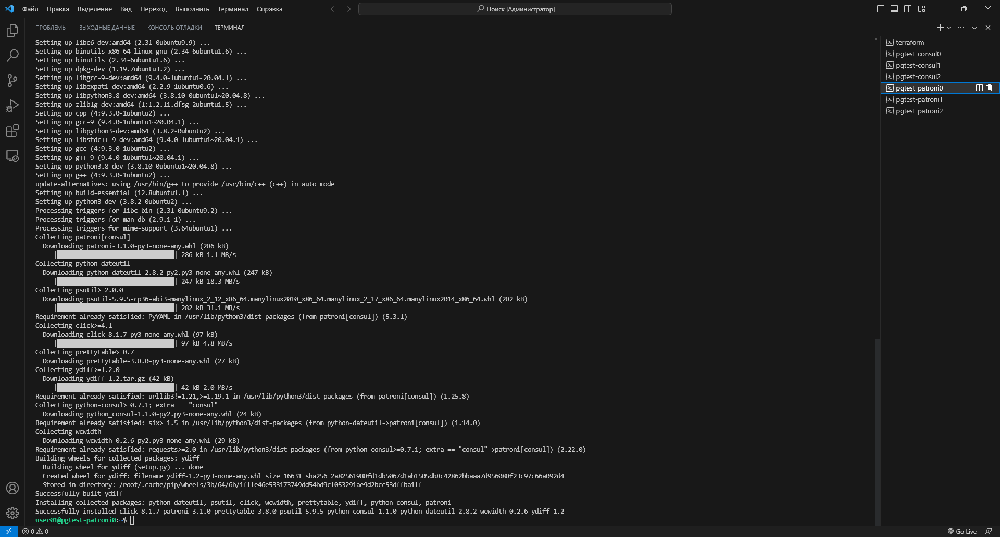


5. Создаю конфигурационный файл [patroni.yml](https://github.com/nvdmike/OTUSPostgreSQL/blob/main/Final/files/patroni.yml "patroni.yml") для Patroni (я его создал отдельно, потом скопировал на свой GitHub, поэтому просто его копирую оттуда):

```bash
cd /etc/patroni
sudo wget https://github.com/nvdmike/OTUSPostgreSQL/raw/main/Final/files/patroni.yml
```

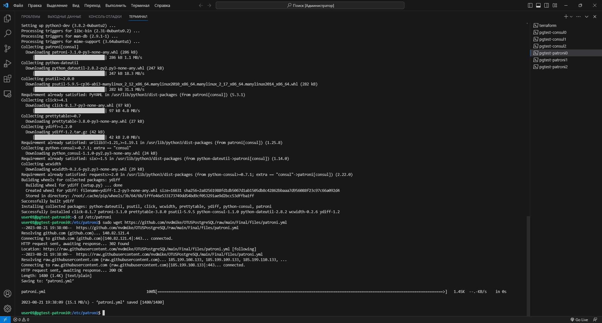

<details><summary>Параметры конфигурационного файла patroni.yml</summary>

```bash
* name					#имя узла, на котором настраивается данный конфиг.
* scope					#имя кластера. Его мы будем использовать при обращении к ресурсу, а также под этим именем будет зарегистрирован сервис в consul.
* consul-token				#если наш кластер consul использует ACL, необходимо указать токен.
* restapi-connect_address		#адрес на настраиваемом сервере, на который будут приходить подключения к patroni.
* restapi-auth				#логин и пароль для аутентификации на интерфейсе API.
* pg_hba				#блок конфигурации pg_hba для разрешения подключения к СУБД и ее базам. Необходимо обратить внимание на подсеть для
* строки host replication replicator	#Она должна соответствовать той, которая используется в вашей инфраструктуре.
* postgresql-pgpass			#путь до файла, который создаст патрони. В нем будет храниться пароль для подключения к postgresql.
* postgresql-connect_address		#адрес и порт, которые будут использоваться для подключения к СУДБ.
* postgresql				#data_dir — путь до файлов с данными базы.
* postgresql				#bin_dir — путь до бинарников postgresql.
* pg_rewind, replication, superuser	#логины и пароли, которые будут созданы для базы.
```

</details>

6. Ранее сохранённое значение `SecretID` токена необходимо вставить в файл `patroni.yml` в параметр `token` в разделе `consul`:

```
sudo nano -w /etc/patroni/patroni.yml
```

> **Примечание:** на второй и третьей ВМ, помимо этого, необходимо поменять параметр `name` на `pgtest-patroni1` для второй ВМ и `pgtest-patroni2` для третьей ВМ, соответственно. В параметре `host` в блоке `consul` поменять имя Consul на `pgtest-consul1:8500` для второй ВМ и `pgtest-consul2:8500` для третьей ВМ, соответственно. В параметрах `connect_address` в блоках `restapi` и `postgresql` поставить ip-адрес 2й ноды для 2й ВМ Patroni и 3й ноды для 3й ВМ Patroni.

7. Создаю модуль службы [patroni.service](https://github.com/nvdmike/OTUSPostgreSQL/blob/main/Final/files/patroni.service "patroni.service") в systemd для возможности автоматического запуска сервиса:

```
cd /etc/systemd/system
sudo wget https://github.com/nvdmike/OTUSPostgreSQL/raw/main/Final/files/patroni.service
```

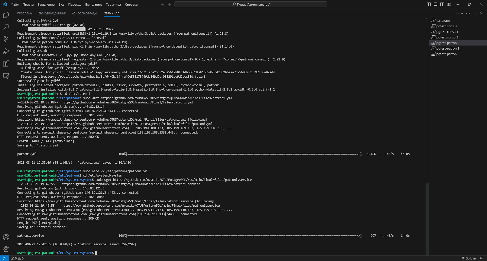

8. Ввожу команду на перечитывание конфигурацию systemd:

```bash
sudo systemctl daemon-reload
```

9. Разрешаю автоматический запуск сервиса Patroni при старте ВМ и стартую его:

```bash
sudo systemctl enable patroni --now
```

10. Проверяю статус сервиса Patroni:

```bash
sudo systemctl status patroni
```

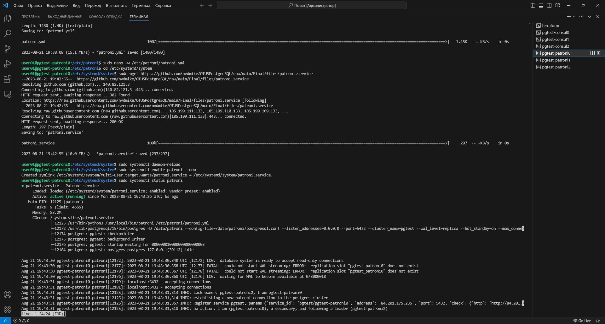

11. Теперь можно посмотреть список всех нод:

```bash
patronictl -c /etc/patroni/patroni.yml list
```

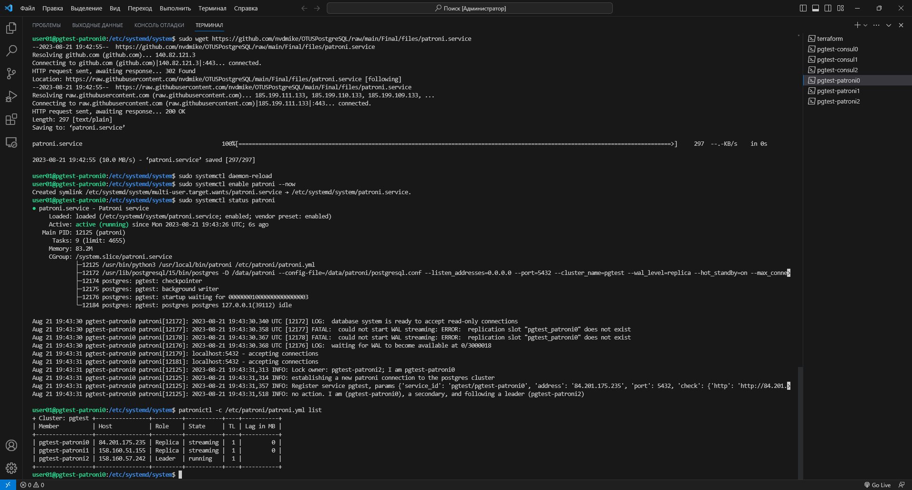