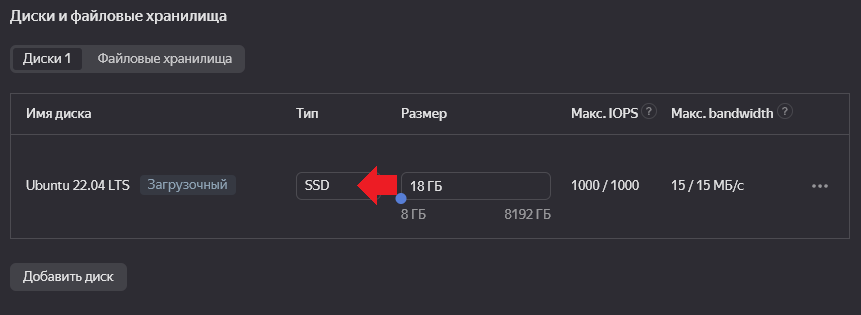
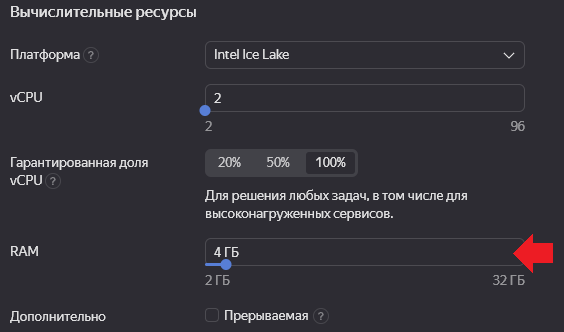
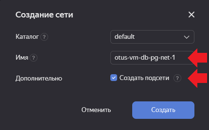
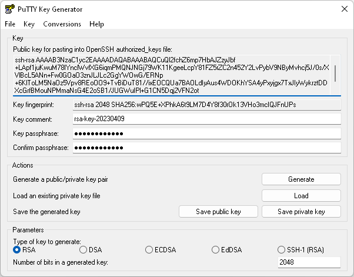
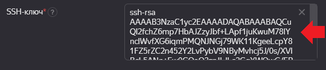
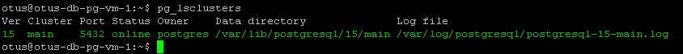

# Урок 2: Работа с уровнями изоляции транзакции в PostgreSQL

## Часть 1: Создание новой ВМ в Yandex Cloud

1.1 Имя новой виртуальной машины: `otus-db-pg-vm-1`


1.2 В качестве ОС выбираю `Ubuntu 22.04`


1.3 Выбираю тип диска SSD, чтобы ускорить работу, размер оставляю без изменений



1.4 Увеличиваю объём RAM до 4х Гб



1.5 Создаю сеть с именем (и подсети для неё): `otus-vm-db-pg-net-1`



1.6 Создаю нового пользователя для ВМ: `otus`


1.7 Т.к. подключаться к ВМ планирую с рабочей машины под управлением Windows, генерирую SSH ключ в Putty



1.8 Вставляю сгенерированный публичный ключ



1.8 Ставлю галочку `Разрешить доступ к серийной консоли`, чтобы иметь возможность подключаться к ВМ непосредственно через интерфейс Yandex Cloud


## Часть 2: Установка PostgreSQL

2.1 Подключаюсь к ВМ через PuttySSH (в дальнейшем - сессия №1)

2.2 Для установки 15й версии использую в консоли следующую команду:

```bash
sudo apt update && sudo apt upgrade -y && sudo sh -c 'echo "deb http://apt.postgresql.org/pub/repos/apt $(lsb_release -cs)-pgdg main" > /etc/apt/sources.list.d/pgdg.list' && wget --quiet -O - https://www.postgresql.org/media/keys/ACCC4CF8.asc | sudo apt-key add - && sudo apt-get update && sudo apt-get -y install postgresql-15
```

2.3 Для убедиться в том, что кластер стартовал использую команду:

```bash
pg_lsclusters
```



## Часть 3: Работа с БД и выполнение ДЗ

3.1 Запускаю вторую сессию для подключение к данной ВМ через PuttySSH (в дальнейшем - сессия №2)

3.2 В обеих сессиях выполняю команды для запуска консольного клиента psql:

```bash
sudo -u postgres psql
```

3.3 В сессии №1 выполняю команду для выключения auto commit:

```sql
postgres=# \set AUTOCOMMIT OFF
```

3.4 В сессии №1 выполняю команду для создания новой таблицы и заполнения её данными:

```sql
postgres=# create table persons(id serial, first_name text, second_name text); insert into persons(first_name, second_name) values('ivan', 'ivanov'); insert into persons(first_name, second_name) values('petr', 'petrov'); commit;
```

3.5 В сессии №1 выполняю команду для того, чтобы посмотреть текущий уровень изоляции:

```sql
postgres=# show transaction isolation level;
```

> Результат:

```log
transaction_isolation
-----------------------
read committed
(1 row)
```

3.7 Проверка уровня изоляции (этап 1):

a) В обеих сессиях выполняю команды для того, чтобы начать новую транзакцию:

```sql
postgres=# begin;
```

b) В сессии №1 выполняю команду для вставки новых значений в таблицу `persons`:

```sql
postgres=# insert into persons(first_name, second_name) values('sergey', 'sergeev');
```

Результат: добавлена новая запись в таблицу `persons`

c) В сессии №2 выполняю команду для просмотра значений из таблицы `persons`:

```sql
postgres=# select * from persons;
```

> Результат:

| id    | first_name  | second_name |
| ----- | ----------- | ----------- |
|     1 | ivan        | ivanov      |
|     2 | petr        | petrov      |

(2 rows)

> **Вопрос:** видите ли вы новую запись и если да то почему?

> **Ответ:** новая запись не видна.

d) В сессии №1 выполняю команду для завершения транзакцию:

```sql
postgres=# commit;
```

e) В сессии №2 снова выполняю команду для просмотра значений из таблицы `persons`:

```sql
postgres=# select * from persons;
```

> Результат:

| id    | first_name  | second_name |
| ----- | ----------- | ----------- |
|     1 | ivan        | ivanov      |
|     2 | petr        | petrov      |
|     3 | sergey      | sergeev     |

(3 rows)

> **Вопрос:** видите ли вы новую запись и если да то почему?

> **Ответ:** да, новая запись появилась. Это происходит из-за того, что в PostgreSQL установлен уровень изоляции Read uncommitted, который исключает "грязное чтение", т.е. незафиксированные изменения (без commit) сделанные в другой транзакции.

f) В сессии №2 выполняю команду для завершения транзакцию:

```sql
postgres=# commit;
```

3.8 Проверка уровня изоляции (этап 2):

a) В обеих сессиях выполняю команды для того, чтобы начать новую транзакцию:

```sql
postgres=# begin;
```

b) В обеих сессиях выполняю команды:

```sql
postgres=# set transaction isolation level repeatable read;
```

c) В сессии №1 выполняю команду для вставки новых значений в таблицу `persons`:

```sql
postgres=# insert into persons(first_name, second_name) values('sveta', 'svetova');
```

d) В сессии №2 выполняю команду для просмотра значений из таблицы `persons`:

```sql
postgres=# select * from persons;
```

> Результат:

| id    | first_name  | second_name |
| ----- | ----------- | ----------- |
|     1 | ivan        | ivanov      |
|     2 | petr        | petrov      |
|     3 | sergey      | sergeev     |

(3 rows)

> **Вопрос:** видите ли вы новую запись и если да то почему?

> **Ответ:** новая запись не видна.

e) В сессии №1 выполняю команду для завершения транзакцию:

```sql
postgres=# commit;
```

f) В сессии №2 снова выполняю команду для просмотра значений из таблицы `persons`:

```sql
postgres=# select * from persons;
```

> Результат:

| id    | first_name  | second_name |
| ----- | ----------- | ----------- |
|     1 | ivan        | ivanov      |
|     2 | petr        | petrov      |
|     3 | sergey      | sergeev     |

(3 rows)

> **Вопрос:** видите ли вы новую запись и если да то почему?

> **Ответ:** новая запись не видна.

g) В сессии №2 выполняю команду для завершения транзакцию:

```sql
postgres=# commit;
```

h) В сессии №2 снова выполняю команду для просмотра значений из таблицы `persons`:

```sql
postgres=# select * from persons;
```

> Результат:

| id    | first_name  | second_name |
| ----- | ----------- | ----------- |
|     1 | ivan        | ivanov      |
|     2 | petr        | petrov      |
|     3 | sergey      | sergeev     |
|     4 | sveta       | svetova     |

(4 rows)

> **Вопрос:** видите ли вы новую запись и если да то почему?

> **Ответ:** да, новая запись появилась. Это происходит из-за того, что обе транзакции были изолированы друг от друга. После завершения изолированной транзакции, внесённая запись стала видна.