# Урок 7: Работа с базами данных, пользователями и правами

## Часть 1: Подготовка ВМ

> **Примечание:** ssh-ключ был создан ранее, поэтому новый не гененрирую

1. Создаю на Яндекс.Облако сеть командой:

```bash
yc vpc network create --name otus-vm-db-pg-net-1 --labels my-label=otus-vm-db-pg-net-1 --description "otus-vm-db-pg-net-1"
```

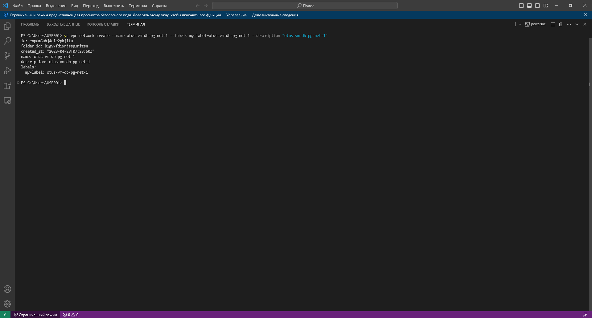

2. Создаю на Яндекс.Облако подсеть командой:

```bash
yc vpc subnet create --name otus-vm-db-pg-subnet-1 --zone ru-central1-a --range 10.1.2.0/24 --network-name otus-vm-db-pg-net-1 --description "otus-vm-db-pg-subnet-1"
```

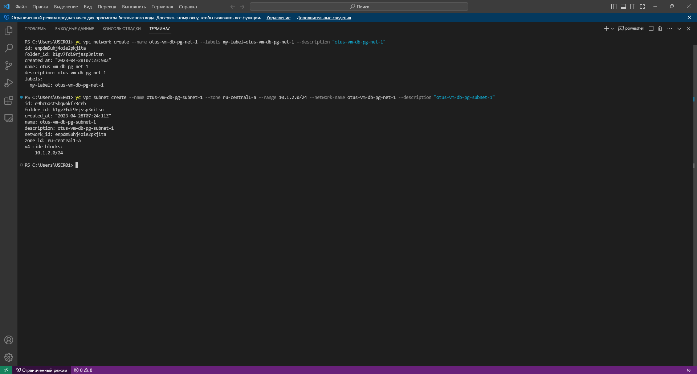

3. Создаю ВМ на Яндекс.Облако с заданными параметрами и подставляю ssh-ключ в метаданные ВМ (После создания ВМ данные об ip-адресе содержатся блоке `one_to_one_nat`. Так, же информацию о ВМ можно вывести командой: `yc compute instance get otus-pg-on-ubuntu`):

```bash
yc compute instance create otus-pg-on-ubuntu --zone ru-central1-a --network-interface subnet-name=otus-vm-db-pg-subnet-1,nat-ip-version=ipv4 --preemptible --platform standard-v3 --cores 4 --core-fraction 20 --memory 4GB --create-boot-disk image-folder-id=standard-images,image-family=ubuntu-2204-lts --ssh-key "C:\Users\USER01/.ssh/id_ed25519.pub"
```

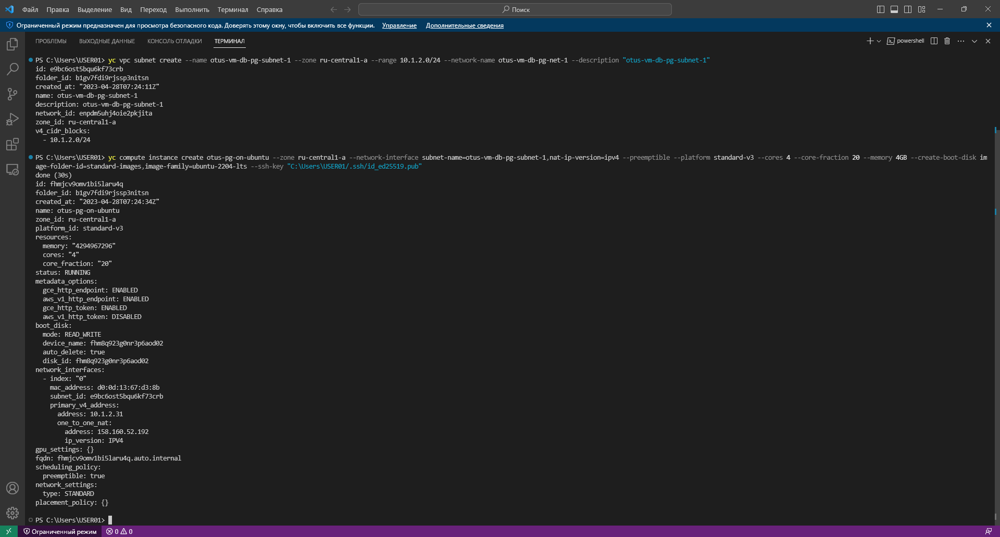

4. Подключаюсь к ВМ по ssh командой:

```bash
ssh yc-user@158.160.52.192
```

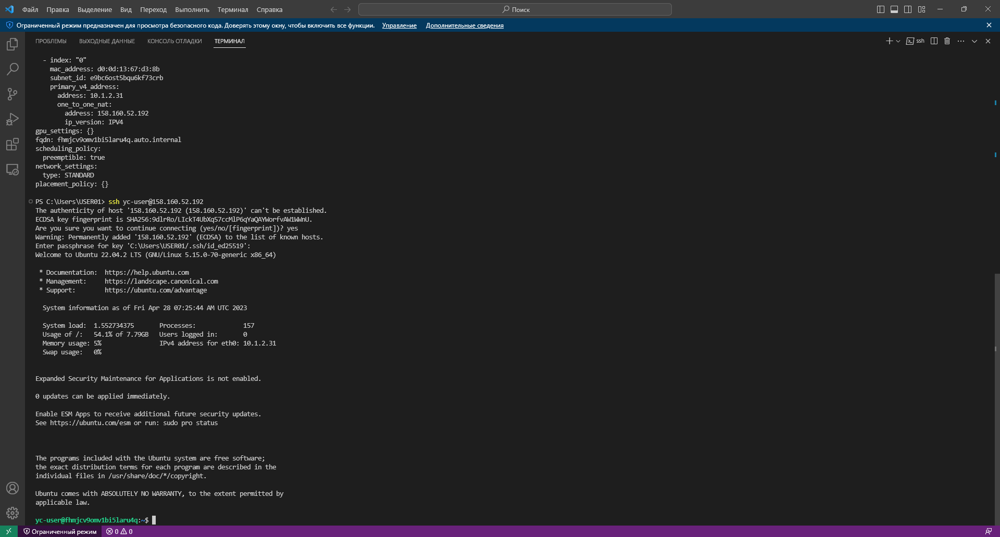

## Часть 2: Установка PostgreSQL 14

1. Устанавливаю PostgreSQL 14 командой:

```bash
sudo apt update && sudo DEBIAN_FRONTEND=noninteractive apt upgrade -y -q && sudo sh -c 'echo "deb http://apt.postgresql.org/pub/repos/apt $(lsb_release -cs)-pgdg main" > /etc/apt/sources.list.d/pgdg.list' && wget --quiet -O - https://www.postgresql.org/media/keys/ACCC4CF8.asc | sudo apt-key add - && sudo apt-get update && sudo DEBIAN_FRONTEND=noninteractive apt -y install postgresql-14
```

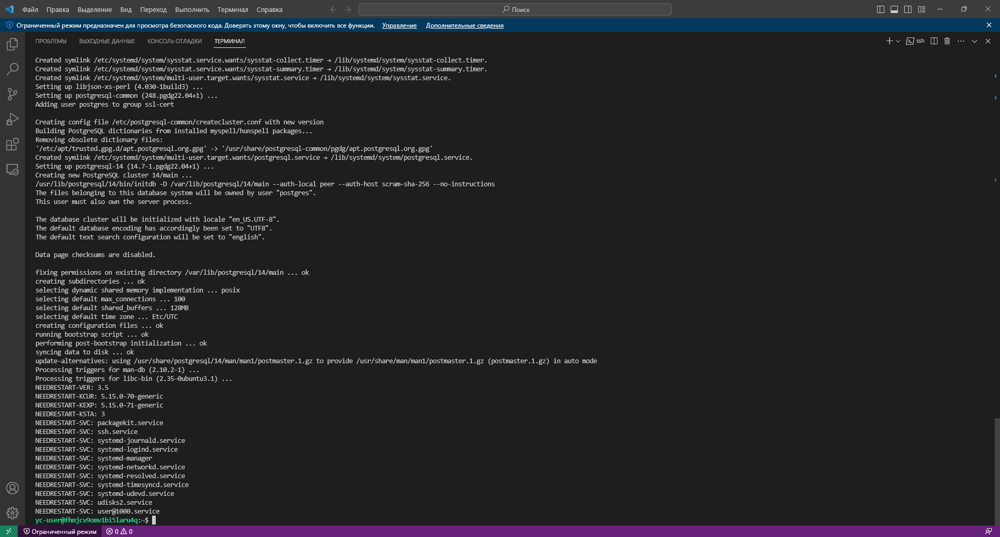

2. Проверяю то, что кластер запущен:

```bash
sudo -u postgres pg_lsclusters
```

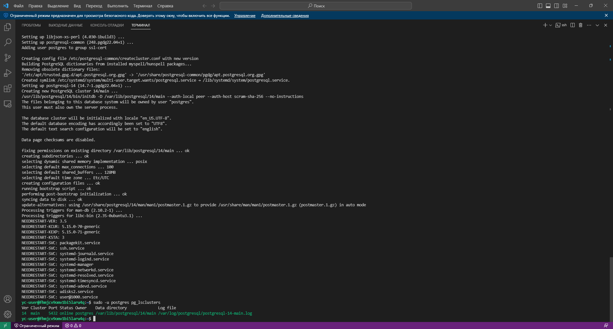

3. Захожу из под пользователя postgres в psql командой:

```bash
sudo -u postgres psql
```

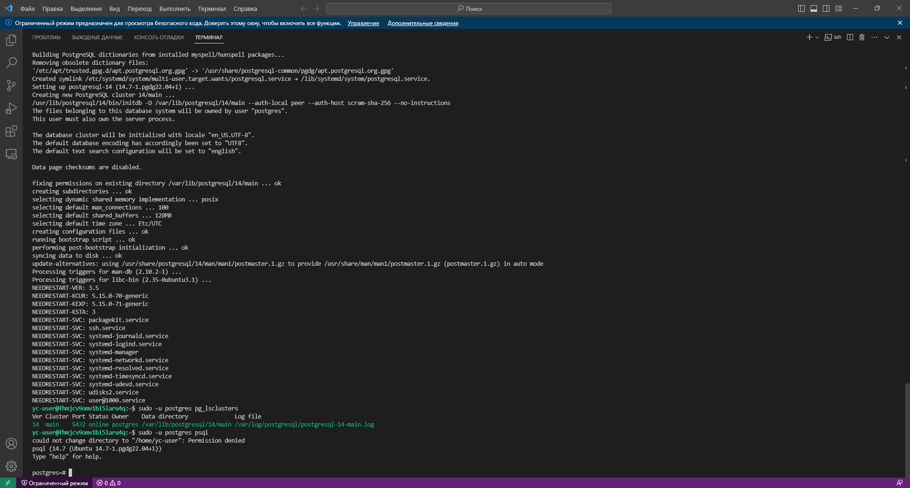

4. Создаю новую БД testdb:

```sql
postgres=# create database testdb;
```

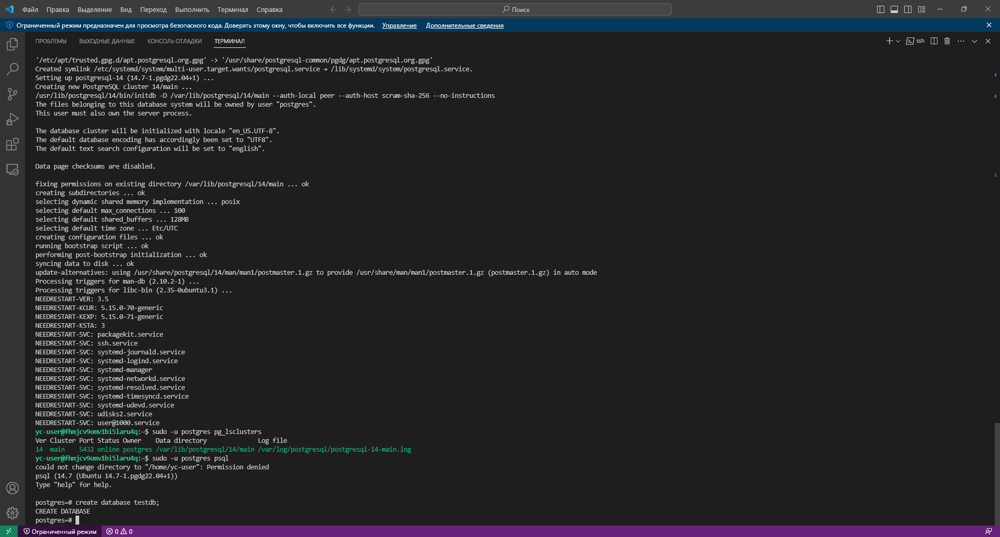

5. Захожу в созданную базу данных под пользователем `postgres` и создаю в ней новую схему `testnm`:

```sql
postgres=# \c testdb;
testdb=# create schema testnm;
```

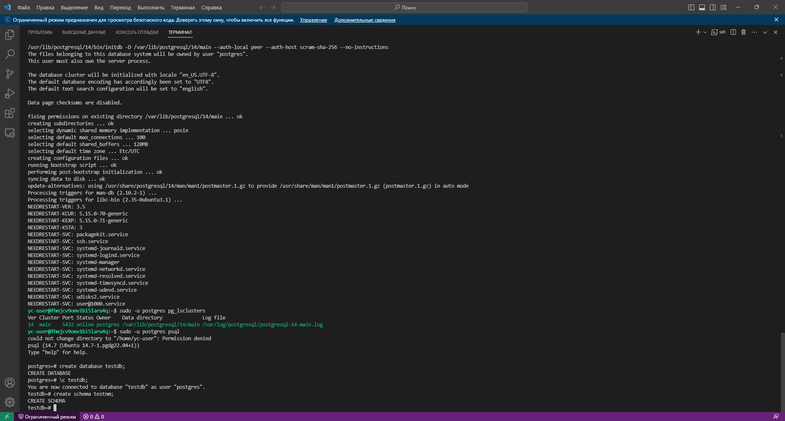

6. Создаю новую таблицу `t1` с одной колонкой `c1` типа `integer` и вставляю в неё строку со значением `c1=1`:

```sql
testdb=# create table t1(c1 int); insert into t1(c1) values(1);
```

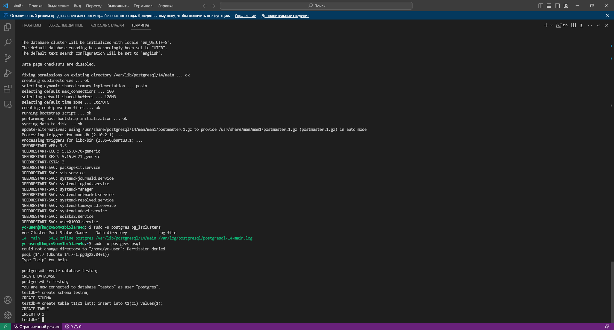

7. Создаю новую роль `readonly` (команды `create user` и `create role` равнозначны, отличие в том, что для команды `create user` по-умолчанию подразумевается `login`, а для команды `create role` - `nologin`). Даю новой роли право на подключение к базе данных `testdb`, право на использование схемы `testnm` (`usage` разрешает доступ к объектам, содержащимся в указанной схеме, при условии, что собственные требования к привилегиям объектов также выполняются. По сути, это позволяет получателю гранта «искать» объекты в схеме.), право на `select` для всех таблиц схемы `testnm`:

```sql
testdb=# create role readonly; grant connect on database testdb to readonly; grant usage on schema testnm to readonly; grant select on all tables in schema testnm to readonly;
```

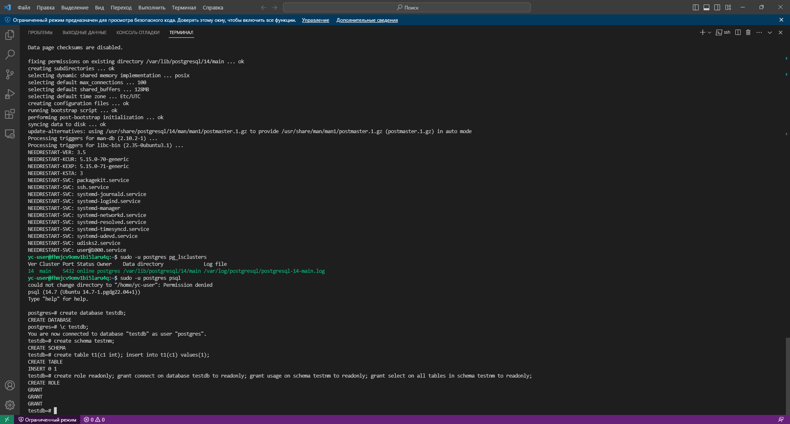

8. Создаю пользователя `testread` с паролем `test123` и даю роль `readonly` пользователю `testread`, после чего выхожу из под пользователя `postgres`:

```sql
testdb=# create user testread password 'test123'; grant readonly to testread;
testdb=# \q
```

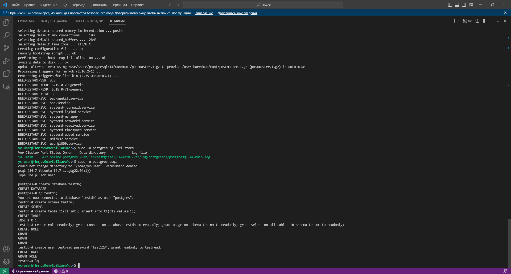

9. Захожу под пользователем `testread` в базу данных `testdb` и делаю выборку из таблицы `t1`:

```bash
psql -U testread -d testdb -h localhost
```

```sql
testdb=> select * from t1;
```

> **Результат:** выборка из таблицы не получилась, т.к. таблица `t1` создалась в первой схеме по-умолчанию, т.к. схема `testnm` не была указана явно, таблица `t1` была расположена в схеме `public`, а её владелец - пользователь `postgres` (в какой схеме находится таблица можно проверить, используя команду `\dt`).

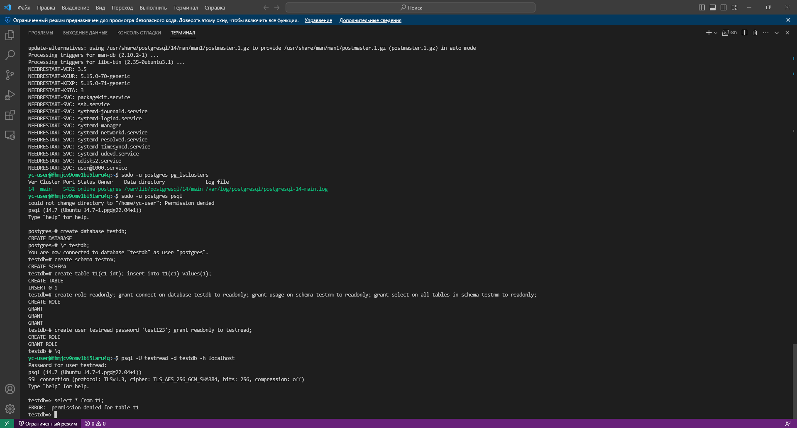

10. Выхожу из под пользователя testread и снова захожу в БД под пользователем `postgres`, после чего удаляю таблицу `t1` и пересоздаю её с явным указанием схемы `testnm`, затем заполняю таблицу данными и далее выхожу из под пользователя `postgres`:

```sql
testdb=> \q
```

```bash
sudo -u postgres psql
```

```sql
postgres=# \c testdb;
testdb=# drop table t1; create table testnm.t1(c1 int); insert into testnm.t1(c1) values(1);
testdb=# \q
```

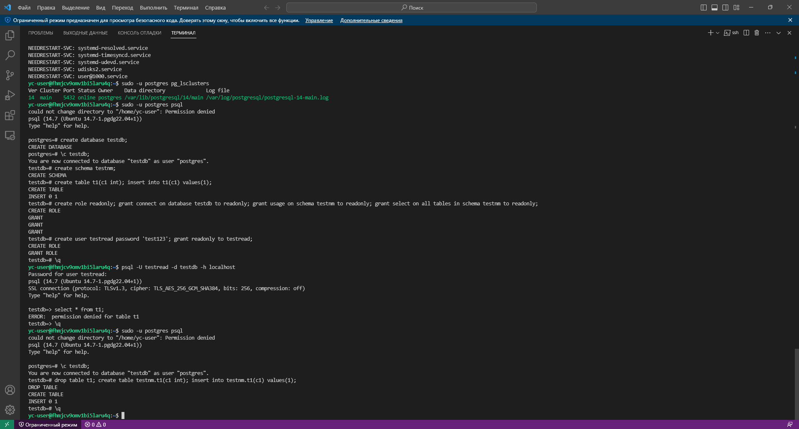

11. Снова захожу под пользователем `testread` и выбираю данные из таблицы `t1`:

```bash
psql -U testread -d testdb -h localhost
```

```sql
testdb=> select * from testnm.t1;
```

> **Результат:** снова не получилось, потому что PostgreSQL таблицы создаются с правами доступа только для пользователя, под которым они созданы, а таблица была создана пользователем `postgres`.

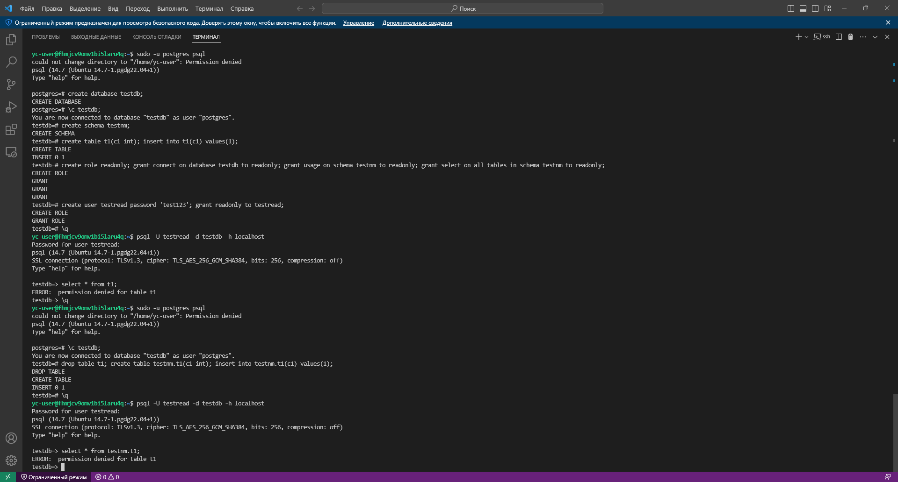

12. Выхожу из под пользователя `testread`, захожу под пользователем `postgres`, даю права на `select` для роли `readonly` и выхожу из под пользователя `postgres`:

```sql
testdb=> \q
```

```bash
sudo -u postgres psql
```

```sql
postgres=# \c testdb;
testdb=# grant select on all tables in schema testnm to readonly;
testdb=# \q
```

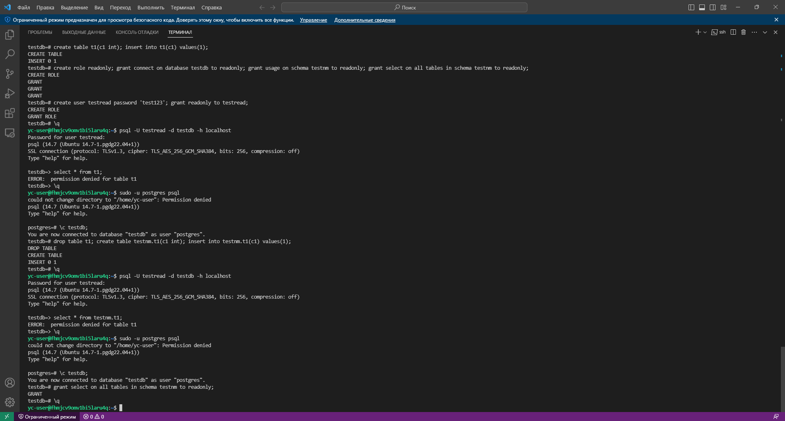

13. Снова захожу из под пользователя `testread`, затем выбираю данные из таблицы:

```bash
psql -U testread -d testdb -h localhost
```

```sql
testdb=> select * from testnm.t1;
```

> **Результат:** в этот раз данные выбрались. Чтобы избежать такого в будущем, необходимо создавать таблицы тем пользователем, под которым планируется работа с данными таблицами.

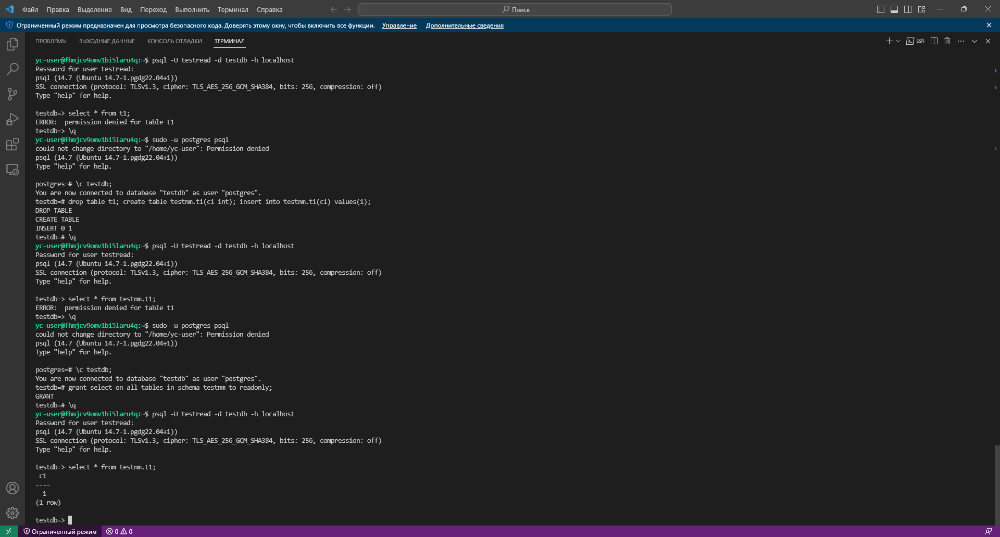

14. Выполняю команду:

```sql
testdb=> create table t2(c1 integer); insert into t2 values (2);
```

> **Результат:** таблица создалась и была заполнена данными. Это происходит из-за того, что существует групповая роль `public` (которая явно не определена) и в эту роль включены все остальные роли, что приводит к тому, что все роли по умолчанию будут иметь привилегии наследуемые от `public`. Соответственно, требуется отобрать права на схему `public` у роли `public`.

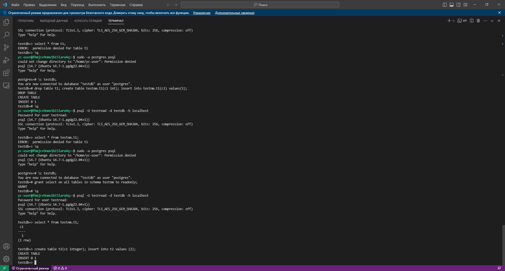

15. Выхожу из под пользователя `testread`, вхожу под postgres и отбираю все права у роли `public` на схему `public` и выхожу из под пользователя `postgres`:

```sql
testdb=> \q
```

```bash
sudo -u postgres psql
```

```sql
postgres=# \c testdb;
testdb=# revoke all on schema public from public;
testdb=# \q
```

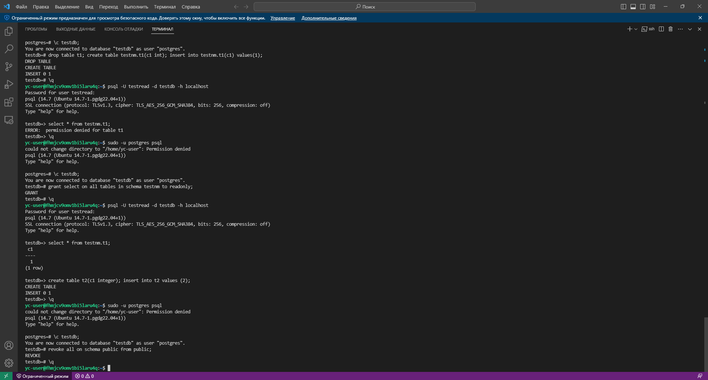

16. Выхожу из под пользователя `postgres`, захожу под `testread` и пытаюсь создать таблицу (и на всякий случай проверил возможность явного создания таблиц и их наполнения в схеме `public`):

```bash
psql -U testread -d testdb -h localhost
```

```sql
testdb=> create table t3(c1 integer); insert into t2 values (2);
testdb=> create table public.t3(c1 integer); insert into public.t2 values (2);
```

> **!ВОПРОС!** Всё-таки ещё немного плаваю в теме ролей и прав, но мне не очень понятен один момент: я пробовал отобрать права на схему `public` для пользователя `readonly` (`revoke all on schema public from readonly;`) и даже у самого пользователя `testread` (`revoke all on schema public from testread;`), но ничего не получилось - пользователь `testread` по-прежнему имел права для создания таблиц и их наполнения в схеме `public`. Как видно выше, сработал только вариант с отбором прав на схему `public` у роли `public`. Я не понимаю почему.

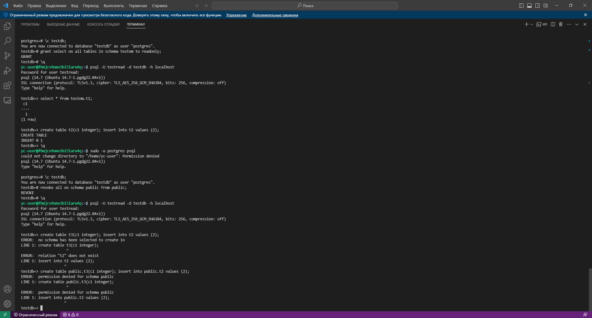