# Урок 8: Настройка autovacuum с учетом особеностей производительности

## Часть 1: Подготовка ВМ

> **Примечание:** ssh-ключ был создан ранее, поэтому новый не гененрирую

1. Создаю на Яндекс.Облако сеть командой:

```bash
yc vpc network create --name otus-vm-db-pg-net-1 --labels my-label=otus-vm-db-pg-net-1 --description "otus-vm-db-pg-net-1"
```

2 Создаю на Яндекс.Облако подсеть командой:

```bash
yc vpc subnet create --name otus-vm-db-pg-subnet-1 --zone ru-central1-a --range 10.1.2.0/24 --network-name otus-vm-db-pg-net-1 --description "otus-vm-db-pg-subnet-1"
```

3. Создать инстанс ВМ с 2 ядрами и 4 Гб ОЗУ и SSD 10GB и подставляю ssh-ключ в метаданные ВМ:

```bash
yc compute instance create otus-pg-on-ubuntu --zone ru-central1-a --network-interface subnet-name=otus-vm-db-pg-subnet-1,nat-ip-version=ipv4 --preemptible --platform standard-v3 --cores 2 --core-fraction 20 --memory 4GB --create-boot-disk type=network-ssd,size=10GB,image-folder-id=standard-images,image-family=ubuntu-2204-lts --ssh-key "C:\Users\USER01/.ssh/id_ed25519.pub"  
```

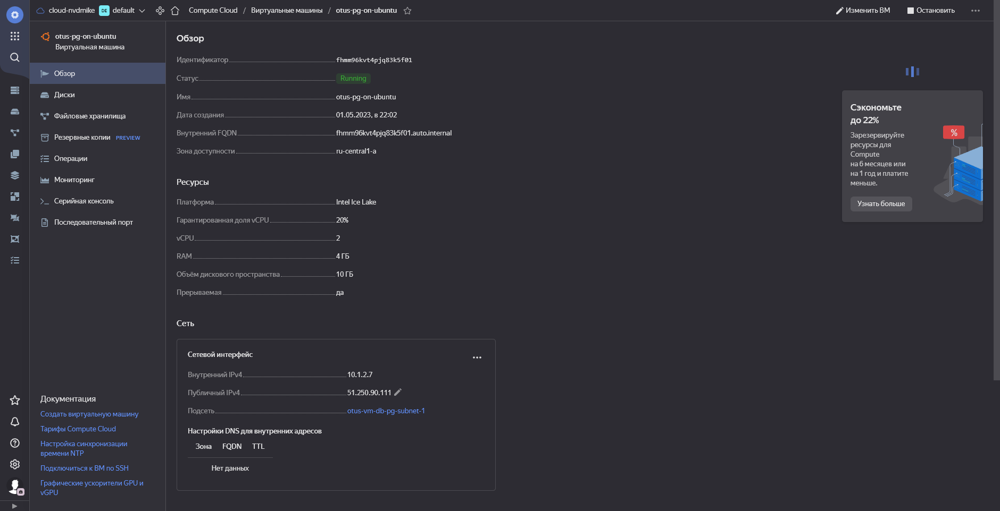

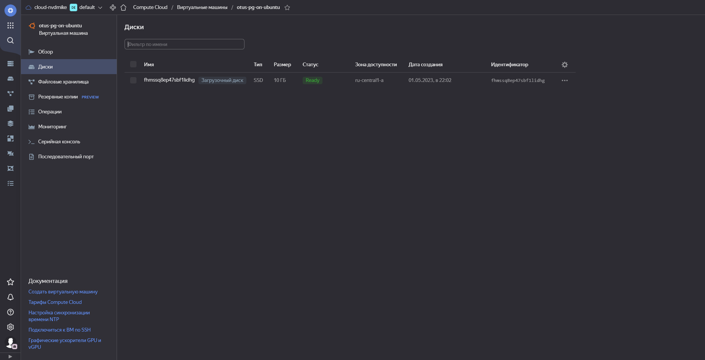

## Часть 2: Работа с ВМ

1. Подключаюсь к ВМ по ssh командой:

```bash
ssh yc-user@51.250.90.111
```

2. Устанавливаю на него PostgreSQL 15 с дефолтными настройками:

```bash
sudo apt update && sudo DEBIAN_FRONTEND=noninteractive apt upgrade -y -q && sudo sh -c 'echo "deb http://apt.postgresql.org/pub/repos/apt $(lsb_release -cs)-pgdg main" > /etc/apt/sources.list.d/pgdg.list' && wget --quiet -O - https://www.postgresql.org/media/keys/ACCC4CF8.asc | sudo apt-key add - && sudo apt-get update && sudo DEBIAN_FRONTEND=noninteractive apt -y install postgresql-15
```

3. Перехожу в пользователя postgres:

```bash
sudo su postgres
```

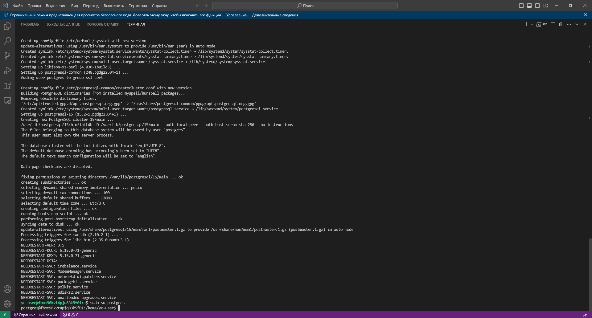

4. Далее, я использую утилиту `pgbench` для тестирования быстродействия конфигурации кластера. Перед началом теста, необходимо запустить данную утилиту с ключом `-i`, чтобы утилита выполнила инициализацию, т.е. в данном случае в выбранной БД будут созданы четыре таблицы `pgbench_accounts`, `pgbench_branches`, `pgbench_history` и `pgbench_tellers`, на которых и будет проводиться тестирование:

```bash
pgbench -i postgres
```

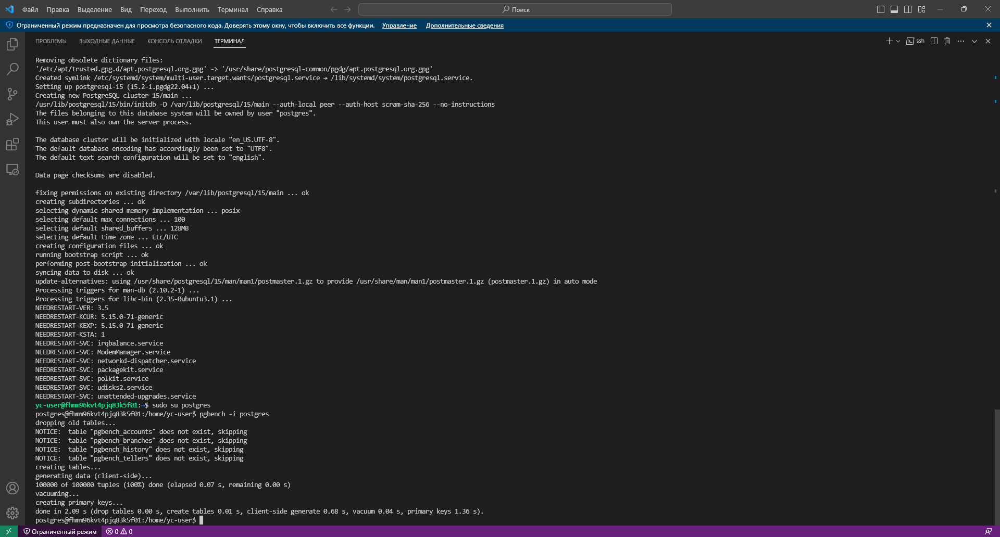

5. Выполняю тестирование:

```bash
pgbench -c8 -P 6 -T 60 -U postgres postgres
```

```bash
-c - число имитируемых клиентов, то есть число одновременных сеансов базы данных (в данном случае 8 клиентов).
-P - выводить отчёт о прогрессе через заданное число секунд (в данном случае каждые 6 секунд).
-T - выполнять тест с ограничением по времени (в секундах), а не по числу транзакций для каждого клиента (60 секунд).
-U - под пользователем postgres
в конце указывается БД, на которой проводится тестирование
```

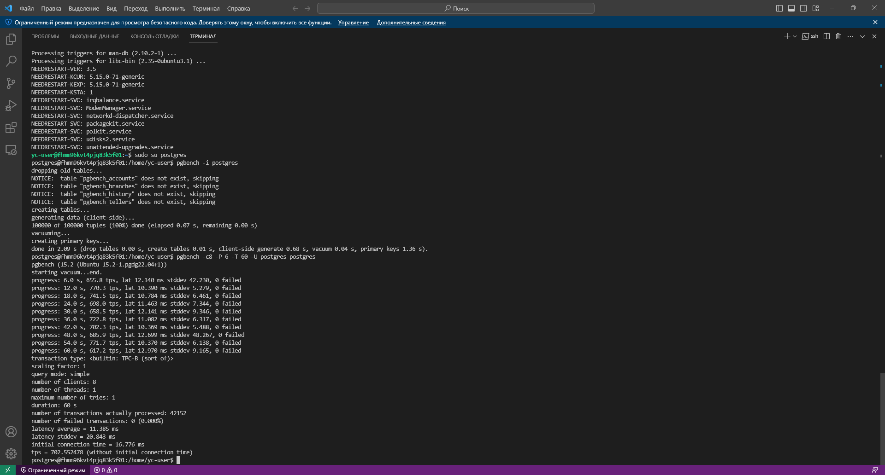

6. Перехожу под обычного пользователя и модифицирую конфигурационный файл с учётом тех настроек, которые были приложены к ДЗ:

```bash
sudo nano /etc/postgresql/15/main/postgresql.conf
```

```bash
* max_connections = 40			#Определяет максимальное число одновременных подключений к серверу БД.
* shared_buffers = 1GB			#Задаёт объём памяти, который будет использовать сервер баз данных для буферов в разделяемой памяти.
* work_mem = 6553kB			#Задаёт объём памяти, который будет использоваться для внутренних операций сортировки и хеш-таблиц, прежде чем будут задействованы временные файлы на диске.
* maintenance_work_mem = 512MB		#Задаёт максимальный объём памяти для операций обслуживания БД, в частности VACUUM, CREATE INDEX и ALTER TABLE ADD FOREIGN KEY.
* effective_io_concurrency = 2		#Задаёт допустимое число параллельных операций ввода/вывода, которое говорит PostgreSQL о том, сколько операций ввода/вывода могут быть выполнены одновременно.
* wal_buffers = 16MB			#Задаёт объём разделяемой памяти, который будет использоваться для буферизации данных WAL, ещё не записанных на диск.
* checkpoint_completion_target = 0.9	#Задаёт целевое время для завершения процедуры контрольной точки, как коэффициент для общего времени между контрольными точками.
* max_wal_size = 16GB			#Задаёт максимальный размер, до которого может вырастать WAL между автоматическими контрольными точками в WAL.
* min_wal_size = 4GB			#Пока WAL занимает на диске меньше этого объёма, старые файлы WAL в контрольных точках всегда перерабатываются, а не удаляются.
* random_page_cost = 4			#Задаёт приблизительную стоимость чтения одной произвольной страницы с диска.
* effective_cache_size = 3GB		#Определяет представление планировщика об эффективном размере дискового кеша, доступном для одного запроса.
* default_statistics_target = 500	#Устанавливает значение ориентира статистики по умолчанию, распространяющееся на столбцы, для которых командой ALTER TABLE SET STATISTICS не заданы отдельные ограничения.
```

7. Перезапускаю кластер и заново запускаю тестирование:

```bash
sudo pg_ctlcluster 15 main restart
sudo su postgres
pgbench -c8 -P 6 -T 60 -U postgres postgres
```
  
> **Результат:** можно заметить, что с новыми настройками количество быстродействие (TPS - transactions per second/количество транзакций в секунду) увеличилось с 702.552478 до 717.964345. Возможно более оптимальные настройки кластера привели к увеличению его производительности, но особой разницы я не заметил.

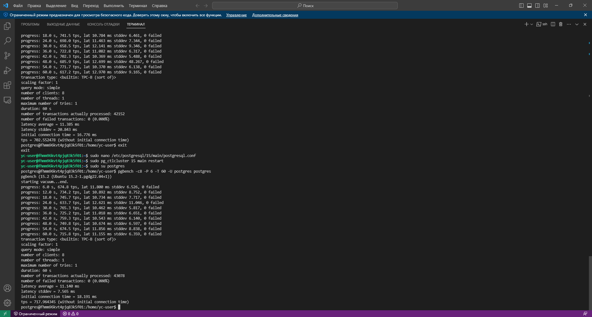

8. Вхожу в psql, создаю таблицу с текстовым полем и заполняю таблицу случайно сгенерированными значениями в размере 1млн строк и смотрю размер получившейся таблицы:

```bash
psql
```

```sql
postgres=# create table t1(c1 char(100));
postgres=# insert into t1(c1) select 'text' from generate_series(1, 1000000);
postgres=# select pg_size_pretty(pg_total_relation_size('t1'));
```

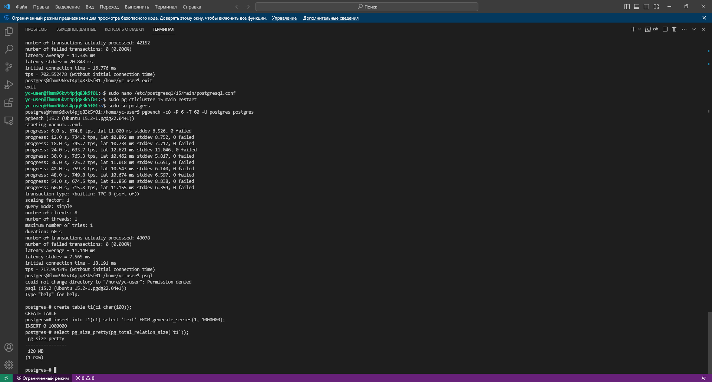

9. Обновлняю 5 раз все строки (добавляя к строкам новый символ), затем смотрю количество мёртвых строк и смотрю когда последний раз выполнялся автовакуум:

```sql
postgres=# update t1 set c1='texta'; update t1 set c1='textb'; update t1 set c1='textc'; update t1 set c1='textd'; update t1 set c1='texte';
postgres=# select relname, n_live_tup, n_dead_tup, trunc(100*n_dead_tup/(n_live_tup+1))::float "ratio%", last_autovacuum from pg_stat_user_tables where relname = 't1';
postgres=# select * from pg_stat_activity where query ~ 'autovacuum' \gx
```

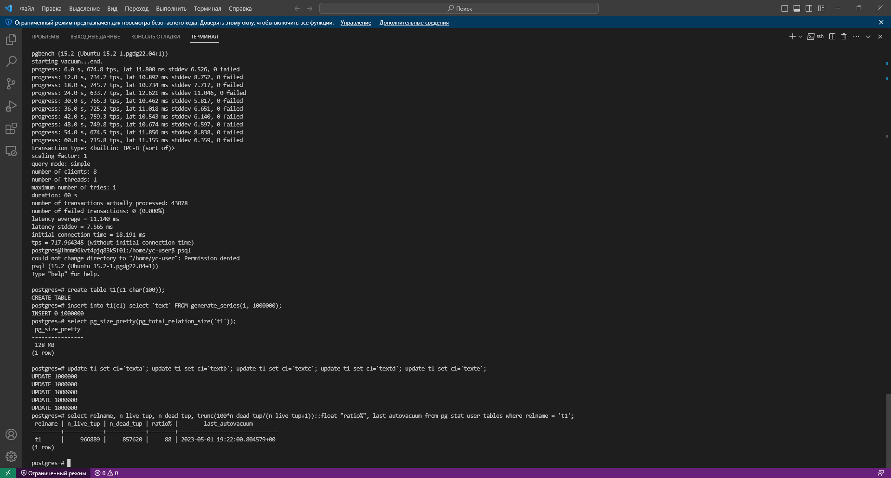

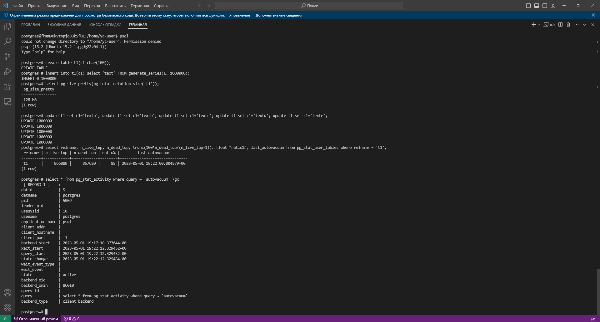

10. Обновлняю 5 раз все строки (добавляя к строкам новый символ) и смотрю размер таблицы:

```sql
postgres=# update t1 set c1='textf'; update t1 set c1='textg'; update t1 set c1='texth'; update t1 set c1='texti'; update t1 set c1='textj';
postgres=# select pg_size_pretty(pg_total_relation_size('t1'));
```

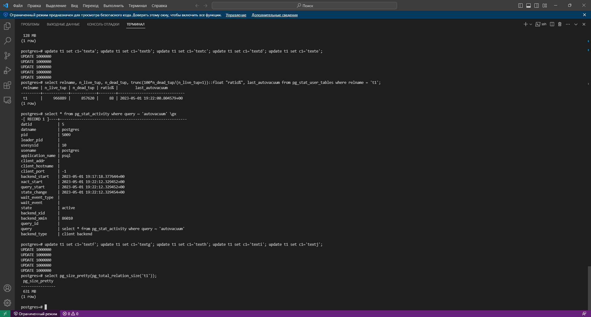

11. Отключаю автовакуум на таблице `t1`, затем 10 раз обновляю все строки (добавляя к строкам новый символ) и смотрю размер файла с таблицей (в финале включаю автовакуум):

```sql
postgres=# alter table t1 set (autovacuum_enabled = off);
postgres=# update t1 set c1='textk'; update t1 set c1='textl'; update t1 set c1='textm'; update t1 set c1='textn'; update t1 set c1='texto'; update t1 set c1='textp'; update t1 set c1='textq'; update t1 set c1='textr'; update t1 set c1='texts'; update t1 set c1='textt';
postgres=# select pg_size_pretty(pg_total_relation_size('t1'));
```

> **Результат:** автовакуум не уменьшает размер таблицы, после очищения мёртвых строк (т.е. как бы происходит резервирования места для таблицы), поэтому после первого обновления мы получили размер таблицы 613Mb, после повтороного обновления, этот размер увеличился с учётом того, что данные были обновлены ещё 10 раз. Отключение автовакуума приводит не только к увеличению размера таблицы, но и к тому, что мёртвые строки не вычищаются. Проблему с размером таблицы можно решить используя `vacuum full`.

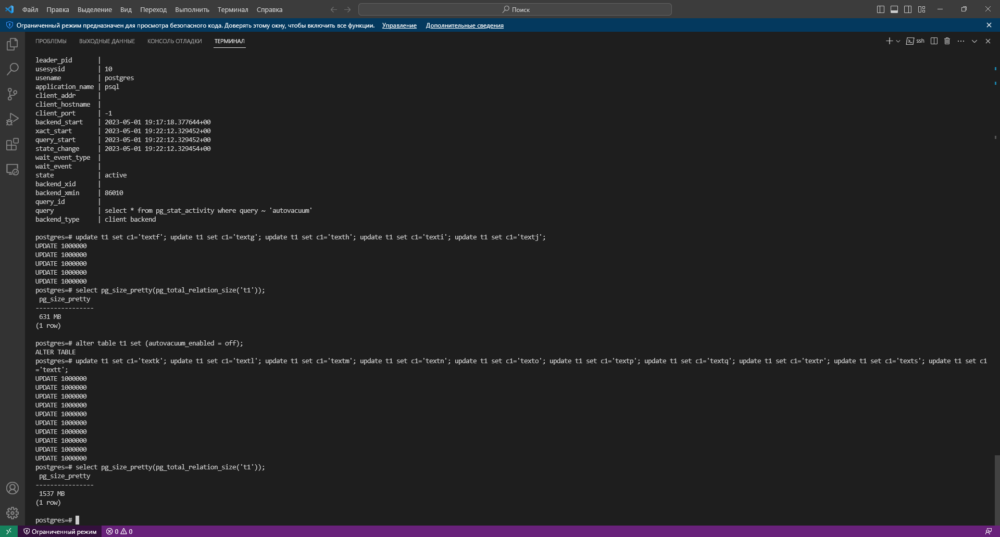

```sql
postgres=# select relname, n_live_tup, n_dead_tup, trunc(100*n_dead_tup/(n_live_tup+1))::float "ratio%", last_autovacuum from pg_stat_user_tables where relname = 't1';
```

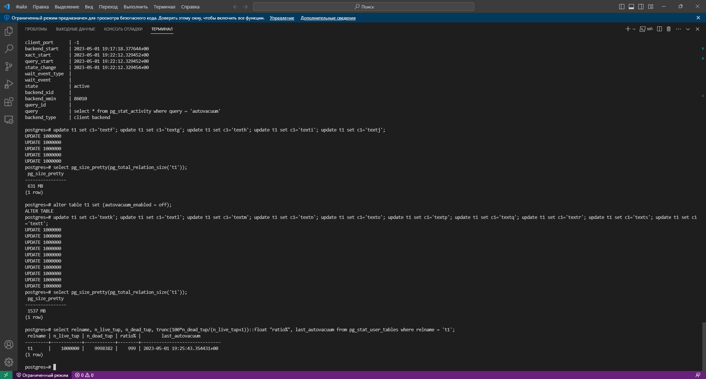

```sql
postgres=# alter table t1 set (autovacuum_enabled = on);
```

## Часть 3: Задание со звездочкой *

1. Анонимная процедура, в которой в цикле 10 раз обновятся все строки в искомой таблице с выводом номера шага цикла:

```sql
do $$
begin
  for cnt in 1..10 loop
    update t1 set c1 = 'text' || cnt;
	commit;
    raise notice 'UPDATE%', cnt;
   end loop;
end; $$;
```