# Урок 9: Механизм блокировок

> **Примечание:** Посчитал, что оформление ДЗ у меня было довольно убогим и плохо читаемым, поэтому почитал ещё немного про синтаксис Markdown и решил немного "проапгрейдить" домашки. В том числе отредактировал старые ДЗ, чтобы они тоже были более читаемыми:
> 
> [Урок 2: Работа с уровнями изоляции транзакции в PostgreSQL](https://github.com/nvdmike/OTUSPostgreSQL/blob/main/Lesson02/Lesson02.md "Урок 2: Работа с уровнями изоляции транзакции в PostgreSQL")
> 
> [Урок 3: Установка и настройка PostgteSQL в контейнере Docker](https://github.com/nvdmike/OTUSPostgreSQL/blob/main/Lesson03/Lesson03.md "Урок 3: Установка и настройка PostgteSQL в контейнере Docker")
> 
> [Урок 6: Установка и настройка PostgreSQL](https://github.com/nvdmike/OTUSPostgreSQL/blob/main/Lesson06/Lesson06.md "Урок 6: Установка и настройка PostgreSQL")
> 
> [Урок 7: Работа с базами данных, пользователями и правами](https://github.com/nvdmike/OTUSPostgreSQL/blob/main/Lesson07/Lesson07.md "Урок 7: Работа с базами данных, пользователями и правами")
> 
> [Урок 8: Настройка autovacuum с учетом особеностей производительности](https://github.com/nvdmike/OTUSPostgreSQL/blob/main/Lesson08/Lesson08.md "Урок 8: Настройка autovacuum с учетом особеностей производительности")

## Часть 1: Подготовка ВМ

> **Примечание:** ssh-ключ был создан ранее, поэтому новый не гененрирую

1. Создаю на Яндекс.Облако сеть командой:

```bash
yc vpc network create --name otus-vm-db-pg-net-1 --labels my-label=otus-vm-db-pg-net-1 --description "otus-vm-db-pg-net-1"
```

2 Создаю на Яндекс.Облако подсеть командой:

```bash
yc vpc subnet create --name otus-vm-db-pg-subnet-1 --zone ru-central1-a --range 10.1.2.0/24 --network-name otus-vm-db-pg-net-1 --description "otus-vm-db-pg-subnet-1"
```

3. Создать инстанс ВМ с 2 ядрами и 4 Гб ОЗУ и SSD 10GB и подставляю ssh-ключ в метаданные ВМ:

```bash
yc compute instance create otus-pg-on-ubuntu --zone ru-central1-a --network-interface subnet-name=otus-vm-db-pg-subnet-1,nat-ip-version=ipv4 --preemptible --platform standard-v3 --cores 2 --core-fraction 20 --memory 4GB --create-boot-disk type=network-ssd,size=10GB,image-folder-id=standard-images,image-family=ubuntu-2204-lts --ssh-key "C:\Users\USER01/.ssh/id_ed25519.pub"  
```

4. Подключаюсь к ВМ по ssh командой:

```bash
ssh yc-user@51.250.76.131
```

5. Устанавливаю на него PostgreSQL 14 :

```bash
sudo apt update && sudo DEBIAN_FRONTEND=noninteractive apt upgrade -y -q && sudo sh -c 'echo "deb http://apt.postgresql.org/pub/repos/apt $(lsb_release -cs)-pgdg main" > /etc/apt/sources.list.d/pgdg.list' && wget --quiet -O - https://www.postgresql.org/media/keys/ACCC4CF8.asc | sudo apt-key add - && sudo apt-get update && sudo DEBIAN_FRONTEND=noninteractive apt -y install postgresql-14
```

1. Захожу под пользователем `postgres`:

```bash
sudo -u postgres psql
```

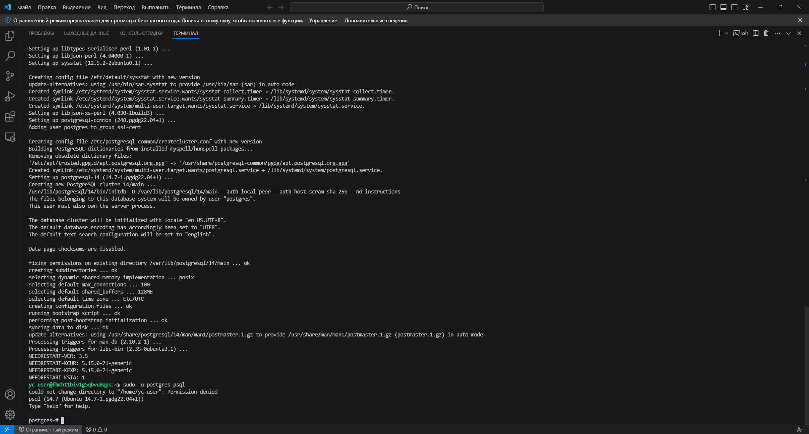

## Часть 2: Настройте сервер так, чтобы в журнал сообщений сбрасывалась информация о блокировках, удерживаемых более 200 миллисекунд. Воспроизведите ситуацию, при которой в журнале появятся такие сообщения.

1. Для настройки сервера таким образом, чтобы в журнал сообщений сбрасывалась информация о блокировках, удерживаемых более 200 миллисекунд, изменяю параметр `deadlock_timeout` на 200 (в миллисекундах) и устанавливаю параметр `log_lock_waits = on`. Для того, чтобы в журнал попадала информация об ожидании больше, чем установлено в параметре `deadlock_timeout`. Для того, чтобы изменения применились, использую команду `pg_reload_conf`, которая отправляет сигнал SIGHUP главному серверному процессу, чтобы он "скомандовал" всем подчинённым процессам перезагрузить файлы конфигурации:

```sql
postgres=# alter system set deadlock_timeout to 200;
postgres=# alter system set log_lock_waits = on;
postgres=# select pg_reload_conf();
```

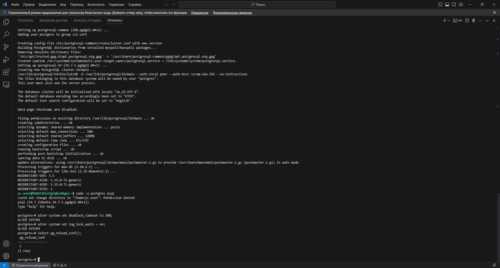

2. Смотрю, что заданные мною параметры применились:

```sql
postgres=# show log_lock_waits;
postgres=# show deadlock_timeout;
```

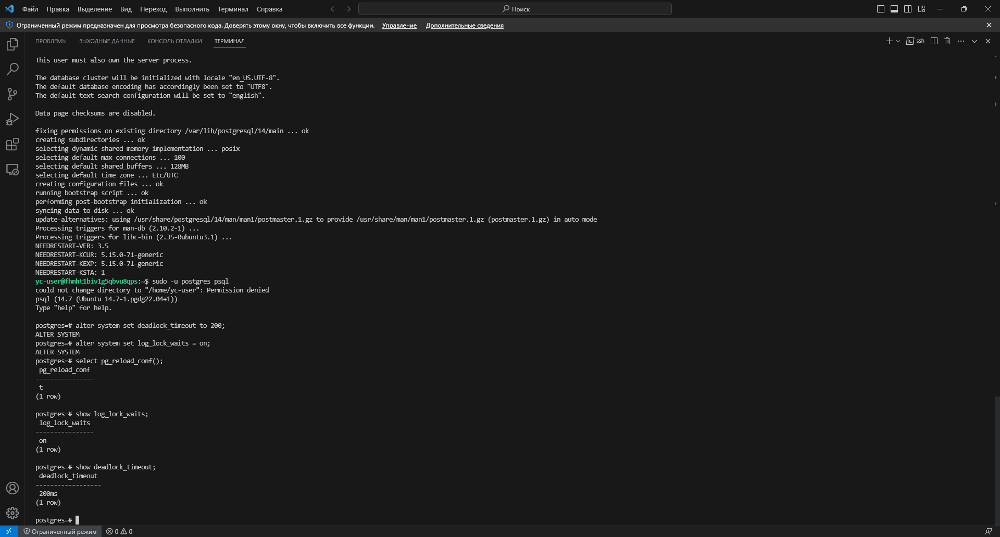

3. Создаю таблицу и заполняю её данными:

```sql
postgres=# create table test(
  t_id integer primary key,
  t_text text
);
insert into test values (1, 'Какой-то тестовый текст №1'), (2, 'Какой-то тестовый текст №2');
```

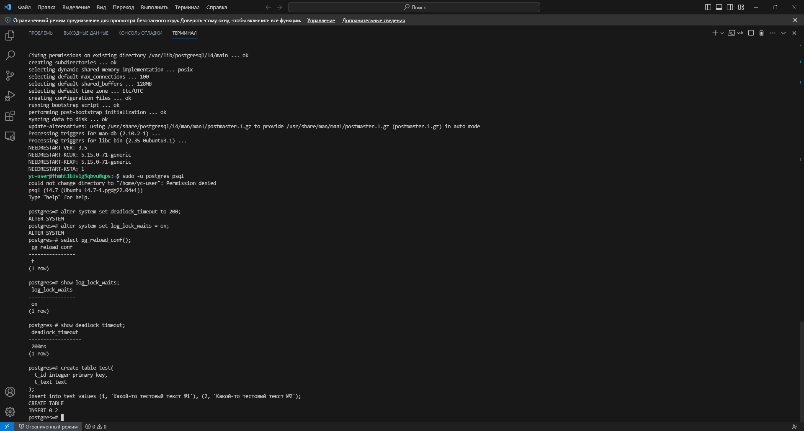

4. Запускаю одновременно два новых терминала (далее `терминал 1` и `терминал 2`; терминал, в котором проводились все предыдущие манипуляции, для удобства я далее буду называть `основной терминал`) и захожу в этих терминалах в psql.

5. Для начала, в обоих терминалах пытаюсь узнать идентификаторы их обслуживающих процессов, для чего я в обоих терминалах выполняю команду:

```sql
postgres=# select pg_backend_pid();
```

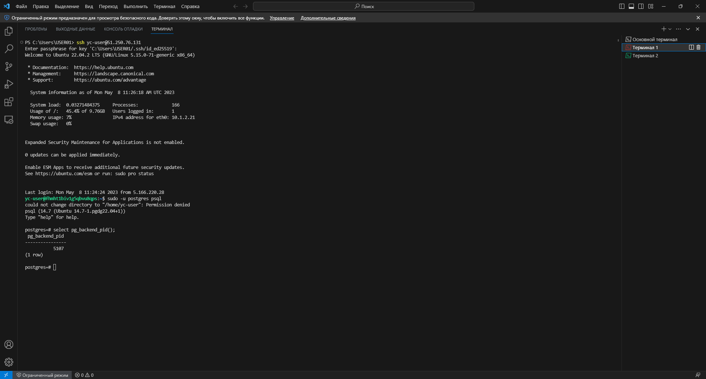

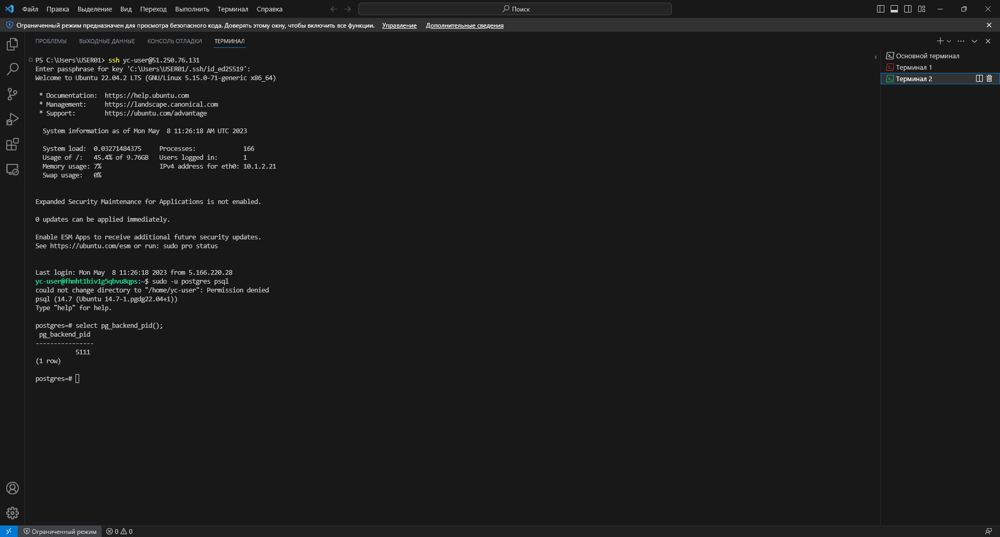

6. В `терминале 1` я запускаю команду, где происходит попытка изменить данные в таблице `test`, где условием является `t_id = 1` (при этом команды на завершение транзакции нет):

```sql
postgres=# begin;
update test set t_text = 'Изменения, которые внесены в терминале 1' where t_id = 1;
```

7. В `терминале 2` запускаю команду, где так же происходит попытка изменить данные в таблице `test` и условием является `t_id = 1` (при этом команда на завершение транзакции есть):

```sql
postgres=# begin;
update test set t_text = 'Изменения, которые внесены в терминале 2' where t_id = 1;
commit;
```

8. Далее, в `основном терминале` я смотрю последние 10 сообщений в журнале:

```bash
sudo tail -n 10 /var/log/postgresql/postgresql-14-main.log
```

> **Результат** (в логе показываю только то, что относится к блокировкам, полный вывод можно посмотреть на скриншоте):

```log
2023-05-08 11:27:56.022 UTC [5111] postgres@postgres LOG:  process 5111 still waiting for ShareLock on transaction 735 after 200.094 ms
2023-05-08 11:27:56.022 UTC [5111] postgres@postgres DETAIL:  Process holding the lock: 5107. Wait queue: 5111.
2023-05-08 11:27:56.022 UTC [5111] postgres@postgres CONTEXT:  while updating tuple (0,1) in relation "test"
2023-05-08 11:27:56.022 UTC [5111] postgres@postgres STATEMENT:  update test set t_text = 'Изменения, которые внесены в терминале 2' where t_id = 1;
```

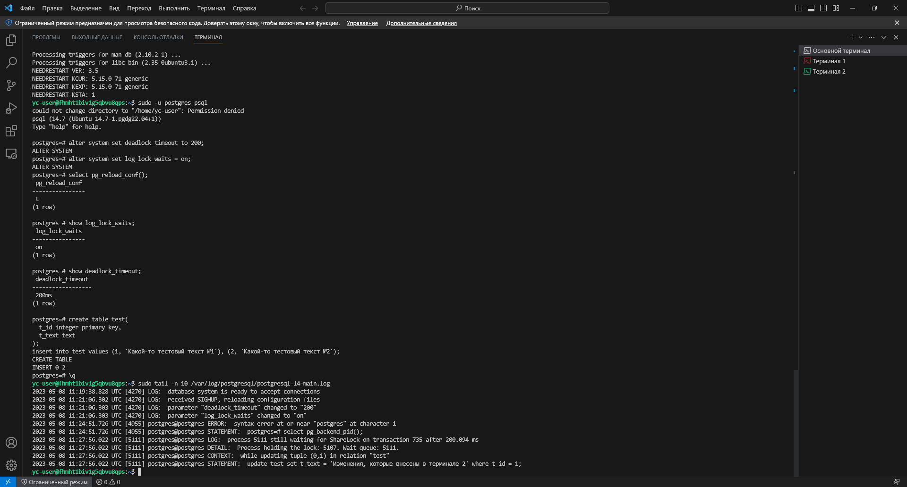

> Как видно, в журнал попала информация о блокировках, при ожидании более 200 миллисекунд.

## Часть 3: Смоделируйте ситуацию обновления одной и той же строки тремя командами UPDATE в разных сеансах. Изучите возникшие блокировки в представлении pg_locks и убедитесь, что все они понятны. Пришлите список блокировок и объясните, что значит каждая.

1. В `основном терминале` пересоздаю таблицу `test`:

```sql
postgres=# drop table test;
create table test(
  t_id integer primary key,
  t_text text
);
insert into test values (1, 'Какой-то тестовый текст №1'), (2, 'Какой-то тестовый текст №2');
```

2. Дополнительно запускаю ещё один экземпляр терминала (далее `терминал 3`) и захожу в нём в psql.

3. В новом запущеном терминале пытаюсь узнать идентификатор обслуживающего процесса (предыдущие идентификаторы мне уже известны, т.к. я уже выполнял эту команду ранее в `терминале 1` (`PID: 5107`) и `терминале 2` (`PID: 5111`)):

```sql
postgres=# select pg_backend_pid();
```

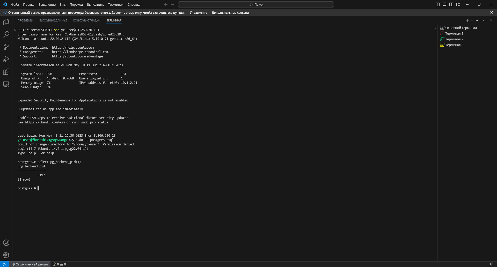

4. В каждом терминале выполняю команду (где, вместо `№` подставляю "номер" терминала, в котором выполняю команду):

```sql
postgres=# begin;
update test set t_text = 'Изменения, которые внесены в терминале №' where t_id = 1;
```

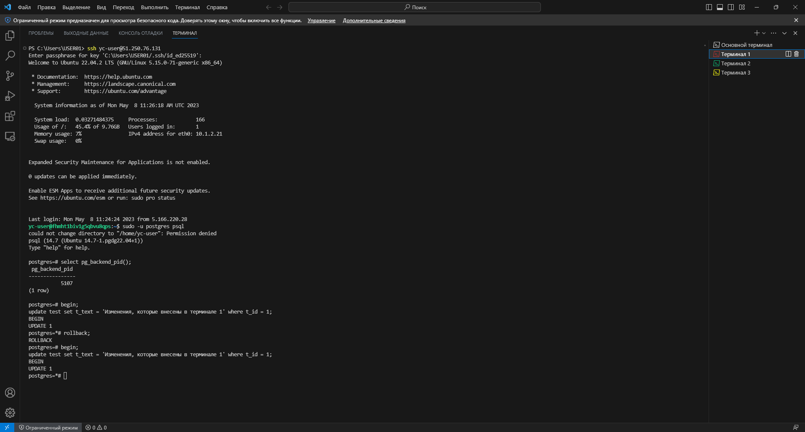

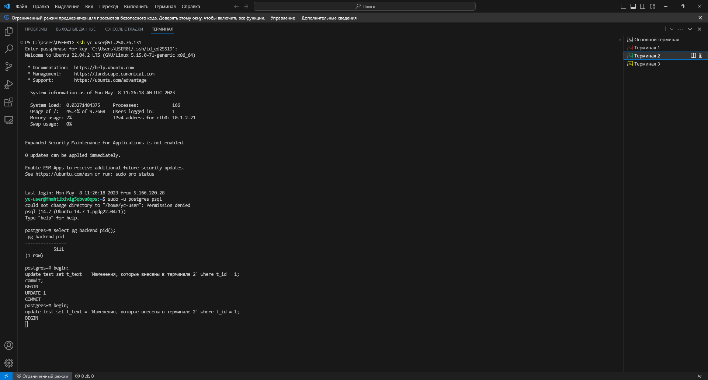

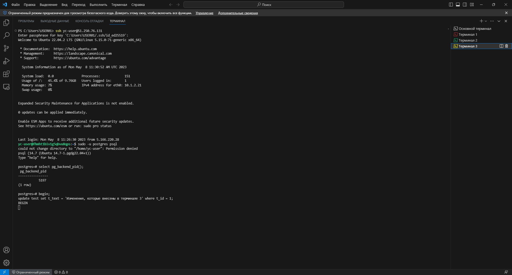

5. В `основном терминале` выполняю выборку из представления `pg_locks`:

```sql
postgres=# select locktype, mode, granted, pid, pg_blocking_pids(pid) AS wait_for from pg_locks where relation = 'test'::regclass;;
```

> **Результат:**

| locktype |       mode       | granted | pid  | wait_for |
| -------- | ---------------- | ------- | ---- |  ------- |
| relation | RowExclusiveLock | t       | 5107 | {}       |
| relation | RowExclusiveLock | t       | 5111 | {5107}   |
| relation | RowExclusiveLock | t       | 5197 | {5111}   |
| tuple    | ExclusiveLock    | f       | 5197 | {5111}   |
| tuple    | ExclusiveLock    | t       | 5111 | {5107}   |

(5 rows)

> Как видно из представленного выше выода представления `pg_locks`, при одновременном выполнении команды update одной и той же записи из трёх терминалов (при условии, что транзакция в терминале не была завершена), возникают эксклюзивные блокировки (`RowExclusiveLock`) той строки, изменение которой производится. Если посмотреть вывод представления, то видно, что:
> - транзакция `5107` находится в подвешенном состоянии (нет команды завершения транзакции), но в поле `wait_for` (данное поле показывает блокирующий процесс - `pg_blocking_pids(pid)`) пусто;
> - транзакция `5111` ожидает окончания выполнения транзакции `5107`;
> - транзакция `5197`, в свою очередь, ожидает выполнения транзакции `5111`.

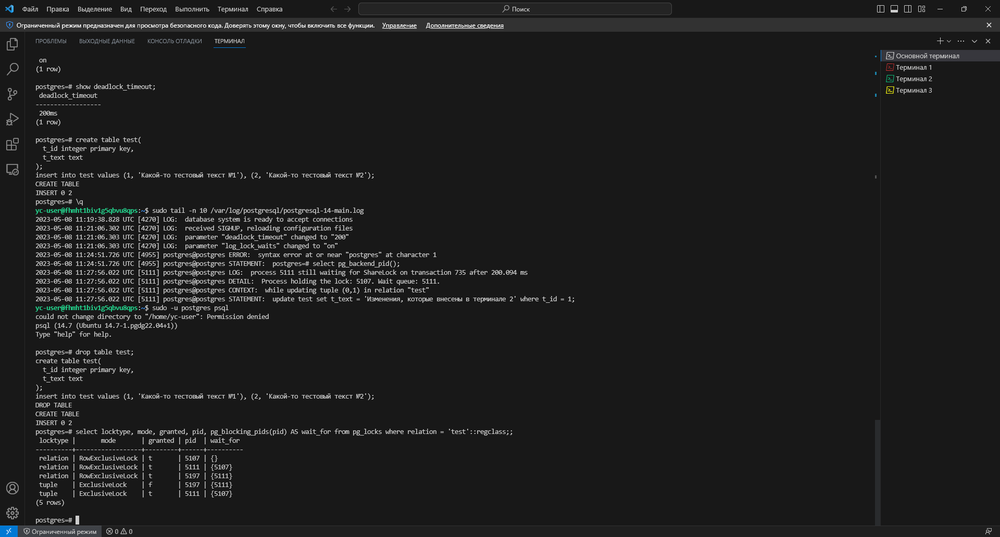

## Часть 4: Воспроизведите взаимоблокировку трех транзакций. Можно ли разобраться в ситуации постфактум, изучая журнал сообщений?

1. Для чистоты эксперимента, в `основном терминале` пересоздаю таблицу `test` уже с тремя строками:

```sql
postgres=# drop table test;
create table test(
  t_id integer primary key,
  t_text text
);
insert into test values (1, 'Какой-то тестовый текст №1'), (2, 'Какой-то тестовый текст №2'), (3, 'Какой-то тестовый текст №3');
```

2. В данном случае я поочерёдно (по шагам) выполняю следующие команды в различных терминалах:

| № шага | Терминал   | Команда                                                                                                   |
| ------ | ---------- | --------------------------------------------------------------------------------------------------------- |
| 1      | терминал 1 | ```sql postgres=# begin; select t_text from test where t_id = 1 for update; ```                           |
| 2      | терминал 2 | ```sql postgres=# begin; select t_text from test where t_id = 2 for update; ```                           |
| 3      | терминал 3 | ```sql postgres=# begin; select t_text from test where t_id = 3 for update; ```                           |
| 4      | терминал 1 | ```sql postgres=# update test set t_text = 'Изменения, которые внесены в терминале 1' where t_id = 2; ``` |
| 5      | терминал 2 | ```sql postgres=# update test set t_text = 'Изменения, которые внесены в терминале 2' where t_id = 3; ``` |
| 6      | терминал 3 | ```sql postgres=# update test set t_text = 'Изменения, которые внесены в терминале 3' where t_id = 1; ``` |

> **Результат:** 
> - запрос, выполненный в `терминале 1` находится в подвешенном состоянии:

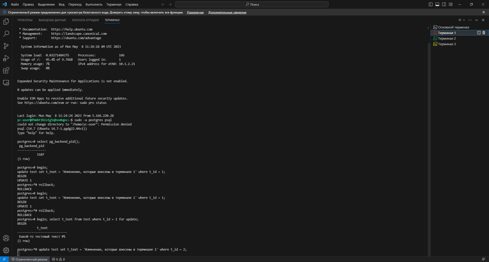

> - запрос, который выполнялся в `терминале 2` обновил строку:

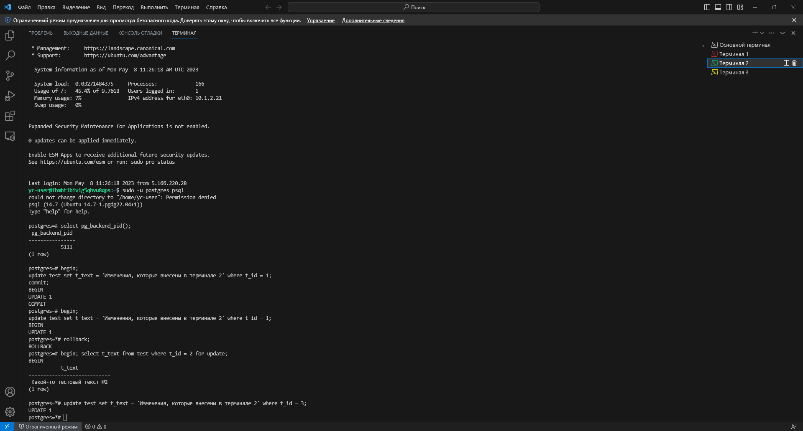

> - запрос, который выполнялся в `терминале 3` выполнился с ошибкой:

```log
ERROR:  deadlock detected
DETAIL:  Process 5197 waits for ShareLock on transaction 746; blocked by process 5107.
Process 5107 waits for ShareLock on transaction 747; blocked by process 5111.
Process 5111 waits for ShareLock on transaction 748; blocked by process 5197.
HINT:  See server log for query details.
CONTEXT:  while updating tuple (0,1) in relation "test"
```

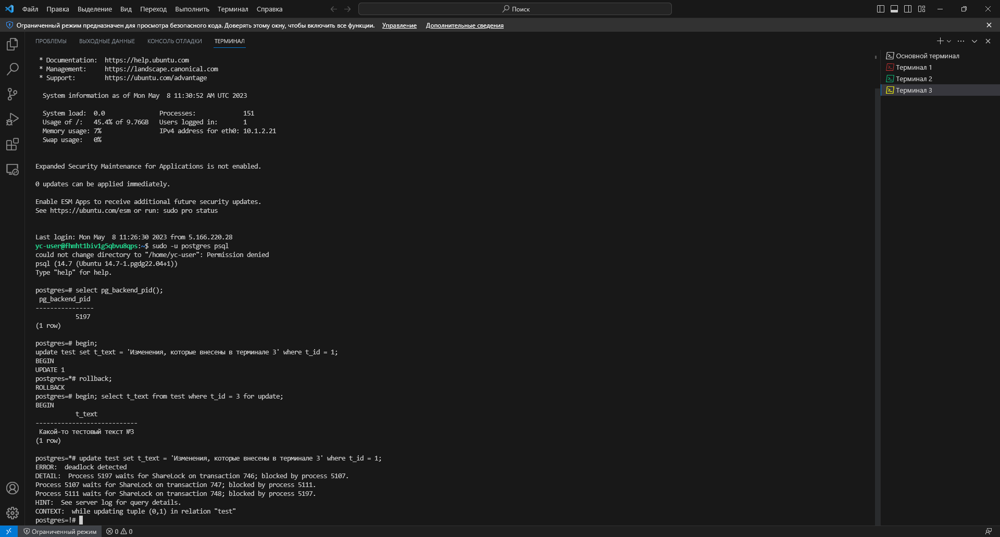

5. В `основном терминале` смотрю сообщения в журнале (сначала начал смотреть 10 строк, но этого оказалось мало и я начал смотреть последние 20 строк журнала):

```bash
sudo tail -n 20 /var/log/postgresql/postgresql-14-main.log
```

> **Результат** (в логе показываю только то, что относится к блокировкам, полный вывод можно посмотреть на скриншоте):

```log
2023-05-08 11:41:51.491 UTC [5197] postgres@postgres LOG:  process 5197 detected deadlock while waiting for ShareLock on transaction 746 after 200.092 ms
2023-05-08 11:41:51.491 UTC [5197] postgres@postgres DETAIL:  Process holding the lock: 5107. Wait queue: .
2023-05-08 11:41:51.491 UTC [5197] postgres@postgres CONTEXT:  while updating tuple (0,1) in relation "test"
2023-05-08 11:41:51.491 UTC [5197] postgres@postgres STATEMENT:  update test set t_text = 'Изменения, которые внесены в терминале 3' where t_id = 1;
2023-05-08 11:41:51.491 UTC [5197] postgres@postgres ERROR:  deadlock detected
2023-05-08 11:41:51.491 UTC [5197] postgres@postgres DETAIL:  Process 5197 waits for ShareLock on transaction 746; blocked by process 5107.
        Process 5107 waits for ShareLock on transaction 747; blocked by process 5111.
        Process 5111 waits for ShareLock on transaction 748; blocked by process 5197.
        Process 5197: update test set t_text = 'Изменения, которые внесены в терминале 3' where t_id = 1;
        Process 5107: update test set t_text = 'Изменения, которые внесены в терминале 1' where t_id = 2;
        Process 5111: update test set t_text = 'Изменения, которые внесены в терминале 2' where t_id = 3;
2023-05-08 11:41:51.491 UTC [5197] postgres@postgres HINT:  See server log for query details.
2023-05-08 11:41:51.491 UTC [5197] postgres@postgres CONTEXT:  while updating tuple (0,1) in relation "test"
2023-05-08 11:41:51.491 UTC [5197] postgres@postgres STATEMENT:  update test set t_text = 'Изменения, которые внесены в терминале 3' where t_id = 1;
2023-05-08 11:41:51.491 UTC [5111] postgres@postgres LOG:  process 5111 acquired ShareLock on transaction 748 after 7972.070 ms
2023-05-08 11:41:51.491 UTC [5111] postgres@postgres CONTEXT:  while updating tuple (0,3) in relation "test"
2023-05-08 11:41:51.491 UTC [5111] postgres@postgres STATEMENT:  update test set t_text = 'Изменения, которые внесены в терминале 2' where t_id = 3;
```

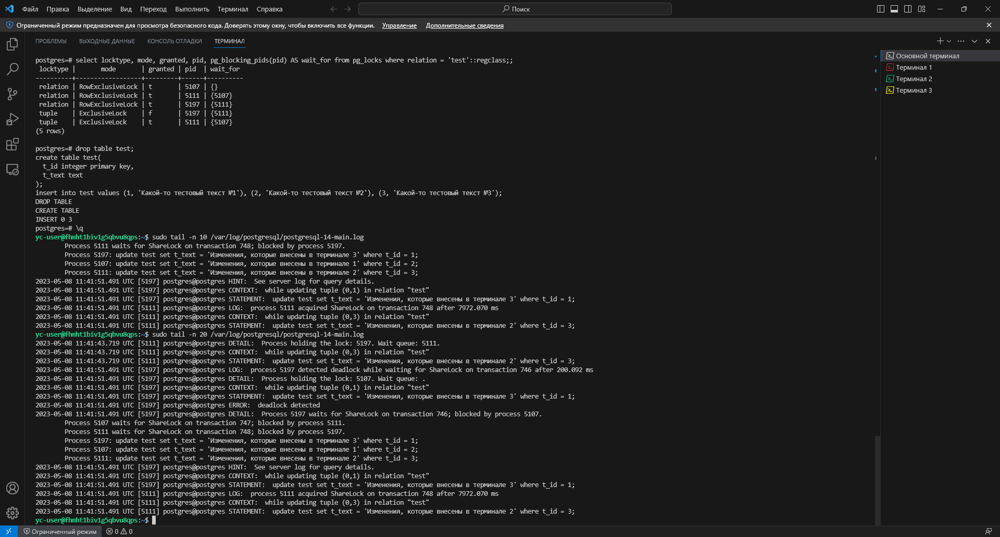

> По журналу видно, что процесс `5197` ушёл в deadlock при выполнении транзации `746`. Так же, из журнала видно, что процесс, запущенный в `терминале 3` ожидал выполнение транзакции в `терминале 1` и `терминале 2`, а транзакция, запущенная в `терминале 2` ожидала выполнения транзакции, запущенной в `терминале 3`. Т.е. возникла взаимоблокировка. В таких случаях PostgreSQL сам обрывает транзакцию, по своим алгоритмам.

## Часть 5: Могут ли две транзакции, выполняющие единственную команду UPDATE одной и той же таблицы (без where), заблокировать друг друга?

1. Для данной задачи я удалю старый вариант таблицы `test` и создам новую таблицу `test` с миллионом сгенерированных строк:

```sql
postgres=# drop table test;
create table test(
  t_id integer primary key generated always as identity,
  t_text text
);
insert into test(t_text) select 'Какой-то текст' from generate_series(1, 1000000);
```

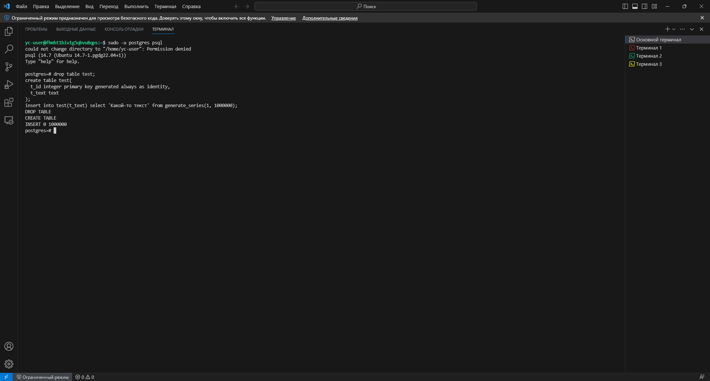

1. В `терминале 1` выполняю команду:

```sql
postgres=# begin;
update test set t_text = 'Изменения, которые внесены в терминале 1';
commit;
```

2. В `терминале 2` выполняю команду (не дожидаясь завершения выполнения первой транзакции):
```sql
postgres=# begin;
update test set t_text = 'Изменения, которые внесены в терминале 2';
commit;
```

> **Результат:**  без каких-либо дополнительных "опций" обе транзакции выполняются без взаимоблокировок: транзакция, выполнявшаяся в `терминале 2`, дождалась своей очереди и выполнилась.

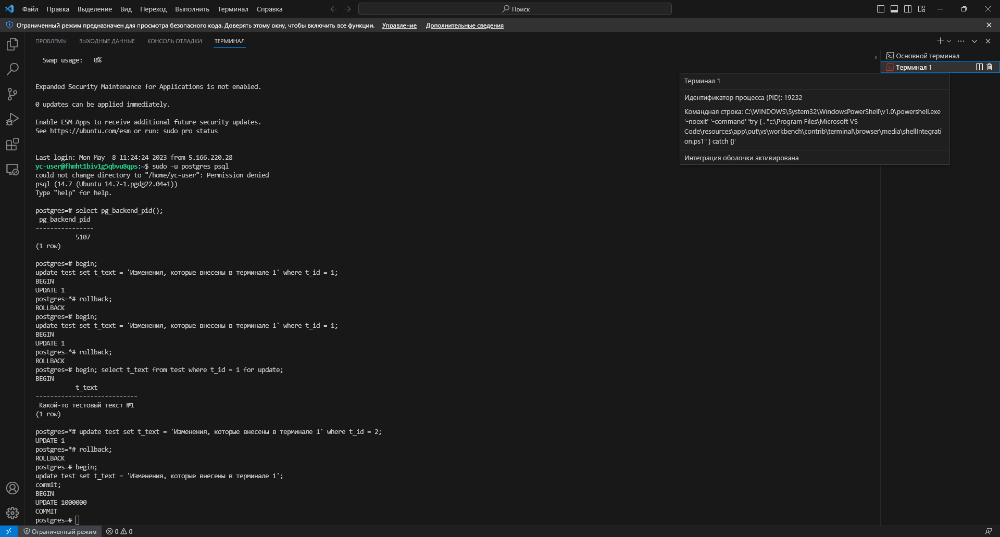

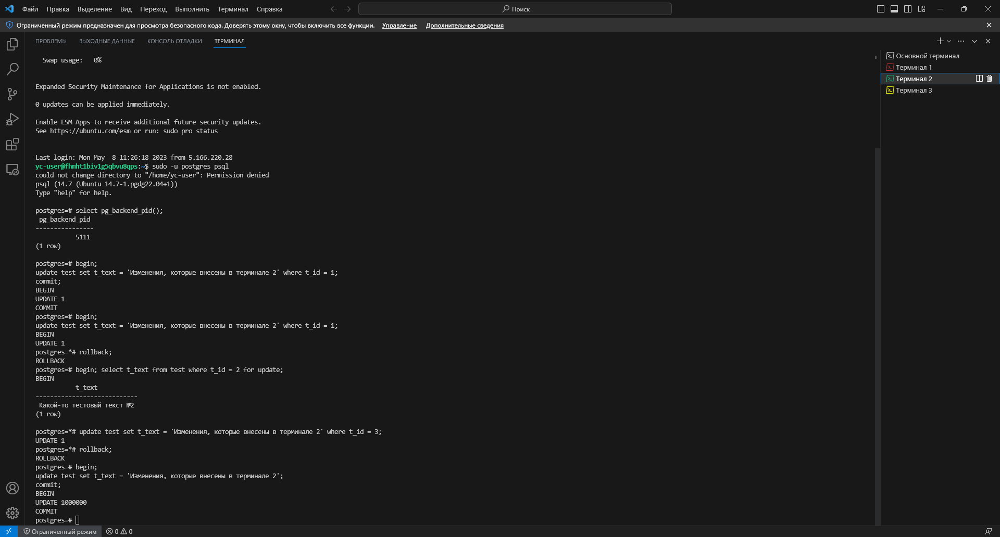

## Часть 5: Задание со звездочкой*: попробуйте воспроизвести такую ситуацию.

1. Пересоздаю таблицу `test` с миллионом сгенерированных строк:

```sql
postgres=# drop table test;
create table test(
  t_id integer primary key generated always as identity,
  t_text text
);
insert into test(t_text) select 'Какой-то текст' from generate_series(1, 1000000);
```

2. В этот раз, в `терминале 1` я использую команду:

```sql
postgres=# begin;
update test set t_text = (select t_text from test order by t_id asc limit 1 for update);
commit;
```

3. В `терминале 2` выполняю следующую команду:

```sql
postgres=# begin;
update test set t_text = (select t_text from test order by t_id desc limit 1 for update);
commit;
```

> **Результат:**
> - запрос, который выполнялся в `терминале 1` выполнился с ошибкой:

```log
BEGIN
ERROR:  deadlock detected
DETAIL:  Process 5107 waits for ShareLock on transaction 760; blocked by process 5111.
Process 5111 waits for ShareLock on transaction 759; blocked by process 5107.
HINT:  See server log for query details.
CONTEXT:  while updating tuple (7352,128) in relation "test"
ROLLBACK
```

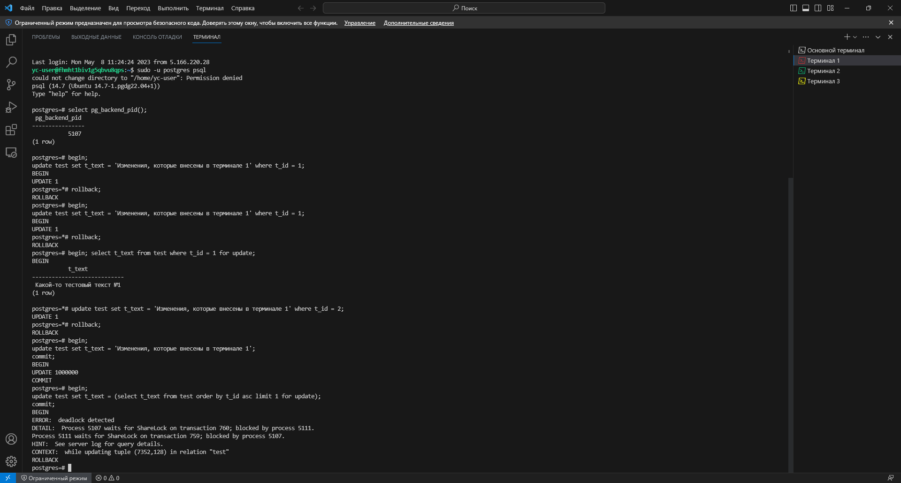

> - запрос, который выполнялся в `терминале 2` обновил строки:

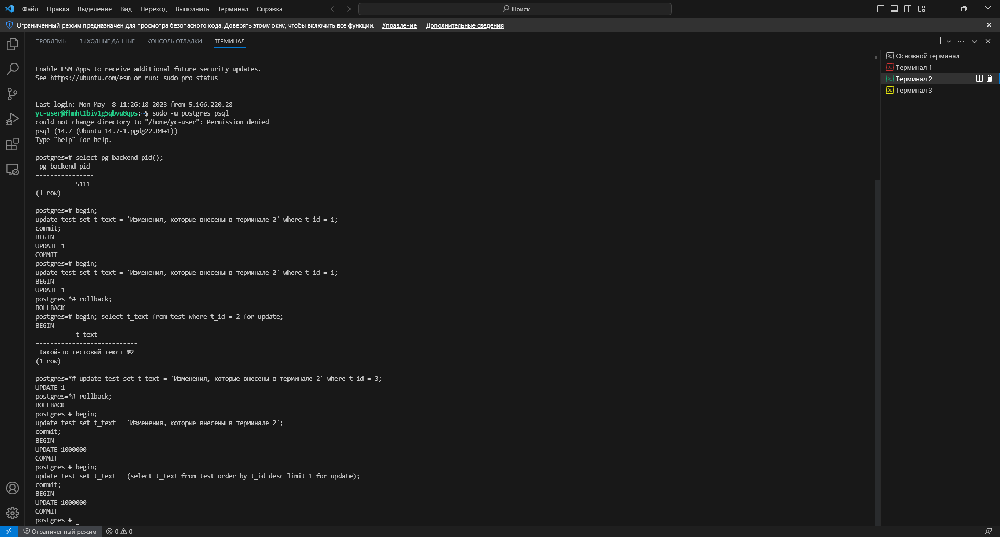

> В данном случае, причиной блокировки послужили части подзапроса, в которых выполнялись операции `select for update`: в подзапросе, который выполнялся в `терминале 1`, выбиралась 1я строка с сортировкой по возрастанию и данная строка была заблокирована для обновления; в подзапросе, который выполнялся в `терминале 2`, наоборот, была заблокирована для обновления последняя строка, т.к. там использовалась сортировка по убванию. Когда два апдейта столкнулись друг с другом в этих пересечениях и произошла взаимоблокировка, а PostgreSQL оборвал одну из транзакций, в соответствии с собственными алгоритмами.