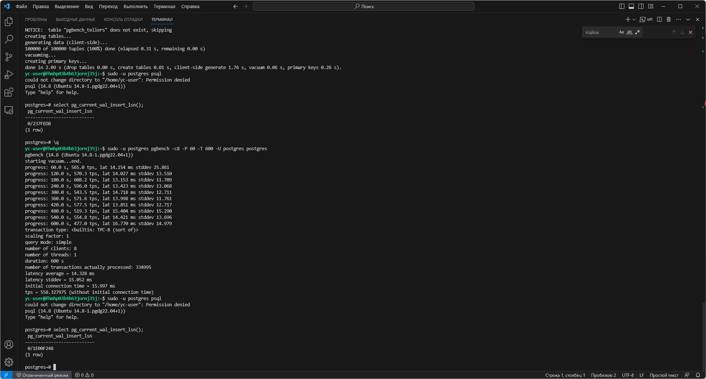

# Урок 10: Работа с журналами

## Часть 1: Подготовка ВМ

> **Примечание:** ssh-ключ был создан ранее, поэтому новый не гененрирую

1. Создаю на Яндекс.Облако сеть командой:

```bash
yc vpc network create --name otus-vm-db-pg-net-1 --labels my-label=otus-vm-db-pg-net-1 --description "otus-vm-db-pg-net-1"
```

2 Создаю на Яндекс.Облако подсеть командой:

```bash
yc vpc subnet create --name otus-vm-db-pg-subnet-1 --zone ru-central1-a --range 10.1.2.0/24 --network-name otus-vm-db-pg-net-1 --description "otus-vm-db-pg-subnet-1"
```

3. Создать инстанс ВМ с 2 ядрами и 4 Гб ОЗУ и SSD 10GB и подставляю ssh-ключ в метаданные ВМ:

```bash
yc compute instance create otus-pg-on-ubuntu --zone ru-central1-a --network-interface subnet-name=otus-vm-db-pg-subnet-1,nat-ip-version=ipv4 --preemptible --platform standard-v3 --cores 2 --core-fraction 20 --memory 4GB --create-boot-disk type=network-ssd,size=10GB,image-folder-id=standard-images,image-family=ubuntu-2204-lts --ssh-key "C:\Users\USER01/.ssh/id_ed25519.pub"
```

4. Подключаюсь к ВМ по ssh командой:

```bash
ssh yc-user@158.160.36.130
```

5. Устанавливаю на него PostgreSQL 14 :

```bash
sudo apt update && sudo DEBIAN_FRONTEND=noninteractive apt upgrade -y -q && sudo sh -c 'echo "deb http://apt.postgresql.org/pub/repos/apt $(lsb_release -cs)-pgdg main" > /etc/apt/sources.list.d/pgdg.list' && wget --quiet -O - https://www.postgresql.org/media/keys/ACCC4CF8.asc | sudo apt-key add - && sudo apt-get update && sudo DEBIAN_FRONTEND=noninteractive apt -y install postgresql-14
```

1. Захожу под пользователем `postgres`:

```bash
sudo -u postgres psql
```


## Часть 2: Настройте выполнение контрольной точки раз в 30 секунд.

1. Настраиваю выполнение контрольной точки раз в 30 секунд:

```sql
postgres=# alter system set checkpoint_timeout = '30s';
postgres=# \q
```

2. После настройки, необходимо перегрузить кластер, т.к. изменения в ином случае не применятся и снова захожу в psql:

```bash
sudo systemctl restart postgresql
sudo -u postgres psql
```

3. Смотрю применились ли настройки или нет и выхожу из psql:

```sql
postgres=# show checkpoint_timeout;
postgres=# \q
```


## Часть 3: 10 минут c помощью утилиты pgbench подавайте нагрузку.

1. Перед началом теста, запускаю утилиту `pgbench` с ключом `-i` под пользователем `postgres`, чтобы утилита выполнила инициализацию (т.е. в данном случае в выбранной БД будут созданы четыре таблицы `pgbench_accounts`, `pgbench_branches`, `pgbench_history` и `pgbench_tellers`, на которых и будет проводиться тестирование). Затем захожу psql:

```bash
sudo -u postgres pgbench -i postgres
sudo -u postgres psql
```


2 Перед тем, как подать нагрузку, я определяю текущую позицию добавления в журнале предзаписи и выхожу из psql:

```sql
postgres=# select pg_current_wal_insert_lsn();
postgres=# \q
```


3. Подаю нагрузку с помощью утилиты `pgbench` и, после завершения работы утилиты, снова захожу в psql:

```bash
sudo -u postgres pgbench -c8 -P 60 -T 600 -U postgres postgres
sudo -u postgres psql
```


## Часть 4: Измерьте, какой объем журнальных файлов был сгенерирован за это время. Оцените, какой объем приходится в среднем на одну контрольную точку.

1. Смотрю текущую позицию добавления в журнале транзакций после нагрузочного тестирования:

```sql
postgres=# select pg_current_wal_insert_lsn();
```



2. Зная две позиции LSN, можно получить размер журнальных записей между ними (в байтах) простым вычитанием одной позиции из другой. Надо только привести позиции к типу pg_lsn, что я и делаю:

```sql
select '0/1E00F248'::pg_lsn - '0/237FED8'::pg_lsn;
```


> **Результат:** после нагрузочного тестирования, размер журналов составил `466154352/1024/1024 = 444,5MB`.

3. В psql смотрю какой объём приходится на одну контрольную точку используя следующий запрос. Я модифицировал найденный в сети [запрос](https://gist.github.com/lesovsky/4587d70f169739c01d4525027c087d14 "запрос") (не очень уверен в его корректности, но больше ничего другого я найти не смог):

```sql
postgres=# select total_checkpoints
, round(q.buffers_checkpoint/(q.mp * q.total_checkpoints), 2) as "MB per checkpoint"

from(select buffers_checkpoint
  , checkpoints_timed + checkpoints_req as total_checkpoints
  , (1024 * 1024 / block.setting::numeric) as mp

  from pg_stat_bgwriter
  join pg_settings block
    on block.name = 'block_size'
) q;
```


> **Результат:** исходя из полученных данных, было выполнено 31 контрольная точка, на каждую контрольную точку, в среднем приходится 10.99MB

## Часть 5: Проверьте данные статистики: все ли контрольные точки выполнялись точно по расписанию. Почему так произошло?

1. Выполняю запрос:

```sql
postgres=# select * from pg_stat_bgwriter \gx
postgres=# \q
```


> **Результат:** в данном случае, меня интересует поле `checkpoint_write_time` (общее время, которое было затрачено на этап обработки контрольной точки, в котором файлы записываются на диск, в миллисекундах). Как можно увидеть, время, затраченную на обработку контрольной точки составляет `590077 * 0,001 = 590 секунд`. Как можно заметить, время выполнения каждой контрольной точки существенно выше 30 секунд. Процесс контрольной точки сбрасывает данные в файлы. Это действие выполняется, когда возникает контрольная точка (CHECKPOINT). Это дорогостоящая операция и может вызвать огромное количество операций IO. Весь этот процесс включает в себя дорогостоящие операции чтения/записи на диск. Соответственно, я предполагаю, что при таких настройках сервера, при больших нагрузках (в данном случае, которые были вызваны утилитой `pgbench`), сервер просто не успевает отрабатывать контрольные точки, т.е. по-сути, контрольные точки начинают накладываться друг на друга.

## Часть 6: Сравните tps в синхронном/асинхронном режиме утилитой pgbench. Объясните полученный результат.

1. Подаю нагрузку с помощью утилиты `pgbench`:

```bash
sudo -u postgres pgbench -c8 -P 60 -T 10 -U postgres postgres
```


2. Захожу в psql:

```bash 
sudo -u postgres psql
```

3. Изменяю режим на асинхронный: 

```sql
postgres=# alter system set synchronous_commit = 'off';
postgres=# \q
```

4. После настройки, необходимо перегрузить кластер, т.к. изменения в ином случае не применятся и снова захожу в psql:

```bash
sudo systemctl restart postgresql
sudo -u postgres psql
```

5. Смотрю применились ли настройки или нет и выхожу из psql:

```sql
postgres=# show synchronous_commit;
postgres=# \q
```


6. Снова подаю нагрузку с помощью утилиты `pgbench`:

```bash
sudo -u postgres pgbench -c8 -P 60 -T 10 -U postgres postgres
```


> **Результат:** как можно видеть, скорость увеличилась практически на порядок (результат в синхронном режиме: `tps = 480.668297`, результат в асинхронном режиме: `tps = 4642.077794`). Причина в том, что асинхронная запись — это возможность завершать транзакции быстрее, ценой того, что в случае краха СУБД последние транзакции могут быть потеряны.

## Часть 7: Создайте новый кластер с включенной контрольной суммой страниц. Создайте таблицу. Вставьте несколько значений. Выключите кластер. Измените пару байт в таблице. Включите кластер и сделайте выборку из таблицы. Что и почему произошло? как проигнорировать ошибку и продолжить работу?

1. Создаю новый кластер  на порту `5433` с включённой контрольной суммой страниц:

```bash
sudo pg_createcluster 14 newcluster -p 5433 -- --data-checksums
```

2. Стартую новый кластер:

```bash
sudo pg_ctlcluster 14 newcluster start
```

3. Вхожу в новый кластер:

```bash
sudo -u postgres psql -p 5433
```

4. Создаю в новом кластере таблицу `t1`, добавляю в неё две записи в таблицу, далее смотрю  номер файла с таблицей и выхожу из кластера:

```sql
postgres=# create table t1(c1 text); insert into t1(c1) values ('aaa'); insert into t1(c1) values ('bbb');
postgres=# select pg_relation_filepath('t1');
postgres=# \q
```


5. Выключаю кластер, меняю файл с таблицей, затем я снова стартую кластер и захожу в него:

```bash
sudo pg_ctlcluster 14 newcluster stop
sudo dd if=/dev/zero of=/var/lib/postgresql/14/newcluster/base/13761/16384 oflag=dsync conv=notrunc bs=1 count=8
sudo pg_ctlcluster 14 newcluster start
sudo -u postgres psql -p 5433
```

6. Пытаюсь выбрать данные из таблицы `t1`:

```sql
postgres=# select * from t1;
```

> **Результат:**

```log
WARNING:  page verification failed, calculated checksum 40716 but expected 17987
ERROR:  invalid page in block 0 of relation base/13761/16384
```


> Произошло это потому, что включен параметр `data-checksums`. Данный механизм видит несовпадение контрольной суммы (т.к. файл был повреждён). Для того, чтобы решить данную проблему можно попробовать сделать `FULL VACUUM` с опцией `zero_damaged_pages`. Тогда система просто выдаст предупреждение, обнулит повреждённую страницу в памяти и продолжит обработку. Это поведение разрушает данные, а именно все строки в повреждённой странице. Однако, включив его, вы можете обойти ошибку и получить строки из неповреждённых страниц, которые могут находиться в таблице. Это бывает полезно для восстановления данных, испорченных в результате аппаратной или программной ошибки:

```sql
set zero_damaged_pages = on;
vacuum full t1;
select * from t1;
```

