# Урок 12: Нагрузочное тестирование и тюнинг PostgreSQL

## Часть 1: Установка terraform.

> **Примечание:** для более быстрого разворачивания ВМ и кластера с PostgreSQL, я решил использовать Terraform. Инструкцию для установки terraform можно посмотреть по [ссылке](https://developer.hashicorp.com/terraform/tutorials/aws-get-started/install-cli?in=terraform%2Faws-get-started "Инструкция для установки terraform"). Настроить удалось далеко не с первого раза, огромное спасибо Константину Курочкину, который связался со мной и помог настроить terraform. Я не стал детально расписывать процесс установки, а сделал подробноее описание (что-то типа инструкции на будущее).

1. Копирую каталог `Terraform` в `C:\Program Files\` (сами [файлы](https://github.com/nvdmike/OTUSPostgreSQL/tree/main/Lesson12/files/cloud-terraform "Файлы с настройками terraform") я взял из `Урока 11: Вопрос-ответ`).

2. В переменные среды я прописал путь до каталога `C:\Program Files\Terraform`.

## Часть 2: Настройка terraform.

> **Примечание:** инструкция по настройке terraform для Яндекс.Облако можно посмотреть по [ссылке](https://cloud.yandex.ru/docs/tutorials/infrastructure-management/terraform-quickstart "Инструкция по настройке terraform для Яндекс.Облако")

1. Создаю сервисный аккаунт командой :

```bash
yc iam service-account create --name <имя_сервисного_аккаунта>
```

> Где `имя_сервисного_аккаунта` записывается в формате:
> * Длина — от 3 до 63 символов;
> * Может содержать строчные буквы латинского алфавита, цифры и дефисы;
> * Первый символ — буква. Последний символ — не дефис.

2. Для получения `id_реурса`/`имя_ресурса` (в моём случае - облака), я использую следующую команду:

```bash
yc resource-manager cloud list
```

3. Далее, я смотрю `id_сервисного_аккаунта`:

```bash
yc iam service-account list
```

4. Назначаю сервисному аккаунту роль на ресурс (в данном случае на ресурс `cloud`):

```bash
yc resource-manager cloud add-access-binding <имя_ресурса> --role resource-manager.clouds.owner --subject serviceAccount:<id_сервисного_аккаунта>
```

> Где:
> * `resource-manager` - название сервиса, на чей ресурс назначается роль;
> * `cloud` - категория ресурса;
> * `имя_ресурса` - я уже получил ранее;
> * `resource-manager.clouds.owner` — назначаемая роль;
> * `id_сервисного_аккаунта` - я уже получил ранее.

5. Смотрю `id_каталога`/`имя_каталога`:

```bash
yc resource-manager folders list
```

6. Создаю авторизованный ключ для `сервисного аккаунта` и записываю его в файл (в качестве имени использую `key.json`):

```bash
yc iam key create --service-account-id <id_сервисного_аккаунта> --folder-name <имя_каталога> --output <файл_с_ключом>
```

> Где:
> * `id_сервисного_аккаунта` - я уже получил ранее;
> * `имя_каталога` - я уже получил ранее;
> * `файл_с_ключом` — файл с авторизованным ключом сервисного аккаунта (`key.json`).

7. Создать профиль CLI для выполнения операций от имени сервисного аккаунта:

```bash
yc config profile create <имя_профиля>
```

> Где `имя_профиля` соответствует имени `сервисного аккаунта`, в моём случае.

8. Получил `OAuth-токен` в сервисе Яндекс.OAuth и скопировал его в буфер обмена.

9. Выполнил команду `yc init` и вставил полученный токен.

10. Выбрал каталог по умолчанию: `[1] folder1`.

11. Выбрал зону доступности по умолчанию для сервиса Yandex Compute Cloud: `[1] ru-central1-a`.

12. Далее, я задал конфигурацию профиля:

```bash
yc config set service-account-key <файл_с_ключом>
yc config set cloud-id <id_ресурса>
yc config set folder-id <id_каталога>
```

> Где:
> * `<файл_с_ключом>` — файл с авторизованным ключом сервисного аккаунта (`key.json`);
> * `id_ресурса` — я уже получил ранее;
> * `id_каталога` — я уже получил ранее.

13. Далее, в окнном менеджере я набрал команду `%appdata%`, чтобы перейти в соответствующий каталог и, в открывшийся каталог, я скопировал файл [terraform.rc](https://github.com/nvdmike/OTUSPostgreSQL/blob/main/Lesson12/files/terraform.rc "terraform.rc").

14. Затем я перешёл в каталог с файлами конфигурации terraform и инициализировал файлы конфигурации:

```bash
cd 'C:\Program Files\Terraform\cloud-terraform\'
terraform init
```

> **Примечание:** терминал должен быть запущен в режиме адмнинистратора системы!

15. Т.к. в этом случае, я первый раз использую terraform, решил сгенерировать новый ssh-ключ с именем `yc` и сразу добавляю этот ключ в базу ssh-agent:

```bash
ssh-keygen -t rsa
ssh-add "C:\Users\<имя_пользователя>\.ssh\<имя_ключа>"   
```

> **Примечание:** ключ надо создавать либо без `passphrase`, либо поднимать ssh-агент и прописывать в разделе `connection` настроечного файла [postgtes_settings.tf](https://github.com/nvdmike/OTUSPostgreSQL/blob/main/Lesson12/files/cloud-terraform/postgtes_settings.tf "postgtes_settings.tf"):

```log
connection {
 type        = "ssh"
 user        = "<имя_сервисного_аккаунта>"
 agent       = "true"
 host = self.network_interface[0].nat_ip_address
}
```

16. В параметр name вставляю `имя_сервисного_аккаунта`. Так же копирую сгенерированный ключ и вставляю в файл [meta.txt](https://github.com/nvdmike/OTUSPostgreSQL/blob/main/Lesson12/files/cloud-terraform/meta.txt "meta.txt"):

```log
#cloud-config
users:
  - name: <имя_сервисного_аккаунта>
    groups: sudo
    shell: /bin/bash
    sudo: ['ALL=(ALL) NOPASSWD:ALL']
    ssh_authorized_keys:
      - <публичный_ssh_ключ>
```

> **Примечание:** при вставке ключа важно отставлять все символы и отступы.

17. В файл [variables.tf](https://github.com/nvdmike/OTUSPostgreSQL/blob/main/Lesson12/files/cloud-terraform/variables.tf "variables.tf") прописываю путь к сгенерированному ssh-ключу:

```log
default = "<путь_к_ssh_ключу>"
```

18. Создаю на Яндекс.Облако сеть командой:

```bash
yc vpc network create --name otus-vm-db-pg-net-1 --labels my-label=otus-vm-db-pg-net-1 --description "otus-vm-db-pg-net-1"
```

19. Создаю на Яндекс.Облако подсеть командой:

```bash
yc vpc subnet create --name otus-vm-db-pg-subnet-1 --zone ru-central1-a --range 10.1.2.0/24 --network-name otus-vm-db-pg-net-1 --description "otus-vm-db-pg-subnet-1"
```

20. Меняю `id_подсети` в настроечном файле [postgtes_settings.tf](https://github.com/nvdmike/OTUSPostgreSQL/blob/main/Lesson12/files/cloud-terraform/postgtes_settings.tf "postgtes_settings.tf"):

```log
network_interface {
  subnet_id = "<id_подсети>"
  nat       = true
}
```

> **Примечание:** после настройки terraform, сеть и подсеть уже лучше не удалять, либо каждый раз придётся прописывать новую подсеть в файле [postgtes_settings.tf](https://github.com/nvdmike/OTUSPostgreSQL/blob/main/Lesson12/files/cloud-terraform/postgtes_settings.tf "postgtes_settings.tf").

21. Проверяю корректность настроечного файла:

```bash
terraform validate
```

## Часть 3: Создание ВМ.

1. После запуска терминала в `режиме администратора` необходимо добавить аутентификационные данные в переменные окружения:

```bash
$Env:YC_TOKEN=$(yc iam create-token)
$Env:YC_CLOUD_ID=$(yc config get cloud-id)
$Env:YC_FOLDER_ID=$(yc config get folder-id)
```

> **Примечание:** т.к. iam-токен обновляется довольно часто, команды по добавлению в переменные окружения, придётся выполнять почти каждый раз после нового запуска терминала

2. Перехожу в каталог с конфигурационными файлами terraform и разворачиваю ВМ:

```bash
cd 'C:\Program Files\Terraform\cloud-terraform\'
terraform apply
```

3. Далее, смотрю публичный ip-адрес ВМ в консоли и подключаюсь к ней. Далее проверяю, что кластер поднялся и захожу в psql:

```bash
ssh <сервисный_аккаунт>@<публичный_ip_адрес>
sudo -u postgres pg_lsclusters
```

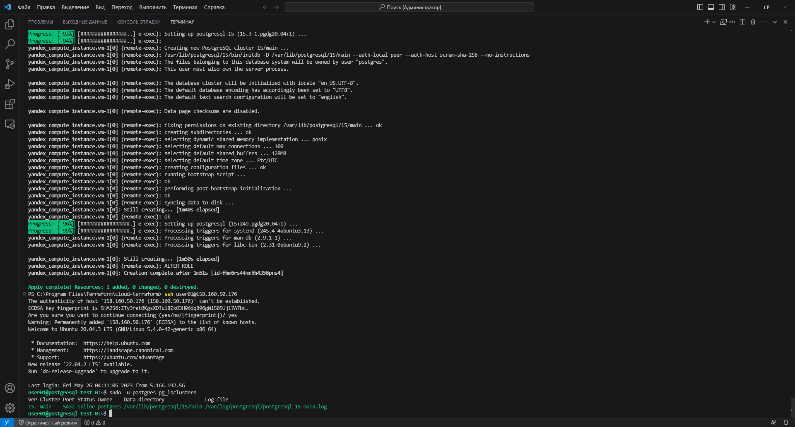

## Часть 4: Настроить кластер PostgreSQL 15 на максимальную производительность не обращая внимание на возможные проблемы с надежностью в случае аварийной перезагрузки виртуальной машины.

1. Перед тем, как настраивать кластер, я выполняю инициализацию утилиты `pgbench` для БД `postgres`:

```bash
sudo -u postgres pgbench -i postgres
```

2. Далее, нагружаю кластер в течении минуты и смотрю полученные значения (это нужно для того, чтобы потом сравнить исходные значения со значениями, которые будут получены после модификации параметров):

```bash
sudo -u postgres pgbench -c8 -P 60 -T 60 -U postgres postgres
```

> **Результат:**

```log
pgbench (15.3 (Ubuntu 15.3-1.pgdg20.04+1))
starting vacuum...end.
progress: 60.0 s, 489.9 tps, lat 16.280 ms stddev 14.442, 0 failed
transaction type: <builtin: TPC-B (sort of)>
scaling factor: 1
query mode: simple
number of clients: 8
number of threads: 1
maximum number of tries: 1
duration: 60 s
number of transactions actually processed: 29400
number of failed transactions: 0 (0.000%)
latency average = 16.288 ms
latency stddev = 14.449 ms
initial connection time = 22.467 ms
tps = 489.923017 (without initial connection time)
```

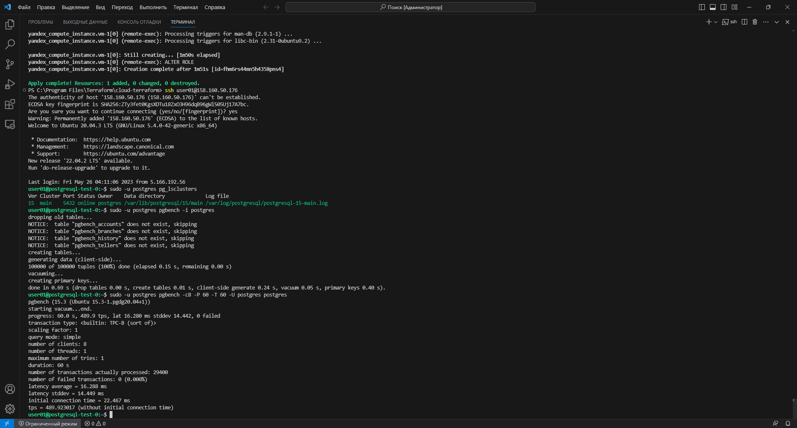

3. Использую сайт https://pgtune.leopard.in.ua для получения оптимальных настроек для выбранной конфигурации ВМ:

```log
# DB Version: 15
# OS Type: linux
# DB Type: mixed
# Total Memory (RAM): 4 GB
# CPUs num: 2
# Connections num: 100
# Data Storage: ssd

max_connections = 100
shared_buffers = 1GB
effective_cache_size = 3GB
maintenance_work_mem = 256MB
checkpoint_completion_target = 0.9
wal_buffers = 16MB
default_statistics_target = 100
random_page_cost = 1.1
effective_io_concurrency = 200
work_mem = 2621kB
min_wal_size = 1GB
max_wal_size = 4GB
```

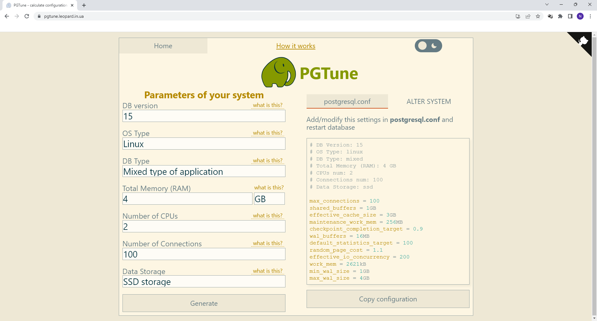

2. В файле `postgresql.conf` в параметре `incude_dir` можно посмотреть каталог в котором можно помещать собственные файлы конфигурации, которые имеют расширение `.conf`:

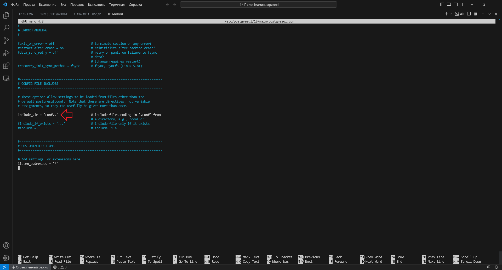

> **Примечание:** файлы конфигурации применяются в следующей последовательности: сначала применяются параметры из файла `postgresql.conf`, далее из файлов, которые имеют расширение `.conf` и расположены в директории, прописанной в параметре `include_dir`, а затем в файле `postgresql.auto.conf`. Т.е. если один и тот же параметр прописан в нескольких файлах, применится тот вариант этого параметра, который будет в файле, применён позже (например, если параметр прописан и в файле `postgresql.conf`, и в файле `postgresql.auto.conf`, применён будет параметр из файла `postgresql.auto.conf`).

3. В данном каталоге я создаю собственный файл [pgtune.conf](https://github.com/nvdmike/OTUSPostgreSQL/blob/main/Lesson12/files/pgtune.conf "pgtune.conf"), в который записываю ранее полученные параметры и проверяю, что файл создался. Помимо этого, чтобы настроить кластер на максимальную производительность, я добавлю параметр `synchronous_commit = 'off'`. Далее я перезагружаю кластер и захожу в psql:

```bash
cd /etc/postgresql/15/main/conf.d
sudo nano
ls -la
sudo pg_ctlcluster 15 main restart
sudo -u postgres psql
```

> **Примечание:** Выставление значения `off` для параметра `synchronous_commit` даст возможность завершать транзакции быстрее, ценой того, что в случае краха СУБД последние транзакции могут быть потеряны.

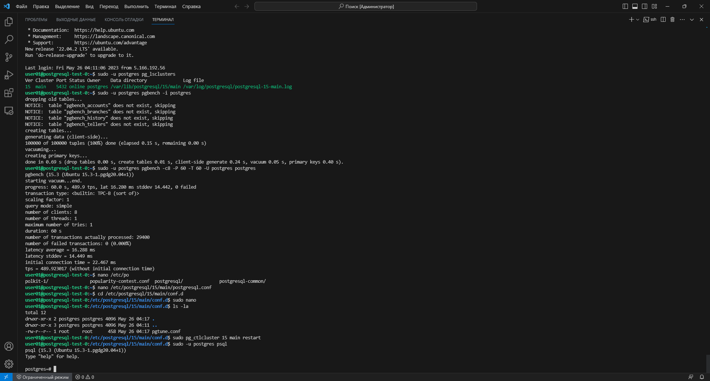

4. Смотрю какие параметры применились:

```sql
postgres=# select * from pg_file_settings;
postgres=# \q
```

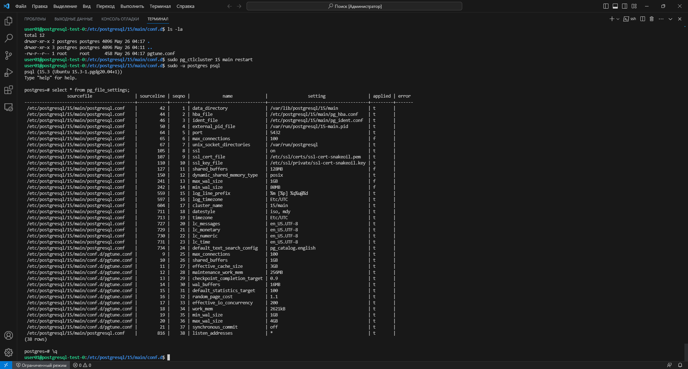

## Часть 5: Нагрузить кластер через утилиту через утилиту pgbench (https://postgrespro.ru/docs/postgrespro/14/pgbench).

1. Снова нагружаю кластер в течении минуты с помощью утилиты `pgbench`:

```bash
sudo -u postgres pgbench -c8 -P 60 -T 60 -U postgres postgres
```

## Часть 6: Написать какого значения tps удалось достичь, показать какие параметры в какие значения устанавливали и почему.

1. Удалось достигнуть следующего значения tps:

> **Результат:**

```log
pgbench (15.3 (Ubuntu 15.3-1.pgdg20.04+1))
starting vacuum...end.
progress: 60.0 s, 1534.1 tps, lat 5.155 ms stddev 1.732, 0 failed
transaction type: <builtin: TPC-B (sort of)>
scaling factor: 1
query mode: simple
number of clients: 8
number of threads: 1
maximum number of tries: 1
duration: 60 s
number of transactions actually processed: 92052
number of failed transactions: 0 (0.000%)
latency average = 5.155 ms
latency stddev = 1.733 ms
initial connection time = 23.534 ms
tps = 1534.326480 (without initial connection time)
```

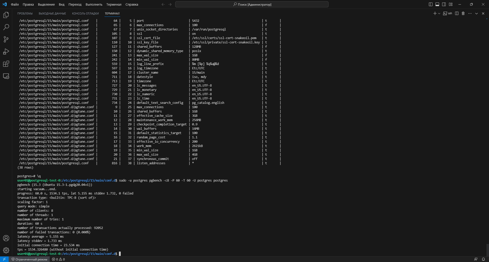

2. Описание применённых параметров:

```bash
* max_connections = 100			#Определяет максимальное число одновременных подключений к серверу БД.
* shared_buffers = 1GB			#Этот параметр определяет, сколько памяти будет выделяться postgres для кеширования данных. В стандартной поставке значение этого параметра мизерное — для обеспечения совместимости. В практических условиях это значение следует установить равным 25% от всей доступной оперативной памяти.
* effective_cache_size = 3GB		#Этот параметр помогает планировщику postgres определить количество доступной памяти для дискового кеширования. На основе того, доступна память или нет, планировщик будет делать выбор между использованием индексов и использованием сканирования таблицы. Это значение следует устанавливать в 50%…75% всей доступной оперативной памяти, в зависимости от того, сколько памяти доступно для системного кеша. Этот параметр не влияет на выделяемые ресурсы – это оценочная информация для планировщика.
* maintenance_work_mem = 256MB		#Задаёт максимальный объём памяти для операций обслуживания БД, в частности VACUUM, CREATE INDEX и ALTER TABLE ADD FOREIGN KEY. Чтобы операции выполнялись максимально быстро, нужно устанавливать этот параметр тем выше, чем больше размер таблиц в БД. Неплохо бы устанавливать его значение от 50 до 75% размера самой большой таблицы или индекса или, если точно определить невозможно, от 32 до 256 МБ. Например, при памяти 1–4 ГБ рекомендуется устанавливать 128–512 МБ.
* checkpoint_completion_target = 0.9	#Задаёт целевое время для завершения процедуры контрольной точки, как коэффициент для общего времени между контрольными точками. Обычно рекомендуется устанавливать данный параметр равным 0.9.
* wal_buffers = 16MB			#Задаёт объём разделяемой памяти, который будет использоваться для буферизации данных WAL, ещё не записанных на диск. Этот параметр стоит увеличивать в системах с большим количеством записей. Значение в 1Мб рекомендуют разработчики postgres даже для очень больших систем. Однако, сайт https://pgtune.leopard.in.ua предложил для моей конфигурации размер 16MB, поэтому я и применил это значение.
* default_statistics_target = 100	#Устанавливает значение ориентира статистики по умолчанию, распространяющееся на столбцы, для которых командой ALTER TABLE SET STATISTICS не заданы отдельные ограничения. Данное знакчение в целом является оптимальным для большинства БД, т.к. позволяет просматривать вполне адекватное количество записей для статистики. В случае необходимости этот параметр можно увеличить.
* random_page_cost = 1.1		#Задаёт приблизительную стоимость чтения одной произвольной страницы с диска. Общие рекомендации: 1.1~1.2 для NVME-SSD дисков; 1.3~1.5 для SATA-SSD дисков; 2.0~2.5 для HDD\SAS RAID; 4.0 (по умолчанию) для медленного одиночного HDD диска.
* effective_io_concurrency = 200	#Задаёт допустимое число параллельных операций ввода/вывода, которое говорит PostgreSQL о том, сколько операций ввода/вывода могут быть выполнены одновременно. Не нашёл в сети рекомендаций для этого параметра, но сайт https://pgtune.leopard.in.ua предложил установить значение 200.
* work_mem = 2621kB			#Задаёт объём памяти, который будет использоваться для внутренних операций сортировки и хеш-таблиц, прежде чем будут задействованы временные файлы на диске. Рекомендуют ставить RAM/32.
* min_wal_size = 1GB			#Пока WAL занимает на диске меньше этого объёма, старые файлы WAL в контрольных точках всегда перерабатываются, а не удаляются. Рекомендаций не нашёл, поэтому поставил значения с сайта https://pgtune.leopard.in.ua.
* max_wal_size = 4GB			#Задаёт максимальный размер, до которого может вырастать WAL между автоматическими контрольными точками в WAL. Рекомендаций не нашёл, поэтому поставил значения с сайта https://pgtune.leopard.in.ua.
* synchronous_commit = 'off'		#Включает/выключает синхронную запись в лог файлы после каждой транзакции. Это защищает от возможной потери данных. Но это накладывает ограничение на пропускную способность сервера. Т.е., установка значения off для данного параметра даёт возможность завершать транзакции быстрее, ценой того, что в случае краха СУБД последние транзакции могут быть потеряны.
```

## Часть 7: Задание со *: аналогично протестировать через утилиту https://github.com/Percona-Lab/sysbench-tpcc (требует установки https://github.com/akopytov/sysbench).

1. Удаляю файл [pgtune.conf](https://github.com/nvdmike/OTUSPostgreSQL/blob/main/Lesson12/files/pgtune.conf "pgtune.conf") с настройками и перезапускаю кластер (чтобы применились стоковые параметры), захожу в psql и проверяю, что применлись базовые настройки, затем снова выхожу из psql:

```bash
sudo rm -fr /etc/postgresql/15/main/conf.d/pgtune.conf
sudo pg_ctlcluster 15 main restart
sudo -u postgres psql
postgres=# select * from pg_file_settings;
postgres=# \q
```

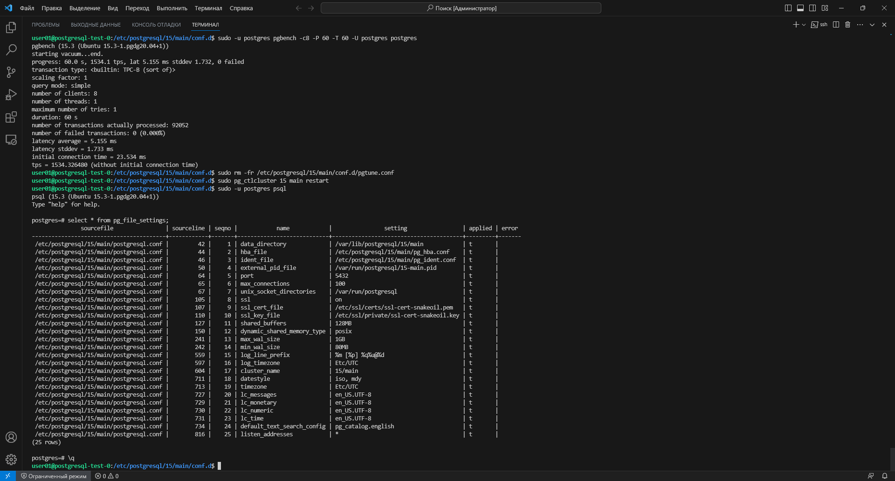

2. Устанавливаю утилиту `sysbench`:

```bash
curl -s https://packagecloud.io/install/repositories/akopytov/sysbench/script.deb.sh | sudo bash
sudo apt -y install sysbench
```

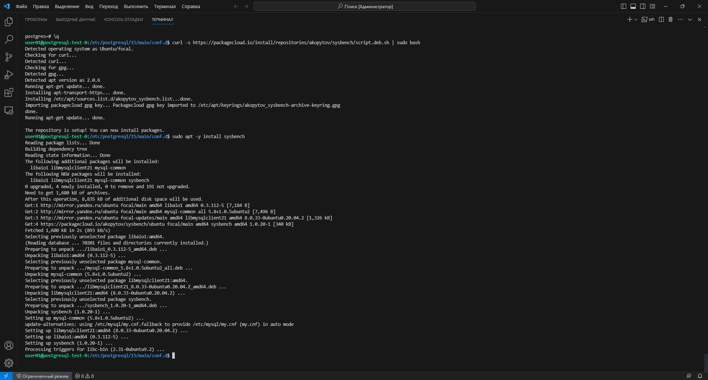

3. Создаю каталог `data` и даю на него права пользователю `postgres`. Далее, перехожу в этот каталог, с помощью утилиты `wget` загружаю архив со скриптами `sysbench-tpcc`, затем распаковываю архив и удаляю сам архив. Затем запускаю psql:
```bash
sudo mkdir /mnt/data
sudo chown -R postgres:postgres /mnt/data
sudo su - postgres
cd /mnt/data/
wget https://github.com/Percona-Lab/sysbench-tpcc/archive/refs/tags/v2.2.zip && unzip v2.2.zip && rm v2.2.zip
psql
```

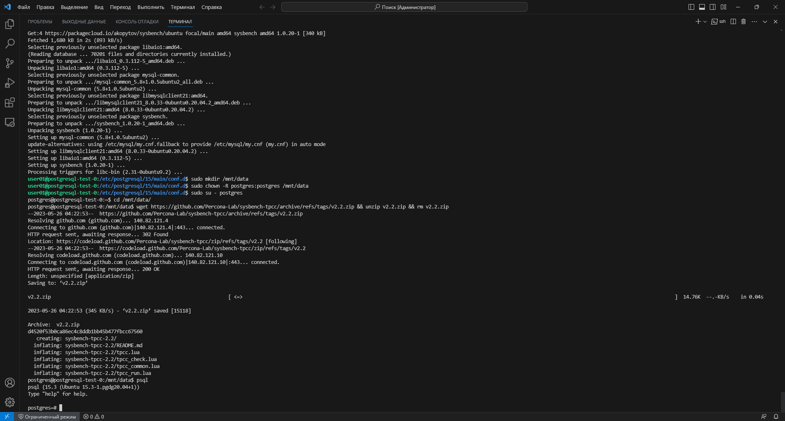

3. Создаю новую БД `tune` и пользователя, так же даю пользователю привилегии на эту БД, далее перехожу в неё и даю все права на схему `public` пользователю `tune`, далее выхожу из psql:

```sql
postgres=# create database tune;
postgres=# create user tune with password 'tune';
postgres=# grant all privileges on database tune to tune;
postgres=# \c tune
tune=# grant all on schema public to tune;
tune=# exit
```

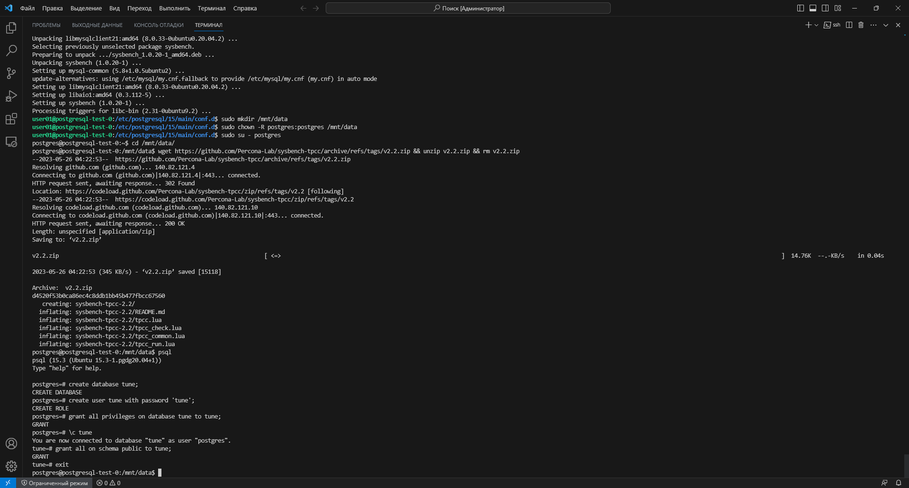

4. Перехожу в каталог со скриптами `sysbench-tpcc` и запускаю инициализацию:

```bash
cd /mnt/data/sysbench-tpcc-2.2
./tpcc.lua --pgsql-port=5432 --pgsql-user=tune --pgsql-password=tune --pgsql-db=tune --time=300 --threads=3 --tables=3 --scale=10 --report-interval=5 --db-driver=pgsql prepare
```

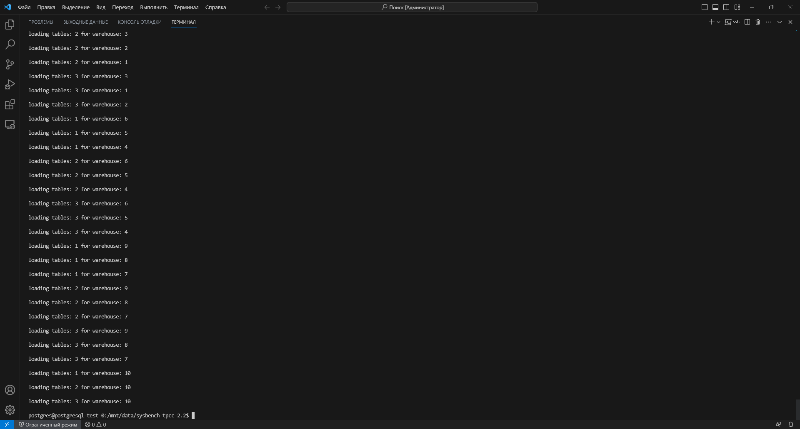

5. Т.к. производилась большая заливка данных, запускаю вакум (так же во время выполнения вакуума соберётся статистика):

```bash
vacuumdb -j 5 -d tune -z
```

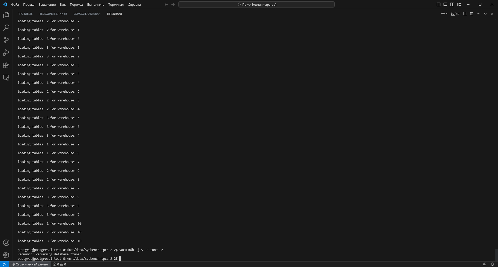

6. Запускаю тест до применения параметров:

```bash
./tpcc.lua --pgsql-port=5432 --pgsql-user=tune --pgsql-password=tune --pgsql-db=tune --time=300 --threads=3 --tables=3 --scale=10 --report-interval=5 --db-driver=pgsql run
```

> **Примечание:** к сожалению дальнейшая работа скрипта `sysbench-tpcc` прекратилась с ошибкой. В чём причина этой ошибки непонятно. Вероятно последние версии скрипта кривые (я пробовал версии `2.1` и `2.2`).

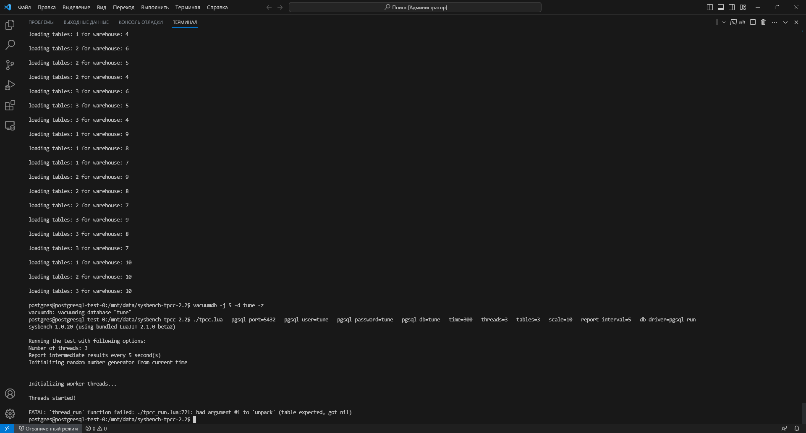

## Часть 8: Далее план был следующий:

1. Снова создаю файл конфигурации [pgtune.conf](https://github.com/nvdmike/OTUSPostgreSQL/blob/main/Lesson12/files/pgtune.conf "pgtune.conf"), в который добавляю, полученные ранее на сайте https://pgtune.leopard.in.ua параметры.

2. После чего, я бы перегрузил кластер, чтобы параметры применились:

```bash
sudo pg_ctlcluster 15 main restart
```

3. Проверил бы, что параметры применились:

```sql
select * from pg_file_settings;
```

4. И снова запустил бы тест:

```bash
./tpcc.lua --pgsql-port=5432 --pgsql-user=tune --pgsql-password=tune --pgsql-db=tune --time=300 --threads=3 --tables=3 --scale=10 --report-interval=5 --db-driver=pgsql run
```

5. В конце, произвёл бы очистку тестовой БД:

```bash
./tpcc.lua --pgsql-port=5432 --pgsql-user=tune --pgsql-password=tune --pgsql-db=tune --time=300 --threads=3 --tables=3 --scale=10 --report-interval=5 --db-driver=pgsql cleanup
```