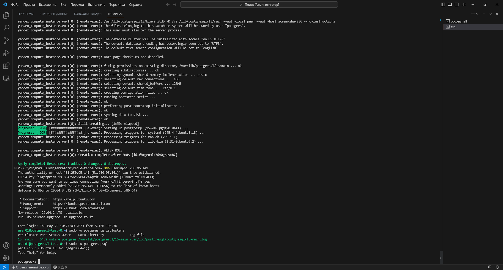
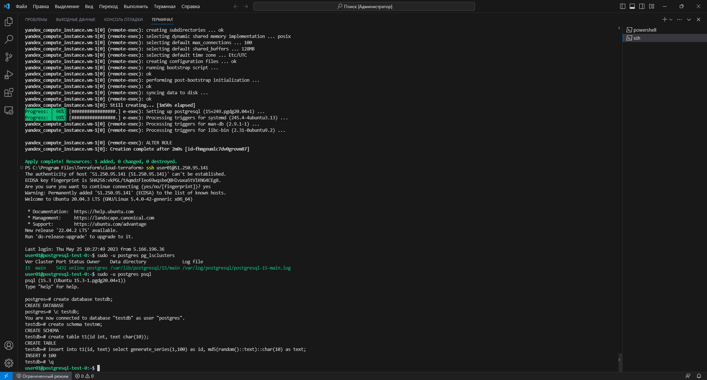
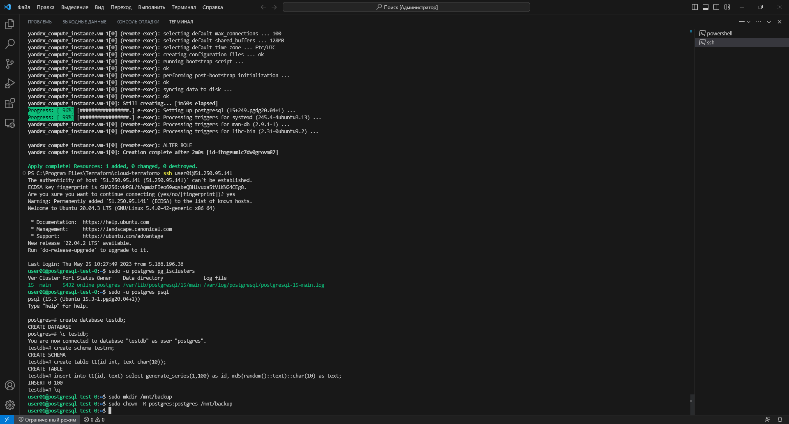
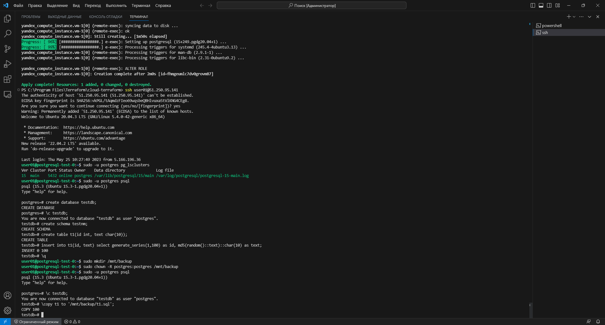
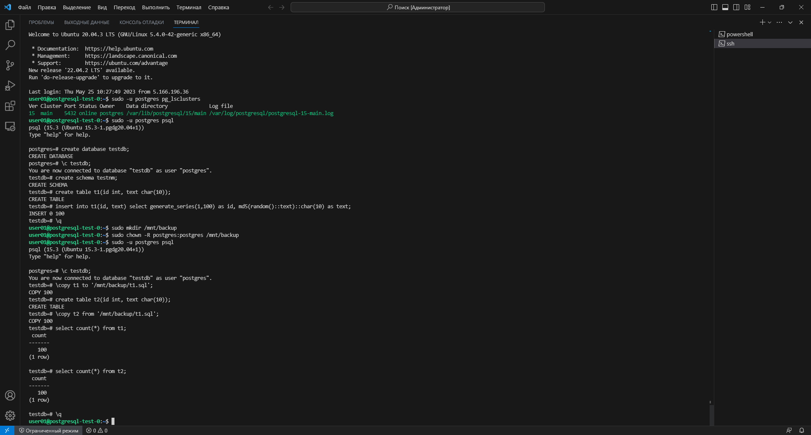
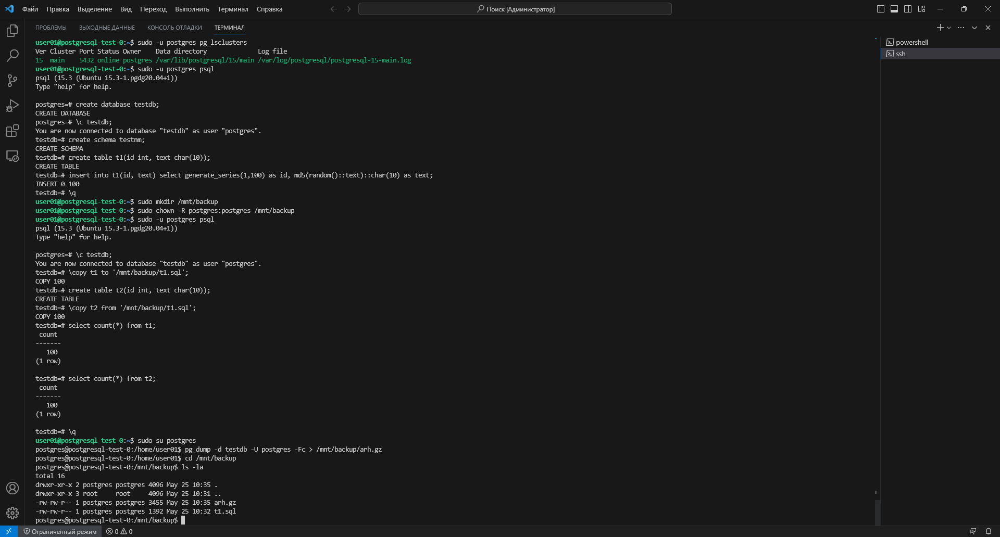
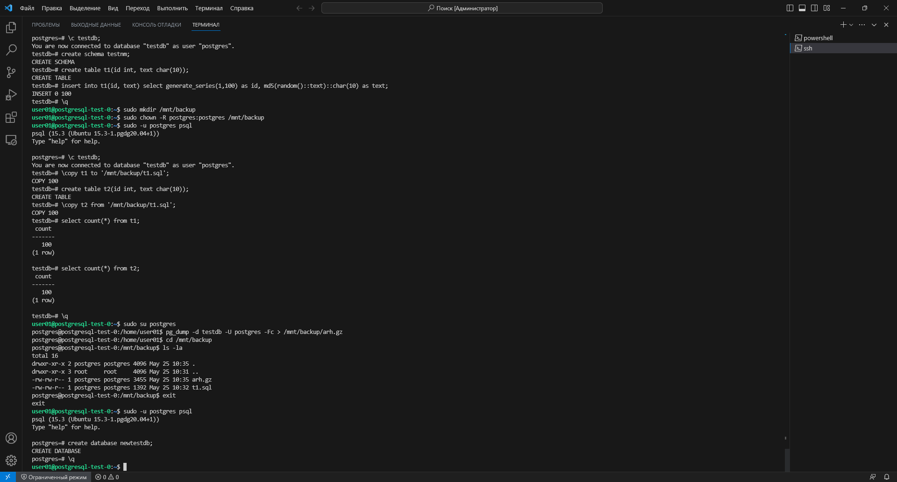
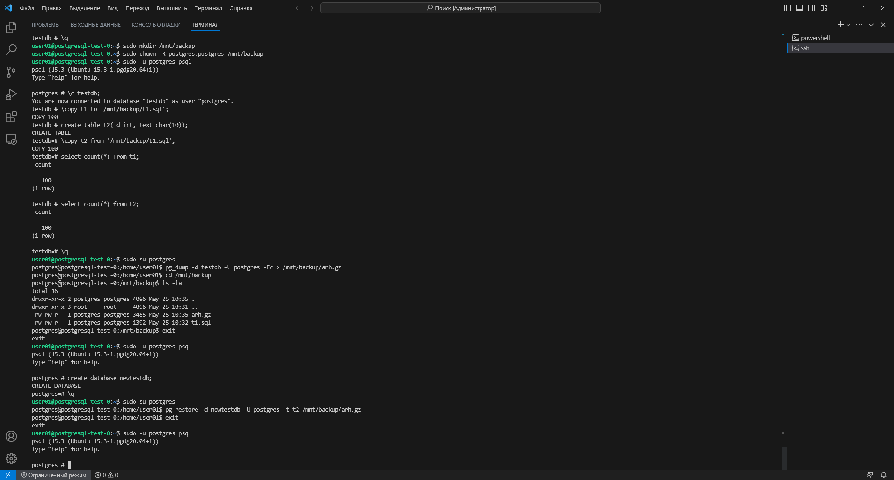
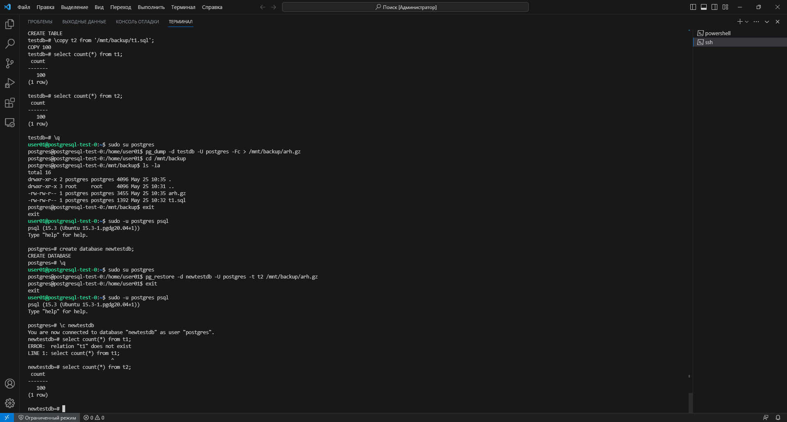

# Урок 13: Бэкапы

> **Примечание:** Как я выполнял настройку terraform, я показывал в предыдущем уроке:
> 
> [Урок 12: Нагрузочное тестирование и тюнинг PostgreSQL](https://github.com/nvdmike/OTUSPostgreSQL/blob/main/Lesson12/Lesson12.md "Урок 12: Нагрузочное тестирование и тюнинг PostgreSQL")

## Часть 1: Создаем ВМ/докер c ПГ.

1. После запуска терминала в `режиме администратора` необходимо добавить аутентификационные данные в переменные окружения:

```bash
$Env:YC_TOKEN=$(yc iam create-token)
$Env:YC_CLOUD_ID=$(yc config get cloud-id)
$Env:YC_FOLDER_ID=$(yc config get folder-id)
```

> **Примечание:** т.к. iam-токен обновляется довольно часто, команды по добавлению в переменные окружения, придётся выполнять почти каждый раз после нового запуска терминала

2. Перехожу в каталог с конфигурационными файлами terraform и разворачиваю ВМ:

```bash
cd 'C:\Program Files\Terraform\cloud-terraform\'
terraform apply
```

3. Далее, смотрю публичный ip-адрес ВМ в консоли и подключаюсь к ней. Далее проверяю, что кластер поднялся и захожу в psql:

```bash
ssh <сервисный_аккаунт>@<публичный_ip_адрес>
sudo -u postgres pg_lsclusters
sudo -u postgres psql
```



## Часть 2: Создаем БД, схему и в ней таблицу.

1. Создаю новую БД `testdb`:

```sql
postgres=# create database testdb;
```

2. Захожу в созданную базу данных под пользователем `postgres` и создаю в ней новую схему `testnm`:

```sql
postgres=# \c testdb;
testdb=# create schema testnm;
```

3. Создаю новую таблицу `t1` с двумя конолками `id` и `text`:

```sql
testdb=# create table t1(id int, text char(10));
```

## Часть 3:Заполним таблицы автосгенерированными 100 записями.

1. Наполняю таблицу 100 сгенерированными записями:

```sql
testdb=# insert into t1(id, text) select generate_series(1,100) as id, md5(random()::text)::char(10) as text;
testdb=# \q
```



## Часть 4: Под линукс пользователем Postgres создадим каталог для бэкапов.

1. Решил создать каталог `backup` в каталоге `mnt` и даю на него права пользователю `postgres`:

```bash
sudo mkdir /mnt/backup
sudo chown -R postgres:postgres /mnt/backup
```



## Часть 5: Сделаем логический бэкап используя утилиту COPY.

1. Захожу в psql:

```bash
sudo -u postgres psql
```

2. Перехожу в БД `testdb` и используя утилиту `copy` для создания логического бэкапа таблицы `t1:

```bash
postgres=# \c testdb;
testdb=# \copy t1 to '/mnt/backup/t1.sql';
```



## Часть 6: Восстановим в 2 таблицу данные из бэкапа.

1. Создаю новую таблицу `t2`:

```sql
testdb=# create table t2(id int, text char(10));
```

2. Восстанавливаю в эту таблицу данные из бэкапа:

```sql
testdb=# \copy t2 from '/mnt/backup/t1.sql';
```

3. Проверяю количество записей в таблице `t1` ИЗ которой создавался логический бэкап:

```sql
testdb=# select count(*) from t1;
```

4. Проверяю количество записей в таблице `t2` В которую логический бэкап был развёрнут:

```sql
testdb=# select count(*) from t2;
testdb=# \q
```

> **Результат:**  как видим, в каждой таблице по 100 записей. Т.е. данные из таблицы `t1` были выгружены в файл с логическим бэкапом, затем из него данные я обратно восстановил, но уже в таблицу `t2`, а в таблице `t1` как было изначальных 100 записей, так и осталось.



## Часть 7: Используя утилиту pg_dump создадим бэкап с оглавлением в кастомном сжатом формате 2 таблиц.

1. Перехожу под пользователя `postgres` и выполняю команду для создания бэкапа, затем перехожу в каталог и смотрю наличие файла с архивом бэкапа:

```bash
sudo su postgres
pg_dump -d testdb -U postgres -Fc > /mnt/backup/arh.gz
cd /mnt/backup
ls -la
```



2. Выхожу из под пользователя `postgres` и захожу в psql:

```bash
exit
sudo -u postgres psql
```

3. Создаю новую БД:

```sql
postgres=# create database newtestdb;
postgres=# \q
```



3. Перехожу под пользователя `postgres` и выполняю восстановление в новую БД только вторую таблицу. Затем выхожу из под пользователя `postgres` и захожу в psql:

```bash
sudo su postgres
pg_restore -d newtestdb -U postgres -t t2 /mnt/backup/arh.gz
exit
sudo -u postgres psql
```



4. Перехожу в новую БД и проверяю наличие данных:

```sql
postgres=# \c newtestdb
newtestdb=# select count(*) from t1;
newtestdb=# select count(*) from t2;
```

> **Результат:** как можно увидеть, таблица `t1` не была создана и вывелась ошибка, а в таблице `t2` 100 записей, как и требовалось. Это произошло из-за того, что ключ `-t` в утилите `pg_restore` указывает на то, что требуется восстановить таблицу и/или данные из указанной таблицы.

```log
ERROR:  relation "t1" does not exist
LINE 1: select count(*) from t1;
```

