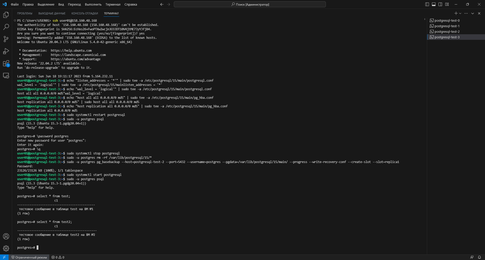

# Урок 14: Репликация

> **Примечание:** Как я выполнял настройку terraform, я показывал ранее:
> 
> [Урок 12: Нагрузочное тестирование и тюнинг PostgreSQL](https://github.com/nvdmike/OTUSPostgreSQL/blob/main/Lesson12/Lesson12.md "Урок 12: Нагрузочное тестирование и тюнинг PostgreSQL")

## Часть 1: Создаю 4 ВМ.

1. Для того, чтобы одной командой создалось сразу 4 виртуальных машины (`postgresql-test-0`, `postgresql-test-1`, `postgresql-test-2`, `postgresql-test-3`), в конфигурационном файле `postgtes_settings.tf` в блоке `resource "yandex_compute_instance" "vm-1" {` выставляю переменную `count` равную необходимому количеству ВМ, т.е. в данном случае 4.

2. После запуска терминала в `режиме администратора` необходимо добавить аутентификационные данные в переменные окружения:

```bash
$Env:YC_TOKEN=$(yc iam create-token)
$Env:YC_CLOUD_ID=$(yc config get cloud-id)
$Env:YC_FOLDER_ID=$(yc config get folder-id)
```

> **Примечание:** т.к. iam-токен обновляется довольно часто, команды по добавлению в переменные окружения, придётся выполнять почти каждый раз после нового запуска терминала

3. Перехожу в каталог с конфигурационными файлами terraform и разворачиваю ВМ:

```bash
cd 'C:\Program Files\Terraform\cloud-terraform\'
terraform apply
```


4. Далее, смотрю публичный ip-адрес созданных ВМ в консоли и подключаюсь к ним:

```bash
ssh <сервисный_аккаунт>@<публичный_ip_адрес>
```

> **Примечание:** для удобства навигации в терминале переименовываю вкладки, соответсвенно названию виртуальных машин:


5. Для всех виртуальных машин требуется изменить конфигурационные файлы, чтобы настроить возможность репликации:

```bash
echo "listen_addresses = '*'" | sudo tee -a /etc/postgresql/15/main/postgresql.conf
echo "wal_level = 'logical'" | sudo tee -a /etc/postgresql/15/main/postgresql.conf
echo "host all all 0.0.0.0/0 md5" | sudo tee -a /etc/postgresql/15/main/pg_hba.conf
echo "host replication all 0.0.0.0/0 md5" | sudo tee -a /etc/postgresql/15/main/pg_hba.conf
```

6. Чтобы параметры применились, перезагружаю кластеры на всех ВМ:

```bash
sudo systemctl restart postgresql
```

7. На всех ВМ захожу в psql:

```bash
sudo -u postgres psql
```

8. Устанавливаю новый пароль для пользователя `postgres` (для теста выбрал пароль попроще - `123`):

```sql
postgres=# \password postgres
```

## Часть 2: На 1 ВМ создаем таблицы test для записи, test2 для запросов на чтение.

1. Создаю таблицу `test` для записи и `test2` для чтения на `postgresql-test-0`:

```sql
postgres=# create table test (c1 text);
postgres=# create table test2 (c1 text);
```


## Часть 3: На 2 ВМ создаем таблицы test2 для записи, test для запросов на чтение.

1. Создаю таблицу `test` для чтения и `test2` для записи на `postgresql-test-1`:

```sql
postgres=# create table test (c1 text);
postgres=# create table test2 (c1 text);
```


## Часть 4: Создаем публикацию таблицы test и подписываемся на публикацию таблицы test2 с ВМ №2.

1. Создаю публикацию для таблицы `test` на первой ВМ (`postgresql-test-0`):

```sql
postgres=# create publication testpub for table test;
```


2. Подписываюсь на публикацию таблицы `test2` на второй ВМ (`postgresql-test-1`):

```sql
postgres=# create subscription testsub connection 'host=postgresql-test-0 port=5432 user=postgres password=123 dbname=postgres' publication testpub with (copy_data = true);
```


## Часть 5: Создаем публикацию таблицы test2 и подписываемся на публикацию таблицы test1 с ВМ №1.

1. Создаю публикацию для таблицы `test2` на второй ВМ (`postgresql-test-1`):

```sql
postgres=# create publication test2pub for table test2;
```


2. Подписываюсь на публикацию таблицы `test2` на первой ВМ (`postgresql-test-0`):

```sql
postgres=# create subscription test2sub connection 'host=postgresql-test-1 port=5432 user=postgres password=123 dbname=postgres' publication test2pub with (copy_data = true);
```


## Часть 6: Проверяю работоспособность репликации.

1. На первой ВМ (`postgresql-test-0`) в таблицу `test` вношу запись:

```sql
postgres=# insert into test values('тестовое сообщение в таблице test на ВМ №1');
```


2. На второй ВМ (`postgresql-test-1`) проверяю, что запись появилась и на этой ВМ:

```sql
postgres=# select * from test;
```


3. На второй ВМ (`postgresql-test-1`) в таблицу `test2` вношу запись:

```sql
postgres=# insert into test2 values('тестовое сообщение в таблице test2 на ВМ №2');
```


2. На первой ВМ (`postgresql-test-0`) проверяю, что запись появилась и на этой ВМ:

```sql
postgres=# select * from test2;
```


## Часть 7: 3 ВМ использовать как реплику для чтения и бэкапов (подписаться на таблицы из ВМ №1 и №2 ).

1. На третьей виртуальной машине так же создаю 2 таблицы:

```sql
postgres=# create table test (c1 text);
postgres=# create table test2 (c1 text);
```


2. Далее, создаю две подписки с двух виртуальных машин:

```sql
postgres=# create subscription testsub_1 connection 'host=postgresql-test-0 port=5432 user=postgres password=123 dbname=postgres' publication testpub with (copy_data = true);
postgres=# create subscription test2sub_1 connection 'host=postgresql-test-1 port=5432 user=postgres password=123 dbname=postgres' publication test2pub with (copy_data = true);
```


3. Проверяю, что записи в таблице `test` и `test2` есть:

```sql
postgres=# select * from test;
postgres=# select * from test2;
```


## Часть 8: Задание со *: реализовать горячее реплицирование для высокой доступности на 4ВМ. Источником должна выступать ВМ №3. Написать с какими проблемами столкнулись.

1. Останавливаю кластер на четвёртой ВМ (`host=postgresql-test-1`), удаляю все файлы PostgreSQL, использую утилиту `pg_basebackup` для создания резервной копии работающего кластера и заново стартую кластер, после чего захожу в psql:

```bash
sudo systemctl stop postgresql
sudo -u postgres rm -rf /var/lib/postgresql/15/*
sudo -u postgres pg_basebackup --host=postgresql-test-2 --port=5432 --username=postgres --pgdata=/var/lib/postgresql/15/main/ --progress --write-recovery-conf --create-slot --slot=replica1
sudo systemctl start postgresql
sudo -u postgres psql
```


2. Смотрю что таблицы созданы и в них есть записи:

```sql
postgres=# select * from test;
postgres=# select * from test2;
```



3. В конце не забываю поменять обратно параметр `count` в конфигурационном файле `postgtes_settings.tf`.