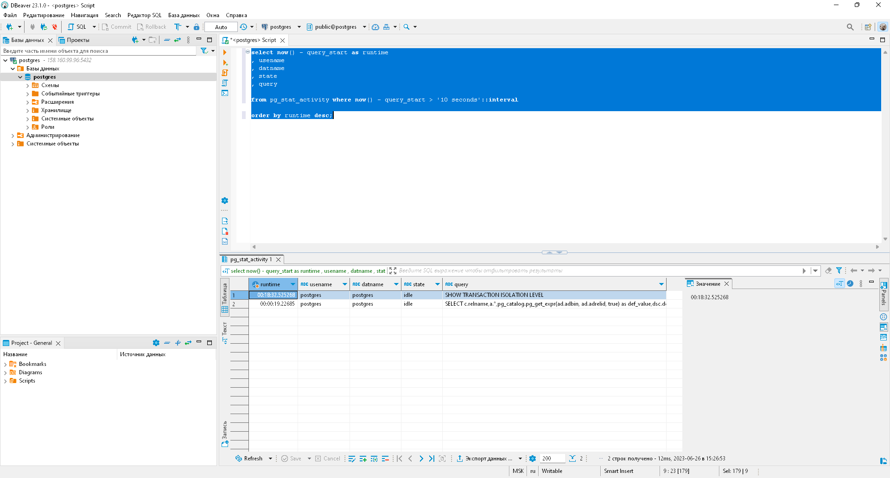

# Урок 18: Работа с индексами, join'ами, статистикой

> **Примечание:** Как я выполнял настройку terraform, я показывал ранее:
> 
> [Урок 12: Нагрузочное тестирование и тюнинг PostgreSQL](https://github.com/nvdmike/OTUSPostgreSQL/blob/main/Lesson12/Lesson12.md "Урок 12: Нагрузочное тестирование и тюнинг PostgreSQL")

# Вариант 1

## Часть 1: Создаю ВМ.

1. После запуска терминала в `режиме администратора` необходимо добавить аутентификационные данные в переменные окружения:

```bash
$Env:YC_TOKEN=$(yc iam create-token)
$Env:YC_CLOUD_ID=$(yc config get cloud-id)
$Env:YC_FOLDER_ID=$(yc config get folder-id)
```

> **Примечание:** т.к. iam-токен обновляется довольно часто, команды по добавлению в переменные окружения, придётся выполнять почти каждый раз после нового запуска терминала

2. Перехожу в каталог с конфигурационными файлами terraform и разворачиваю ВМ:

```bash
cd 'C:\Program Files\Terraform\cloud-terraform\'
terraform apply
```


## Часть 2: Создать индекс к какой-либо из таблиц вашей БД.

> **Примечание:** в этот раз я решил работать с БД с помощью DBeaver, т.к. он более нагляден.

1. Подключаюсь через DBeaver к тестовой БД и создаю в ней новую таблицу:

```sql
create table test as select generate_series as id, generate_series::text || (random() * 10)::text as c1, (array['Yes', 'No', 'Maybe'])[floor(random() * 3 + 1)] as c2 from generate_series(1, 50000);
```


2. Перед созданием индекса выполняю команду `explain` на "стоковой" таблице:

```sql
explain select * from test where id = 100;
```


> **Результат:**

```log
Seq Scan on test  (cost=0.00..789.94 rows=163 width=68)
  Filter: (id = 100)
```

> как можно увидеть из вывода, поиск по таблице осуществляется Seq Scan (т.е. выполняется последовательное чтение из таблицы). Т.е. в данном случае PostgreSQL последовательно читает одну запись за другой, пока не дойдёт до нужной. Как можно заметить, у подобного чтения довольно высокая стоимость - `789.94`.

3. Создаю индекс с именем `index_on_id` на поле `id` (ключевое слово `concurrently` при создании индекса говорит о том, что во время создания индекса не будет создаваться никаких блокировок):

```sql
create index concurrently "index_on_id" on test (id);
```

## Часть 3: Прислать текстом результат команды explain, в которой используется данный индекс.

4. Снова выполняю команду `explain` на таблице `test`:

```sql
explain select * from test where id = 100;
```


> **Результат:**

```log
Index Scan using index_on_id on test  (cost=0.29..8.31 rows=1 width=31)
  Index Cond: (id = 100)
```

> как можно заметить из вывода, поиск по таблице теперь происходит с использованием индекса `index_on_id`, стоимость запроса снизилась с `789.94` до `8.31`, при выполнении того же запроса.

## Часть 4: Реализовать индекс для полнотекстового поиска.

1. Для реализации полнотекстового поиска, создаю новую таблицу `test2`:

```sql
create table test2(id int, text_column text);
```

2. Заполняю таблицу сгенерированными данными:

```sql
insert into test2(id, text_column) select generate_series, concat_ws(' ', (array['world', 'sun', 'animal', 'tree'])[(random() * 5)::int], (array['life', 'hour', 'week', 'year', 'month'])[(random() * 6)::int], (array['people', 'woman', 'man', 'hand', 'face'])[(random() * 6)::int]) from generate_series(1, 1000000);
```

3. Добавляю новое поле типа `tsvector` для того, чтобы осуществлять полнотекстовый поиск и заполняю его данными:

```sql
alter table test2 add column text_column_tsv tsvector;
update test2 set text_column_tsv = to_tsvector(text_column);
```

4. Перед созданием индекса выполняю команду `explain` на "стоковой" таблице по полю `text_column_tsv`, приводя их к лексемам функцией `to_tsquery`. Полнотекстовый поиск в Postgres Pro реализован на базе оператора соответствия `@@`, который возвращает `true`, если `tsvector` (документ) соответствует `tsquery` (запросу):

```sql 
explain select * from test2 where text_column_tsv @@ to_tsquery('world');
```


> **Результат:**

```log
Gather  (cost=1000.00..320114.27 rows=13775 width=49)
  Workers Planned: 2
  ->  Parallel Seq Scan on test2  (cost=0.00..317736.77 rows=5740 width=49)
        Filter: (text_column_tsv @@ to_tsquery('world'::text))
JIT:
  Functions: 2
  Options: Inlining false, Optimization false, Expressions true, Deforming true
```

> Как можно заметить, используется параллельное сканирование. Стоимость такого запроса очень высокая.

5. Создаю индекс `index_tsvector` для полнотекстового поиска:

```sql
create index index_tsvector on test2 using gin (text_column_tsv);
```

6. Снова выполняю команду `explain` на таблице `test2`:

```sql
explain select * from test2 where text_column_tsv @@ to_tsquery('world');
```


> **Результат:**

```log
Gather  (cost=2861.87..61464.94 rows=201500 width=53)
  Workers Planned: 2
  ->  Parallel Bitmap Heap Scan on test2  (cost=1861.87..40314.94 rows=83958 width=53)
        Recheck Cond: (text_column_tsv @@ to_tsquery('world'::text))
        ->  Bitmap Index Scan on index_tsvector  (cost=0.00..1811.50 rows=201500 width=0)
              Index Cond: (text_column_tsv @@ to_tsquery('world'::text))
```

> Как можно заметить, в данном случае уже используется индекс `index_tsvector`, а стоимость выполнения поиска с использованием индекса снизилась с `320114.27` до `61464.94`, т.е. в 5 раз.

## Часть 5: Реализовать индекс на часть таблицы или индекс на поле с функцией.

> **Примечание:** т.к. уже есть таблица `test`, тестирование этого блока буду проводить на ней.

1.  Создаю индекс `id_10_index` на часть таблицы `test`, с условием где `id < 10`:

```sql
create index id_10_index on test(id) where id < 10;
```

2. Выполняю команду `explain` на таблице `test` и смотрю, что при поиске с данным условием используется ранее созданный индекс `id_10_index`:

```sql
explain select * from test where id < 10;
```


> **Результат:**

```log
Index Scan using index_on_id on test  (cost=0.29..8.45 rows=9 width=31)
  Index Cond: (id < 10)
```

> Как можно заметить, поиск действительно происходит по индексу `id_10_index`.

3. Выполняю команду `explain` на таблице `test`, где ставлю условие `id > 10`:

```sql
explain select * from test where id > 10;
```


> **Результат:**

```log
Seq Scan on test  (cost=0.00..1008.00 rows=49990 width=31)
  Filter: (id > 10)
```

> Как можно заметить, поиск теперь проходит уже с использованием последовательного сканирования, а стоимость вырастает с `8.45` до `49990`.

4. Теперь я планирую создать индекс `index_is_okay` по функции `upper` на поле `c2`:

```sql
create index index_is_okay on test(upper(c2));
```

5. Выполняю команду `explain` на таблице `test` и смотрю, что при поиске с данным условием используется ранее созданный индекс `index_is_okay`:

```sql
explain select c2 from test where upper(c2) = 'No';
```


> **Результат:**

```log
Bitmap Heap Scan on test  (cost=6.23..367.67 rows=250 width=4)
  Recheck Cond: (upper(c2) = 'No'::text)
  ->  Bitmap Index Scan on index_is_okay  (cost=0.00..6.17 rows=250 width=0)
        Index Cond: (upper(c2) = 'No'::text)
```

> Как можно заметить, поиск действительно происходит по индексу `index_is_okay`.

6. Выполняю команду `explain` на таблице `test`, но теперь ставлю условие `lower`:

```sql
explain select c2 from test where lower(c2) = 'No';
```


> **Результат:**

```log
Seq Scan on test  (cost=0.00..1133.00 rows=250 width=4)
  Filter: (lower(c2) = 'No'::text)
```

> Как можно заметить, поиск теперь проходит уже с использованием последовательного сканирования.

## Часть 6: Создать индекс на несколько полей.

1. Создаю индекс на два поля на таблицу `test`:

```sql
create index index_2 on test(c1, c2);
```

2. Выполняю команду `explain` на таблице `test` и смотрю, что при поиске с данным условием используется ранее созданный индекс `index_2`:

```sql
explain select * from test where c1 = '10.663401929393308' and c2 = 'No';
```


> **Результат:**

```log
Index Scan using index_2 on test  (cost=0.41..8.43 rows=1 width=31)
  Index Cond: ((c1 = '10.663401929393308'::text) AND (c2 = 'No'::text))
```

# Вариант 2

## Часть 1: Реализовать прямое соединение двух или более таблиц.

1. Создаю новые таблицы и наполняю их данными:

```sql
create table streets(id serial,street text,id_city int);
create table buildings(id serial,building text,id_street int);
create table city(id serial, city text);
insert into streets values(1,'ул.Ленина',1),(2,'ул.Костромская',2),(3,'пр.Невский ',2),(4,'ул.Гагарина ',3);
insert into buildings values(1,'15',1),(2,'122А',1),(4,'234',2),(6,'88',7);
insert into city values(1,'Москва'),(2,'Санкт-Петербург'),(3,'Кострома'),(7,'Коломна');
```

2. Реализую прямое соединение таблиц `streets` и `buildings`:

```sql
select * from streets s join buildings b on b.id_street = s.id;
```


> **Результат:** как можно увидеть, в данном случае к таблице `streets` происходит присоединение таблицы `buildings`, для случаев, когда `b.id_street = s.id`.

## Часть 2: Реализовать левостороннее (или правостороннее) соединение двух или более таблиц.

1. Реализую левое соединение этих таблиц:

```sql
select * from streets s left join buildings b on b.id_street = s.id;
```


> **Результат:** в данном случае будут отображены ВСЕ записи из таблицы `streets` (в т.ч. и те, для которых нет соответствия в таблице `buildings` - в таких случаях будет выведен `NULL`) и соответствующие записи из таблицы `buildings`, для случаев, когда `b.id_street = s.id`.

2. Реализую правое соединение этих таблиц:

```sql
select * from streets s right join buildings b on b.id_street = s.id;
```


> **Результат:** в данном случае будут отображены ВСЕ записи из таблицы `buildings` (в т.ч. и те, для которых нет соответствия в таблице `streets` - в таких случаях будет выведен `NULL`) и соответствующие записи из таблицы `streets`, для случаев, когда `b.id_street = s.id`.

## Часть 3: Реализовать кросс соединение двух или более таблиц.

1. Реализую кросс соединение таблиц:

```sql
select * from streets s cross join buildings b;
```


> **Результат:** в данном случае каждая строка таблицы `streets` соединяется с каждой строкой таблицы `buildings`, давая тем самым в результате все возможные сочетания строк двух таблиц (т.е. декартово произведение) .

## Часть 4: Реализовать полное соединение двух или более таблиц.

1. Реализую полное соединение таблиц:

```sql
select * from streets s full join buildings b on b.id_street = s.id;
```


> **Результат:** в данном случае произойдёт полное соединение таблицы `streets` и `buildings`. Для тех строк, где не будет найдено соответствие будет выведен `NULL`.

## Часть 5: Реализовать запрос, в котором будут использованы разные типы соединений

1. Запрос с разными типами соединений: 

```sql
select c.city
, q.street
, q.building
 
from city c
left join(select *

  from streets s 
  join buildings b
    on b.id_street = s.id
) q
  on q.id_city = c.id;
```


> **Результат:** в данном случае выводятся все записи из таблицы city и, с помощью `left join` я присоединяю к этим записям соответствующие записи из подзапроса, где соединяются таблицы `streets` и `buildings` прямым соединением.

# Задание со *: Придумайте 3 своих метрики на основе показанных представлений, отправьте их через ЛК, а так же поделитесь с коллегами в слаке.

1. Просмотр всех запущенных в текущий момент запросов:

```sql
select pid
, age(query_start, clock_timestamp())
, usename
, query

from pg_stat_activity

where query != '<IDLE>'
and query not ilike '%pg_stat_activity%'

order by query_start desc;
```


2. просмотр неисползуемых индексов:

```sql
select *

from pg_stat_all_indexes

where idx_scan = 0;
```


3. просмотр запросов, которые выполняются более 10 секунд:

```sql
select now() - query_start as runtime
, usename
, datname
, state
, query

from pg_stat_activity where now() - query_start > '10 seconds'::interval

order by runtime desc;
```

