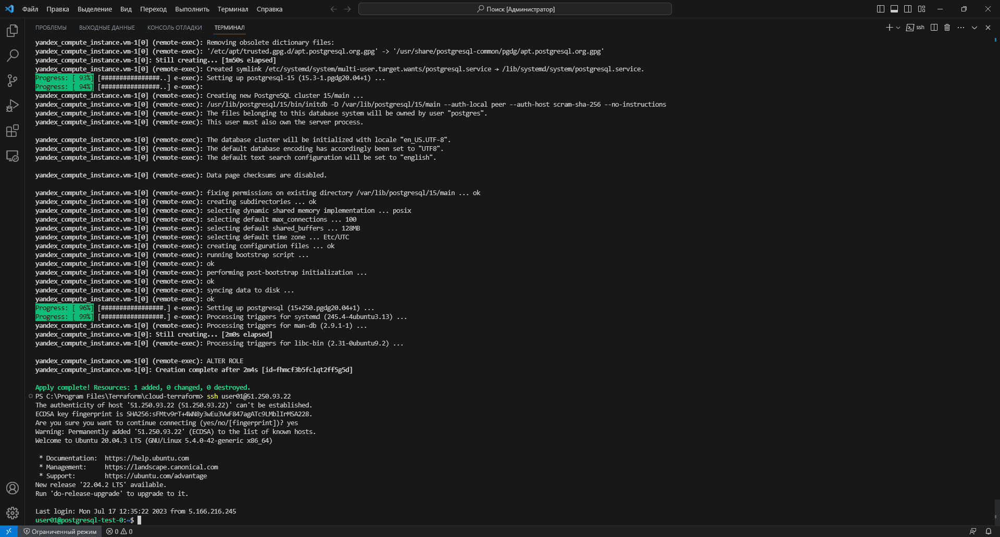
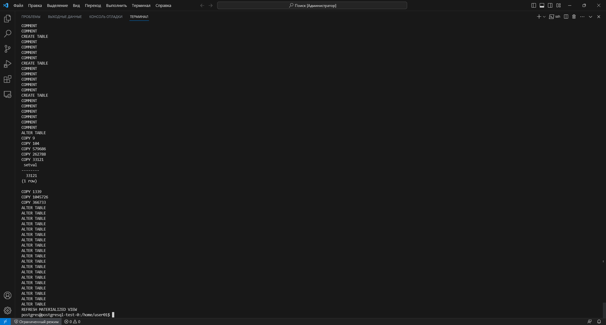
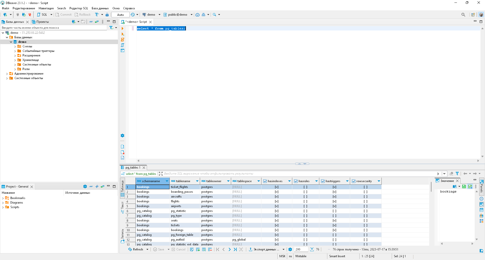
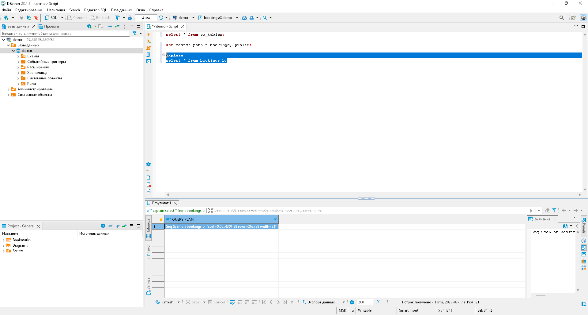
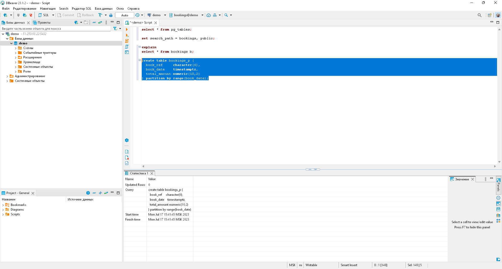
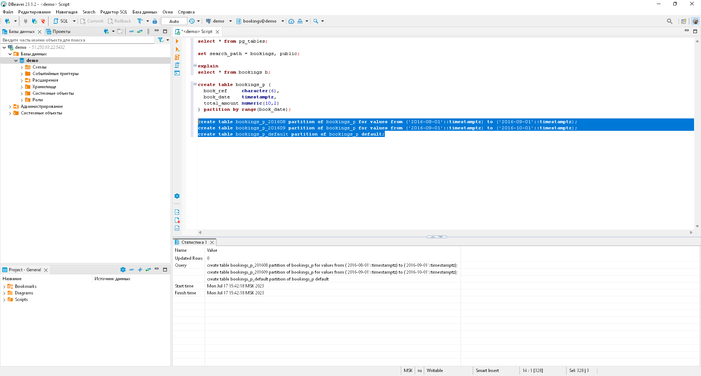
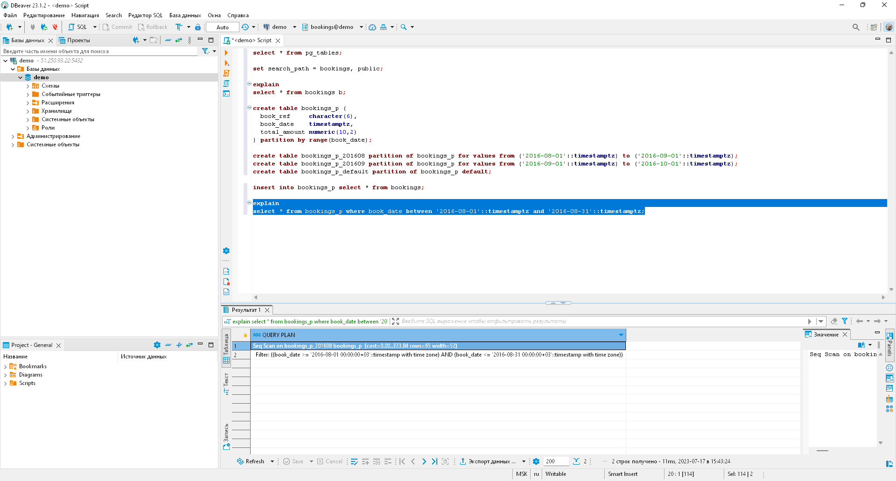
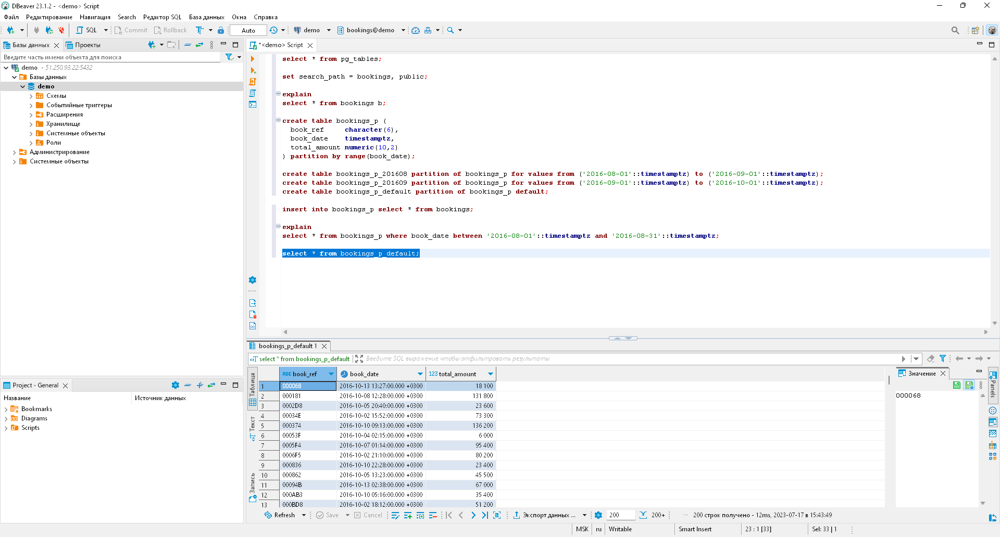
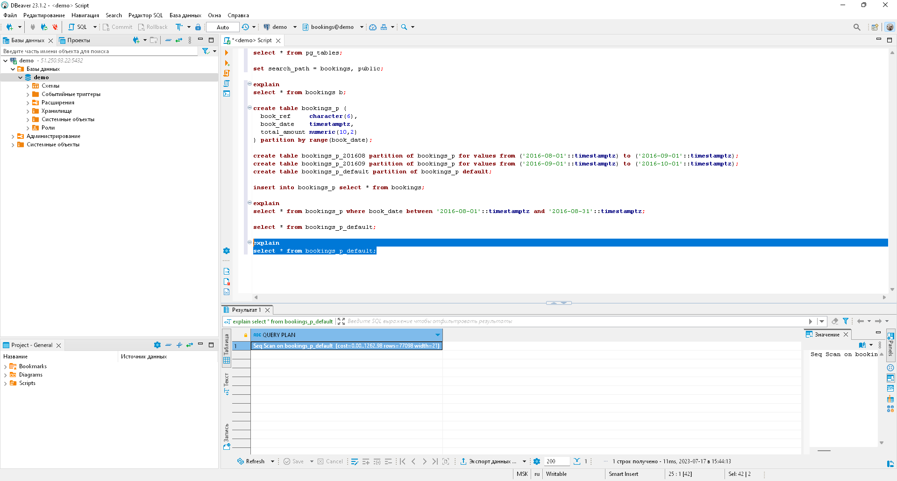

# Урок 20: Секционирование таблицы

> **Примечание:** Как я выполнял настройку terraform, я показывал ранее:
> 
> [Урок 12: Нагрузочное тестирование и тюнинг PostgreSQL](https://github.com/nvdmike/OTUSPostgreSQL/blob/main/Lesson12/Lesson12.md "Урок 12: Нагрузочное тестирование и тюнинг PostgreSQL")

## Часть 1: Создаю ВМ.

1. После запуска терминала в `режиме администратора` необходимо добавить аутентификационные данные в переменные окружения:

```bash
$Env:YC_TOKEN=$(yc iam create-token)
$Env:YC_CLOUD_ID=$(yc config get cloud-id)
$Env:YC_FOLDER_ID=$(yc config get folder-id)
```

> **Примечание:** т.к. iam-токен обновляется довольно часто, команды по добавлению в переменные окружения, придётся выполнять почти каждый раз после нового запуска терминала

2. Перехожу в каталог с конфигурационными файлами terraform и разворачиваю ВМ:

```bash
cd 'C:\Program Files\Terraform\cloud-terraform\'
terraform apply
```



## Часть 2: Установка демонстрационной базы данных 

1. Далее, я скачиваю файл с архивом БД, распаковываю его, перехожу под пользователя `postgres` и устанавливаю демонстрационную БД (для этого необходимо находиться в каталоге с файлом БД):

```bash
wget https://edu.postgrespro.ru/demo_small.zip
unzip demo_small.zip
sudo su postgres
psql -f demo_small.sql
```



2. Работать я планирую в DBeaver, поэтому подключаюсь к БД `demo` и смотрю, что все объекты в этой БД созданы:

```sql
select * from pg_tables;
```



3. Добавляю в путь схему `bookings`

```sql
set search_path = bookings, public;
```

## Часть 3: Секционирование по диапазону значений

1. Смотрю план запроса для несекционированной таблицы `bookings`:
```sql
explain
select * from bookings b;
```



> **Результат:** как можно увидеть на скриншоте выше, при выборе данных происходит последовательное сканирование всей таблицы `bookings`.

2. Создам копию таблицы `bookings`, с секционированием по диапазону дат:
```sql
create table bookings_p (
  book_ref     character(6),
  book_date    timestamptz,
  total_amount numeric(10,2)
) partition by range(book_date);
```



3. Создаю в секционированной таблице `bookings_p`  партиции по диапазону и одну партицию по-умолчанию:

```sql
create table bookings_p_201608 partition of bookings_p for values from ('2016-08-01'::timestamptz) to ('2016-09-01'::timestamptz);
create table bookings_p_201609 partition of bookings_p for values from ('2016-09-01'::timestamptz) to ('2016-10-01'::timestamptz);
create table bookings_p_default partition of bookings_p default;
```



4. Заполняю секционированную таблицу `bookings_p` данными из основной таблицы `bookings`:

```sql
insert into bookings_p select * from bookings;
```

5. Выбираю данные в диапазоне за  `08` месяц:

```sql
explain
select * from bookings_p where book_date between '2016-08-01'::timestamptz and '2016-08-31'::timestamptz;
```



> **Результат:** как видно на скриншоте выше, выполняется последовательное сканирование, однако в данном случае это сканирование выполняется только по партиции `bookings_p_201608` по диапазону значений.

6. Проверяю данные, которые попали в партицию по-умолчанию:

```sql
select * from bookings_p_default;
```


> **Результат:** как можно заметить, данная секция не пустая, - сюда попали те данные, которые не попали в диапазон значений, установленный для ранее созданных секций: т.е. в данном случае сюда попали все записи за `10` месяц.

7. Смотрю план запроса для данной секции:

```sql
explain
select * from bookings_p_default;
```



> **Результат:** как видно на скриноште выше, при таком запросе уже просто выполняется последовательное сканирование по `bookings_p_default`, но уже без ограничения по диапазону.