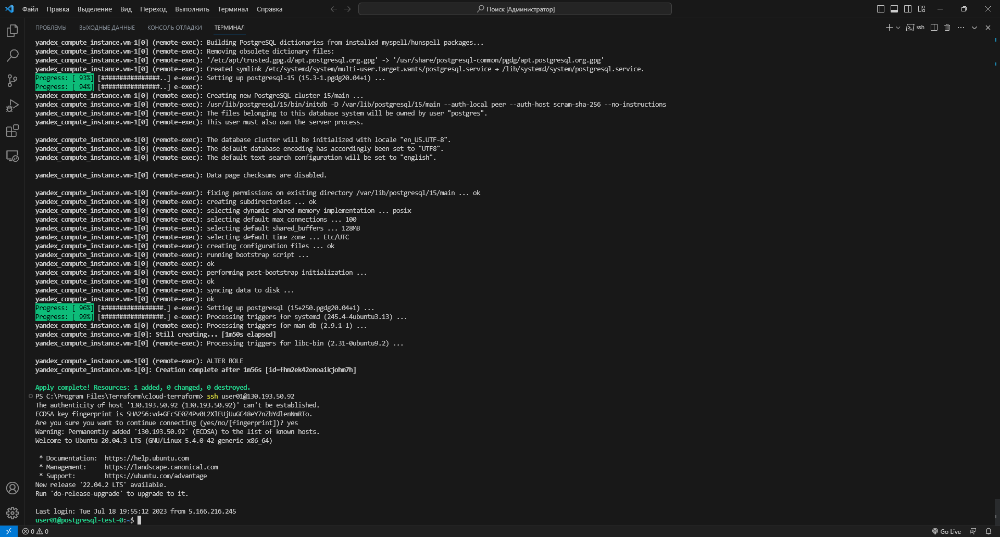
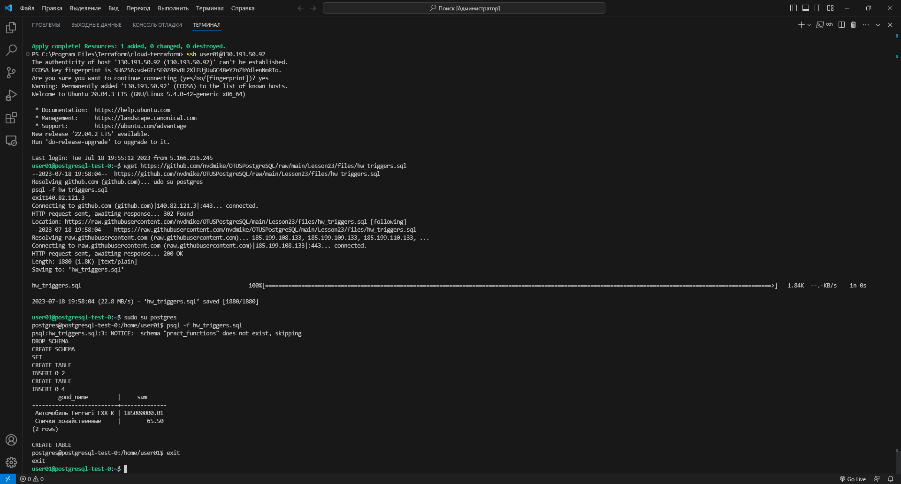
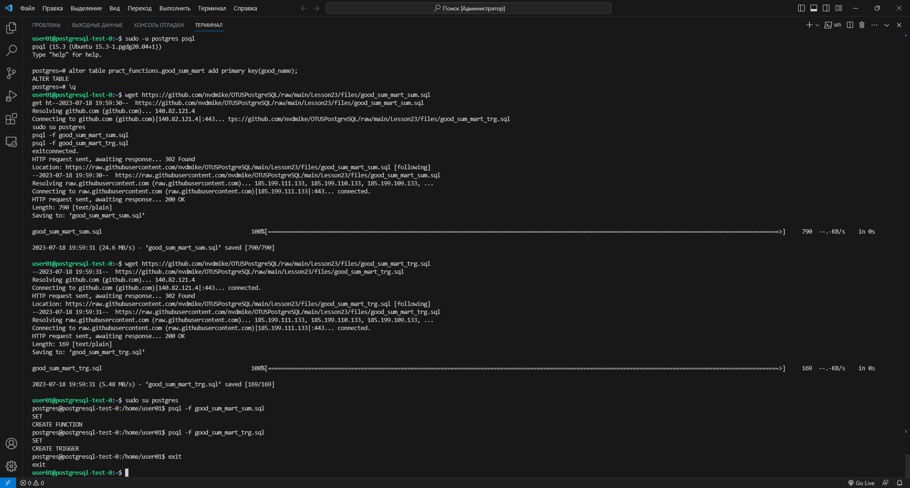
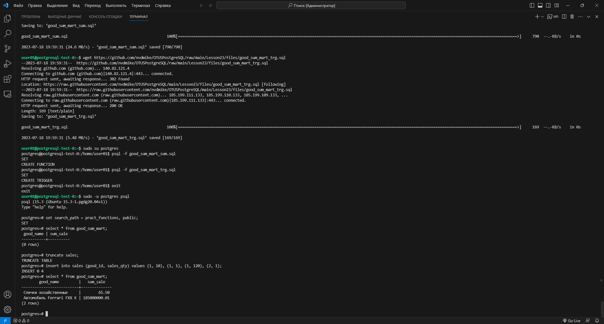
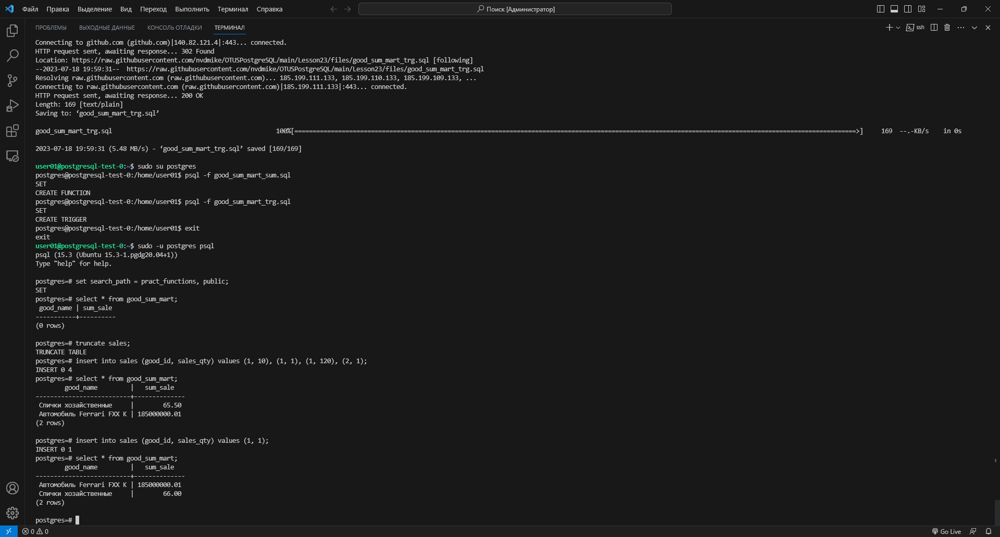
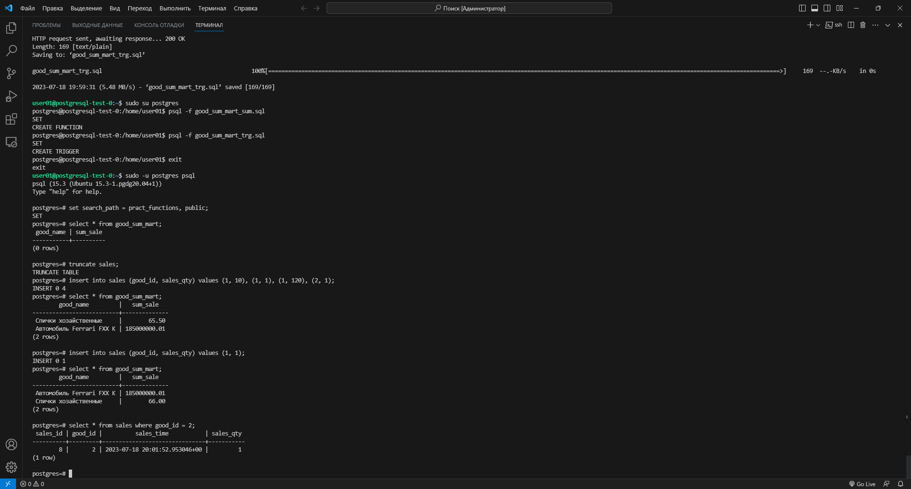
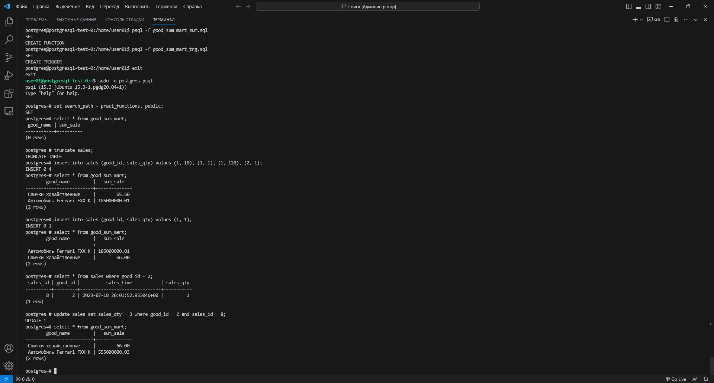
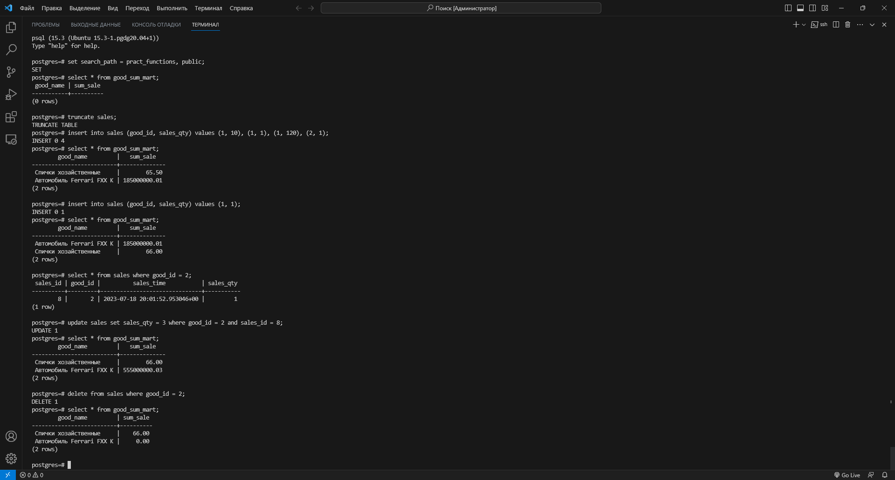

# Урок 23: Триггеры, поддержка заполнения витрин

> **Примечание:** Как я выполнял настройку terraform, я показывал ранее:
> 
> [Урок 12: Нагрузочное тестирование и тюнинг PostgreSQL](https://github.com/nvdmike/OTUSPostgreSQL/blob/main/Lesson12/Lesson12.md "Урок 12: Нагрузочное тестирование и тюнинг PostgreSQL")

## Часть 1: Создаю ВМ.

1. После запуска терминала в `режиме администратора` необходимо добавить аутентификационные данные в переменные окружения:

```bash
$Env:YC_TOKEN=$(yc iam create-token)
$Env:YC_CLOUD_ID=$(yc config get cloud-id)
$Env:YC_FOLDER_ID=$(yc config get folder-id)
```

> **Примечание:** т.к. iam-токен обновляется довольно часто, команды по добавлению в переменные окружения, придётся выполнять почти каждый раз после нового запуска терминала

2. Перехожу в каталог с конфигурационными файлами terraform и разворачиваю ВМ:

```bash
cd 'C:\Program Files\Terraform\cloud-terraform\'
terraform apply
```



## Часть 2: Подготовка стенда.

> **Примечание:** описание задачи находится в файле [hw_triggers.sql](https://github.com/nvdmike/OTUSPostgreSQL/blob/main/Lesson23/files/hw_triggers.sql "hw_triggers.sql").

1. Скачиваю с моего GitHub установочный файл с командами, под пользователя `postgres` и выполняю установку (для этого необходимо находиться в каталоге с файлом `hw_triggers.sql`):

```bash
wget https://github.com/nvdmike/OTUSPostgreSQL/raw/main/Lesson23/files/hw_triggers.sql
sudo su postgres
psql -f hw_triggers.sql
exit
```



> **Примечание:** в файле [hw_triggers.sql](https://github.com/nvdmike/OTUSPostgreSQL/blob/main/Lesson23/files/hw_triggers.sql "hw_triggers.sql") пришлось поправить строку `SET search_path = pract_functions, public;`, т.к. в конце строки отсуствовала точка с запятой и вместо `publ` прописать `public` (вероятно строка была просто обрезана при копировании).

## Часть 3: Создание триггерной функции и триггера. Установка.

1. Захожу в psq:

```bash
sudo -u postgres psql
```

2. Перед началом работы над триггером, нужно создать первичный ключ:

```sql
postgres=# alter table pract_functions.good_sum_mart add primary key(good_name);
postgres=# \q
```

3. Создаю триггерную функцию и сохраняю её в файл [good_sum_mart_sum.sql](https://github.com/nvdmike/OTUSPostgreSQL/blob/main/Lesson23/files/good_sum_mart_sum.sql "good_sum_mart_sum.sql"):

```sql
set search_path = pract_functions, public;

create or replace function good_sum_mart_sum() returns trigger as $$
declare
  v_SalesQty integer;
  v_GoodId integer;
begin
  case TG_OP
    when 'INSERT' then
      v_SalesQty = new.sales_qty;
      v_GoodId = new.good_id; 
    when 'UPDATE' then
      v_SalesQty = new.sales_qty - old.sales_qty;
      v_GoodId = old.good_id;
    when 'DELETE' then
      v_SalesQty = 0 - old.sales_qty;
      v_GoodId = old.good_id;
  end case;
  insert into good_sum_mart(good_name, sum_sale) select good_name, good_price * v_SalesQty from goods where goods_id = v_GoodId
  on conflict (good_name) do update set sum_sale = good_sum_mart.sum_sale + excluded.sum_sale where good_sum_mart.good_name = excluded.good_name;
  return null;
end;
$$ language plpgsql;
```

4. Теперь создаю сам триггер и сохраняю его в файл [good_sum_mart_trg.sql](https://github.com/nvdmike/OTUSPostgreSQL/blob/main/Lesson23/files/good_sum_mart_trg.sql "good_sum_mart_trg.sql"):

```sql
set search_path = pract_functions, public;

create trigger good_sum_mart_trg
after insert or update or delete on sales
for each row execute function good_sum_mart_sum();
```

5. Устанавливаю триггерную функцию и триггер:

```sql
wget https://github.com/nvdmike/OTUSPostgreSQL/raw/main/Lesson23/files/good_sum_mart_sum.sql
wget https://github.com/nvdmike/OTUSPostgreSQL/raw/main/Lesson23/files/good_sum_mart_trg.sql
sudo su postgres
psql -f good_sum_mart_sum.sql
psql -f good_sum_mart_trg.sql
exit
```



## Часть 4: Проверка работы триггера.

1. Захожу в psql:

```bash
sudo -u postgres psql
```

2. Чтобы не писать каждый раз путь к схеме, прописываю `search_path`. Если выбрать данные из таблицы `good_sum_mart`, то логично, что изначально она будет пустая:

```sql
postgres=# set search_path = pract_functions, public;
postgres=# select * from good_sum_mart;
```


3. Т.к. данные в витрине `good_sum_mart` появятся только в случае, если сработает триггер, сначала требуется очистить таблицу `sales`, затем наполнить её данными. После чего я снова пытаюсь выбрать данные из таблицы `good_sum_mart`:

```sql
postgres=# truncate sales;
postgres=# insert into sales (good_id, sales_qty) values (1, 10), (1, 1), (1, 120), (2, 1);
postgres=# select * from good_sum_mart;
```



> **Результат:** как можно увидеть на скриншоте выше, теперь данные в витрине появились. Т.е. триггер на вставку сработал.

4. Попробую добавить запись с существующим ID товара и снова выбрать данные из витрины:

```sql
postgres=# insert into sales (good_id, sales_qty) values (1, 1);
postgres=# select * from good_sum_mart;
```



> **Результат:** как можно заметить, т.к. при попытке обновить существующую строку, т.к. в таблице есть первичный ключ, а в триггере создана обработка конфликта, произойдёт не добавление новой записи, а обновление строки с наименованием товара, с последующим увеличением его общей стоимости на сумму сделки. В нашем случае изменилась стоимость товара `Спички хозайственные` с `65.50` до `66.00`, т.е. `стоимость товара * на количество`.

5. Смотрю данные о количестве проданного товара в таблице `sales`:

```sql
postgres=# select * from sales where good_id = 2;
```



6. Теперь я посмотрю попробую изменить количество проданного товара:

```sql
postgres=# update sales set sales_qty = 3 where good_id = 2 and sales_id = 8;
postgres=# select * from good_sum_mart;
```



> **Результат:** как видно на скриншоте, при обновлении количества товара, общая сумма так же увеличилась в 3 раза.

7. Теперь удалю всё, что связано с товаром, где `good_id = 2`:

```sql
postgres=# delete from sales where good_id = 2;
postgres=# select * from good_sum_mart;
```



> **Результат:** как теперь видно на скриншоте, сумма стала равна нулю.

## Часть 4: Задание со *

> **Результат:** При изменении цены в таблице `goods` в изначальном отчёте, в виде представления, которое было дано в файле [hw_triggers.sql](https://github.com/nvdmike/OTUSPostgreSQL/blob/main/Lesson23/files/hw_triggers.sql "hw_triggers.sql"), мы бы получили не реальную сумму продаж, а сумму с учётом последней цены (т.е. такой отчёт будет работать некорректно в перспективе).
>
> Однако, у способа создания отчётности с триггерами тоже есть минусы:
> - Если триггер не сработает по какой-то причине, мы получим некорректную стоимость;
> - Если создавать триггер на таблице с уже существующими данными, витрину придётся заполнять первоначально вручную (скриптами).